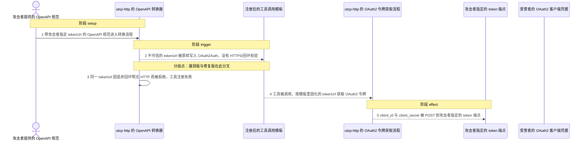
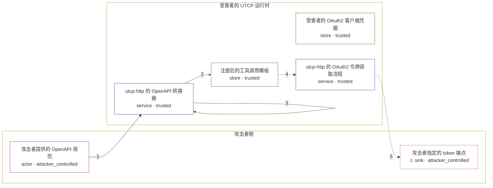

# python-utcp / GHSA-8CP3-QXJ6-PX34

状态：草稿，未完成环境和复现。这个目录由模板生成，不构成漏洞确认。

图解的唯一来源是 `diagram.toml`：编辑后运行 `python3 -m runner diagram python-utcp/GHSA-8CP3-QXJ6-PX34` 重新生成下方的图解区块。图解必须覆盖漏洞涉及的每个主体，并标出漏洞版/修复版的分歧步骤。

<!-- diagram:begin (generated from diagram.toml by `python3 -m runner diagram`; edit diagram.toml, not this block) -->
## 漏洞图解 — python-utcp / GHSA-8CP3-QXJ6-PX34 漏洞图解

utcp-http 从不受信任的 OpenAPI 规范生成工具时，把 clientCredentials.tokenUrl 原样写入 OAuth2Auth，转换期不校验，发送凭据前也不校验。发现 URL 与工具调用 URL 都会经过 HTTPS/回环检查，唯独这个由规范决定的 token 端点绕过了同一道信任边界。于是工具一被调用，受害者的 client_id 与 client_secret 就被 POST 到攻击者指定的明文 HTTP 端点：攻击者可以据此冒充受害者调用下游 API，也可以把凭据投递到内网或云元数据地址形成 SSRF。

### 涉及主体

| 主体 | 类型 | 信任级别 | 在漏洞里的作用 | 来源 |
| --- | --- | --- | --- | --- |
| 攻击者提供的 OpenAPI 规范 (`attacker_spec`) | `actor` | `attacker_controlled` | 规范内容完全由攻击者决定；攻击者在 clientCredentials.tokenUrl 里指定自己的接收端，或指定一个从外部不可达的内网地址。 | fixtures/attack_openapi.json |
| utcp-http 的 OpenAPI 转换器 (`converter`) | `service` | `trusted` | OpenApiConverter 把规范里的 tokenUrl 原样存进 OAuth2Auth。同一份文件对发现 URL 与工具调用 URL 都会调用 ensure_secure_url，这一处却没有，tokenUrl 因此成了唯一没有设防的出站地址。 | fixtures/attack_openapi.json |
| 注册后的工具调用模板 (`call_template`) | `store` | `trusted` | 由规范生成的调用模板被当作可信配置保存；调用工具时按其中的 OAuth2Auth 去取令牌。 | — |
| 受害者的 OAuth2 客户端凭据 (`credentials`) | `store` | `trusted` | 受害者配置的 client_id 与 client_secret，本应只发往受信任的令牌端点。攻击者拿不到它，所以要用恶意规范把它骗出来。 | fixtures/credentials.json |
| utcp-http 的 OAuth2 令牌获取流程 (`http_protocol`) | `service` | `trusted` | HttpCommunicationProtocol._handle_oauth2 直接对 auth_details.token_url 发 POST；缺陷正是这里在凭据出站前没有任何校验。 | — |
| ⚠ 攻击者指定的 token 端点 (`token_endpoint`) | `sink` | `attacker_controlled` | 凭据的落点。真实攻击里它是攻击者托管的接收端，或一个可从受害者网络触达的内网/云元数据地址；这里由受控监听端代替，只做无害记录，不使用任何真实凭据。 | — |

**信任边界**

- **攻击者侧** (`attacker_side`)：成员 `attacker_spec`、`token_endpoint`。攻击者控制规范内容与自己指定的 token 端点，但读不到受害者配置的客户端凭据。
- **受害者的 UTCP 运行时** (`victim_runtime`)：成员 `converter`、`call_template`、`credentials`、`http_protocol`。界内信任由远端规范转换出的调用模板。发现 URL 与工具调用 URL 有 HTTPS/回环校验，tokenUrl 没有，凭据因此被送出。

标 ⚠ 的主体是本仓库合成的替身或无害效果载体，不代表真实外部目标。

### 触发过程

### 主体与信任边界

箭头上的数字是上面的步骤编号；方框只标主体和信任级别，具体动作见「触发过程」。

**分歧点**：第 2 步（`vulnerable_only`）不可信的 tokenUrl 被原样写入 OAuth2Auth，没有 HTTPS/回环校验。
**分歧点**：第 3 步（`patched_only`）同一 tokenUrl 因是非回环明文 HTTP 而被拒绝，工具注册失败。
<!-- diagram:end -->

## 公告与机制

TODO：官方公告、漏洞根因、Agent 信任边界、受影响范围和修复来源。

## 前提

TODO：认证要求、用户交互、已有批准、工具权限、攻击者能控制的内容。

## 版本与启动

TODO：补全 metadata、Dockerfile/镜像 digest 和 Compose，再写出精确启动命令。

Compose 中 `vulnerable` 与 `patched` profiles 分开使用；未指定 profile 不启动服务。镜像变量未配置时 Compose 会明确报错。此模板不暴露宿主端口，也不挂载主机数据。

## 机制复现

TODO：实现 `reproduce.py`，固定输入并执行真实漏洞路径，注明运行位置、参数和超时。

完成实现后使用 `python3 -m runner reproduce python-utcp/GHSA-8CP3-QXJ6-PX34 --build --rounds 3`。
两脚本统一接受 `--context <context.json> --output <目录>`，详细字段见仓库 `docs/environment-contract.md`。
PoC 输出 `facts.json` 和效果文件；验证器只读证据，输出含 `target_ready` 及对应效果断言的 `verdict.json`。
镜像必须包含 Python 3 和 `/lab/` 下的脚本、fixtures；`runtime.mode` 选择 `oneshot` 或有 healthcheck 的 `service`。

## 端到端复现

TODO：实现 `end_to_end.py`；若不需要模型，明确写出不适用原因。真实模型的结果与机制复现分开统计。

## 验证与修复对照

TODO：实现 `verify.py`。记录漏洞版无害效果、修复版阻断和正常任务成功的证据，不能把服务启动失败当成阻断。

## 清理

默认运行器按每个测试的唯一 Compose project 清理容器、网络和 volume。
`--keep-on-failure` 保留失败项目，项目标识和 Compose 配置在结果目录中；仅清理该项目，不能使用全局 prune。

## 失败诊断

TODO：为本漏洞写出预期效果缺失、修复版仍有越界效果、正常任务失败及前提不满足时的具体排查路径。
启动失败、健康检查失败和超时都不能当作修复阻断。报告中应能定位到阶段、预期、实际和受控证据。

## 构建与输入

TODO：填写两版源码 archive、完整 commit，记录 `build.inputs` 中每个下载的 SHA-256；依赖安装必须支持禁网构建。
固定攻击和正常输入放入 `fixtures/` 并登记到 `fixtures/manifest.toml`。固定 seed、环境变量，说明无害效果与真实影响的关系。

## 隔离例外

默认无例外。确需例外时同时填写 `runtime.exceptions`、理由及最小范围，晋升由两位维护者审阅。

## 来源与许可

TODO：列出引用代码、fixtures 和镜像的来源及许可。
