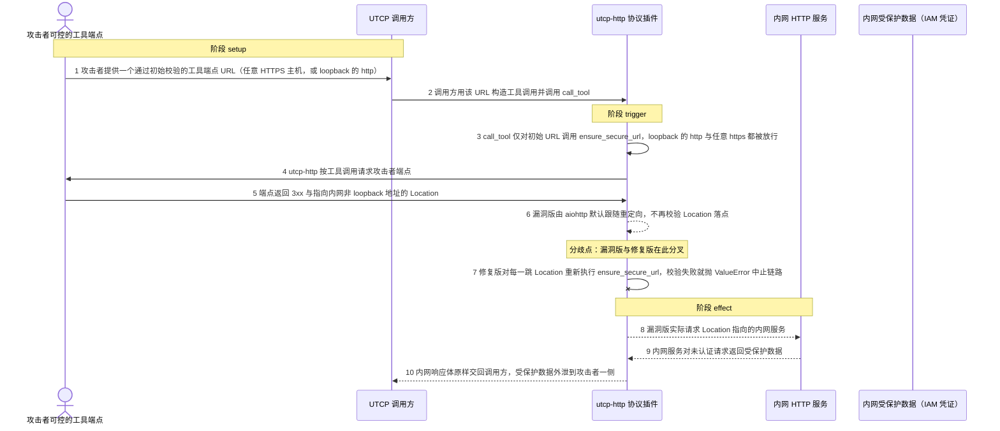
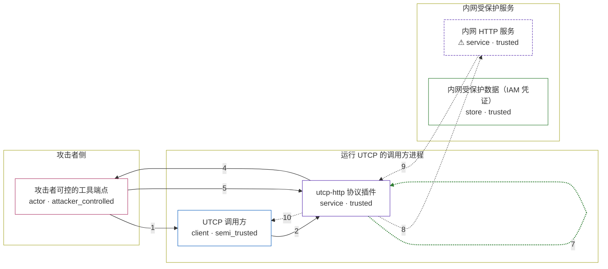

# python-utcp / GHSA-9QHG-99WW-9MQC

状态：草稿，未完成环境和复现。这个目录由模板生成，不构成漏洞确认。

图解的唯一来源是 `diagram.toml`：编辑后运行 `python3 -m runner diagram python-utcp/GHSA-9QHG-99WW-9MQC` 重新生成下方的图解区块。图解必须覆盖漏洞涉及的每个主体，并标出漏洞版/修复版的分歧步骤。

<!-- diagram:begin (generated from diagram.toml by `python3 -m runner diagram`; edit diagram.toml, not this block) -->
## 漏洞图解 — utcp-http 重定向 SSRF：工具调用跟随未校验的 Location

utcp-http 的工具调用只用 ensure_secure_url 校验初始 URL，随后让 aiohttp 以默认的 allow_redirects=True 发请求，重定向之后的落点从未被重新校验。攻击者让自己的端点通过初始校验（任意 HTTPS 主机，或 loopback 的 http），再用 3xx 与 Location 把请求导向非 loopback 的内网地址，就越过了只挡初始 URL 的那道信任边界。内网服务对未认证请求返回的受保护数据（例如云元数据里的 IAM 凭证）会被原样交回调用方，形成可读 SSRF 与数据外泄。

### 涉及主体

| 主体 | 类型 | 信任级别 | 在漏洞里的作用 | 来源 |
| --- | --- | --- | --- | --- |
| 攻击者可控的工具端点 (`attacker`) | `actor` | `attacker_controlled` | 提供能通过初始 URL 校验的工具端点，并让该端点以 3xx 与 Location 把工具调用导向内网地址。 | fixtures/attack_redirect.json |
| UTCP 调用方 (`caller`) | `client` | `semi_trusted` | 注册攻击者给的端点并调用 call_tool，把工具返回值交回上层，是内网响应最终落到的一方。 | — |
| utcp-http 协议插件 (`utcp_http`) | `service` | `trusted` | call_tool 只对初始 URL 执行 ensure_secure_url，之后直接发请求，因此跟随重定向时不再校验 Location 落点。 | — |
| ⚠ 内网 HTTP 服务 (`internal_service`) | `service` | `trusted` | 监听非 loopback 地址、对未认证请求返回受保护数据的内部服务；攻击者本不可直达，重定向把它和调用方连了起来。 | fixtures/internal_canary.json |
| 内网受保护数据（IAM 凭证） (`protected_data`) | `store` | `trusted` | 内网服务持有的受保护资源，是攻击者想要却够不着的目标；漏洞把它读出并交回调用方。 | — |

**信任边界**

- **攻击者侧** (`attacker_side`)：成员 `attacker`。攻击者只控制自己端点的 URL 和它返回的 3xx 与 Location，不能直接访问内网地址。
- **运行 UTCP 的调用方进程** (`utcp_host`)：成员 `caller`、`utcp_http`。这道边界靠 ensure_secure_url 挡住指向内网的初始 URL，但它只检查发起请求前的那一个 URL。
- **内网受保护服务** (`internal_net`)：成员 `internal_service`、`protected_data`。内网服务只应被同网段的可信组件访问；漏洞让它接受来自重定向的调用并把数据交出去。

标 ⚠ 的主体是本仓库合成的替身或无害效果载体，不代表真实外部目标。

### 触发过程

### 主体与信任边界

箭头上的数字是上面的步骤编号；方框只标主体和信任级别，具体动作见「触发过程」。

**分歧点**：第 6 步（`vulnerable_only`）漏洞版由 aiohttp 默认跟随重定向，不再校验 Location 落点。
**分歧点**：第 7 步（`patched_only`）修复版对每一跳 Location 重新执行 ensure_secure_url，校验失败就抛 ValueError 中止链路。
<!-- diagram:end -->

## 公告与机制

TODO：官方公告、漏洞根因、Agent 信任边界、受影响范围和修复来源。

## 前提

TODO：认证要求、用户交互、已有批准、工具权限、攻击者能控制的内容。

## 版本与启动

TODO：补全 metadata、Dockerfile/镜像 digest 和 Compose，再写出精确启动命令。

Compose 中 `vulnerable` 与 `patched` profiles 分开使用；未指定 profile 不启动服务。镜像变量未配置时 Compose 会明确报错。此模板不暴露宿主端口，也不挂载主机数据。

## 机制复现

TODO：实现 `reproduce.py`，固定输入并执行真实漏洞路径，注明运行位置、参数和超时。

完成实现后使用 `python3 -m runner reproduce python-utcp/GHSA-9QHG-99WW-9MQC --build --rounds 3`。
两脚本统一接受 `--context <context.json> --output <目录>`，详细字段见仓库 `docs/environment-contract.md`。
PoC 输出 `facts.json` 和效果文件；验证器只读证据，输出含 `target_ready` 及对应效果断言的 `verdict.json`。
镜像必须包含 Python 3 和 `/lab/` 下的脚本、fixtures；`runtime.mode` 选择 `oneshot` 或有 healthcheck 的 `service`。

## 端到端复现

TODO：实现 `end_to_end.py`；若不需要模型，明确写出不适用原因。真实模型的结果与机制复现分开统计。

## 验证与修复对照

TODO：实现 `verify.py`。记录漏洞版无害效果、修复版阻断和正常任务成功的证据，不能把服务启动失败当成阻断。

## 清理

默认运行器按每个测试的唯一 Compose project 清理容器、网络和 volume。
`--keep-on-failure` 保留失败项目，项目标识和 Compose 配置在结果目录中；仅清理该项目，不能使用全局 prune。

## 失败诊断

TODO：为本漏洞写出预期效果缺失、修复版仍有越界效果、正常任务失败及前提不满足时的具体排查路径。
启动失败、健康检查失败和超时都不能当作修复阻断。报告中应能定位到阶段、预期、实际和受控证据。

## 构建与输入

TODO：填写两版源码 archive、完整 commit，记录 `build.inputs` 中每个下载的 SHA-256；依赖安装必须支持禁网构建。
固定攻击和正常输入放入 `fixtures/` 并登记到 `fixtures/manifest.toml`。固定 seed、环境变量，说明无害效果与真实影响的关系。

## 隔离例外

默认无例外。确需例外时同时填写 `runtime.exceptions`、理由及最小范围，晋升由两位维护者审阅。

## 来源与许可

TODO：列出引用代码、fixtures 和镜像的来源及许可。
