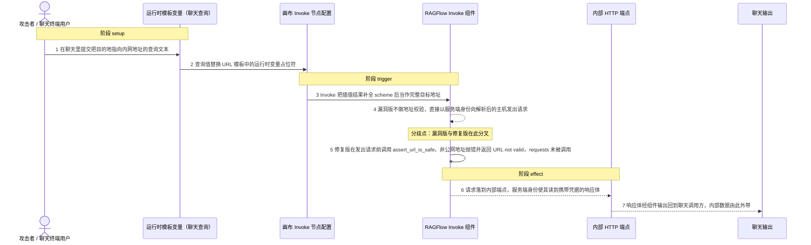
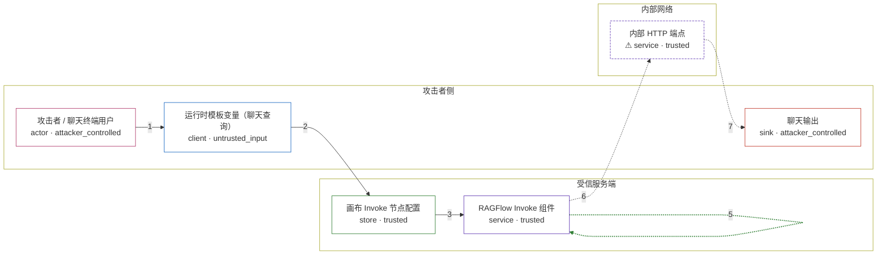

# ragflow / CVE-2026-75898

状态：草稿，未完成环境和复现。这个目录由模板生成，不构成漏洞确认。

图解的唯一来源是 `diagram.toml`：编辑后运行 `python3 -m runner diagram ragflow/CVE-2026-75898` 重新生成下方的图解区块。图解必须覆盖漏洞涉及的每个主体，并标出漏洞版/修复版的分歧步骤。

<!-- diagram:begin (generated from diagram.toml by `python3 -m runner diagram`; edit diagram.toml, not this block) -->
## 漏洞图解 — ragflow / CVE-2026-75898 漏洞图解

Invoke 组件的 _build_url 只做 URL 模板插值与补 scheme，随后 _send_request 直接把该地址交给 requests 发出，没有接入同一版本里已存在的 assert_url_is_safe 地址校验。受信的服务端因此沦为出站代理：攻击者只要让运行时变量把目的地指向 loopback、link-local 或内网地址，就能以服务端身份读到本不可达的内部端点，并把响应体带回聊天输出。

### 涉及主体

| 主体 | 类型 | 信任级别 | 在漏洞里的作用 | 来源 |
| --- | --- | --- | --- | --- |
| 攻击者 / 聊天终端用户 (`attacker`) | `actor` | `attacker_controlled` | 构造聊天查询，使流入 Invoke 的运行时变量取值为内网地址与端口，并读取回传的组件输出。 | fixtures/attack-query.json |
| 运行时模板变量（聊天查询） (`query_value`) | `client` | `untrusted_input` | 已发布 chat 的终端用户可控的查询文本；它替换 URL 模板里的运行时变量占位符，决定组件实际访问的主机与端口。 | — |
| 画布 Invoke 节点配置 (`url_template`) | `store` | `trusted` | agent 作者保存的 Endpoint 模板，例如 http://{sys.query}。模板被信任，但它把不受信的查询值直接送进目的地。 | fixtures/attack-query.json |
| RAGFlow Invoke 组件 (`invoke`) | `service` | `trusted` | 服务端出站 HTTP 组件。漏洞版 _build_url 只做模板替换与补 scheme，_send_request 直接调用 requests.*；修复版在 _build_url 内调用共享校验器 assert_url_is_safe 并禁用重定向。 | agent/component/invoke.py |
| ⚠ 内部 HTTP 端点 (`internal_service`) | `service` | `trusted` | 原本只能从服务端本机访问的内部端点，返回携带凭据的固定响应体；它是被读对象的占位，不是真实外部目标。 | — |
| 聊天输出 (`chat_reply`) | `sink` | `attacker_controlled` | 组件把取回的响应体经 _format_response 与 set_output 回给调用方，内部端点的内容最终落到攻击者手里；它是效果落点，不是被保护资源。 | — |

**信任边界**

- **攻击者侧** (`attacker_side`)：成员 `attacker`、`query_value`、`chat_reply`。攻击者只控制这次查询文本，不控制服务端网络位置，也无法直接访问内部端点；聊天输出回到攻击者会话，是内部数据由此外带的落点。
- **受信服务端** (`server_side`)：成员 `url_template`、`invoke`。RAGFlow 服务端被当作可信执行者；Invoke 本应在发出请求前对目标地址做公网白名单判定。
- **内部网络** (`internal_network`)：成员 `internal_service`。loopback 与内网地址是攻击者从外部够不着的资源，出站请求却以服务端身份到达这里。

标 ⚠ 的主体是本仓库合成的替身或无害效果载体，不代表真实外部目标。

### 触发过程

### 主体与信任边界

箭头上的数字是上面的步骤编号；方框只标主体和信任级别，具体动作见「触发过程」。

**分歧点**：第 4 步（`vulnerable_only`）漏洞版不做地址校验，直接以服务端身份向解析后的主机发出请求。
**分歧点**：第 5 步（`patched_only`）修复版在发出请求前调用 assert_url_is_safe，非公网地址抛错并返回 URL not valid，requests 未被调用。
<!-- diagram:end -->

## 公告与机制

TODO：官方公告、漏洞根因、Agent 信任边界、受影响范围和修复来源。

## 前提

TODO：认证要求、用户交互、已有批准、工具权限、攻击者能控制的内容。

## 版本与启动

TODO：补全 metadata、Dockerfile/镜像 digest 和 Compose，再写出精确启动命令。

Compose 中 `vulnerable` 与 `patched` profiles 分开使用；未指定 profile 不启动服务。镜像变量未配置时 Compose 会明确报错。此模板不暴露宿主端口，也不挂载主机数据。

## 机制复现

`reproduce.py` 在容器内 `/lab/` 运行（`python3 /lab/reproduce.py --context <context.json> --output <目录>`，超时由 `COMPONENT_EXEC_TIMEOUT` 与 `timeout_seconds` 决定）。它按 `context["variant"]` 定位镜像内固定的上游源码树，校验 `agent/component/invoke.py` 的 SHA-256 与 tag `v0.26.2`/`v0.26.3` 一致后，用真实 `agent/component/base.py` 与 `agent/component/invoke.py` 构造 `Invoke` 实例并调用其 `_invoke`；URL 拼装、地址校验、HTTP 调用与响应格式化全部来自该固定版本，没有重写漏洞函数。攻击输入取自 `fixtures/attack-query.json`（端点模板 `http://{sys.query}`，运行时变量绑定 `127.0.0.1:18293`），由容器内 loopback 端点上返回 `fixtures/attack-internal-response.txt`；正常输入取自 `fixtures/benign-query.json`。出站传输只对 loopback 目的地实际发包，其它目的地只记录后拒绝，保证实验不出网。

完成实现后使用 `python3 -m runner reproduce ragflow/CVE-2026-75898 --build --rounds 3`。
两脚本统一接受 `--context <context.json> --output <目录>`，详细字段见仓库 `docs/environment-contract.md`。
PoC 输出 `facts.json` 和效果文件；验证器只读证据，输出含 `target_ready` 及对应效果断言的 `verdict.json`。
镜像必须包含 Python 3 和 `/lab/` 下的脚本、fixtures；`runtime.mode` 选择 `oneshot` 或有 healthcheck 的 `service`。

## 端到端复现

TODO：实现 `end_to_end.py`；若不需要模型，明确写出不适用原因。真实模型的结果与机制复现分开统计。

## 验证与修复对照

TODO：实现 `verify.py`。记录漏洞版无害效果、修复版阻断和正常任务成功的证据，不能把服务启动失败当成阻断。

## 清理

默认运行器按每个测试的唯一 Compose project 清理容器、网络和 volume。
`--keep-on-failure` 保留失败项目，项目标识和 Compose 配置在结果目录中；仅清理该项目，不能使用全局 prune。

## 失败诊断

TODO：为本漏洞写出预期效果缺失、修复版仍有越界效果、正常任务失败及前提不满足时的具体排查路径。
启动失败、健康检查失败和超时都不能当作修复阻断。报告中应能定位到阶段、预期、实际和受控证据。

## 构建与输入

TODO：填写两版源码 archive、完整 commit，记录 `build.inputs` 中每个下载的 SHA-256；依赖安装必须支持禁网构建。
固定攻击和正常输入放入 `fixtures/` 并登记到 `fixtures/manifest.toml`。固定 seed、环境变量，说明无害效果与真实影响的关系。

## 隔离例外

默认无例外。确需例外时同时填写 `runtime.exceptions`、理由及最小范围，晋升由两位维护者审阅。

## 来源与许可

TODO：列出引用代码、fixtures 和镜像的来源及许可。
