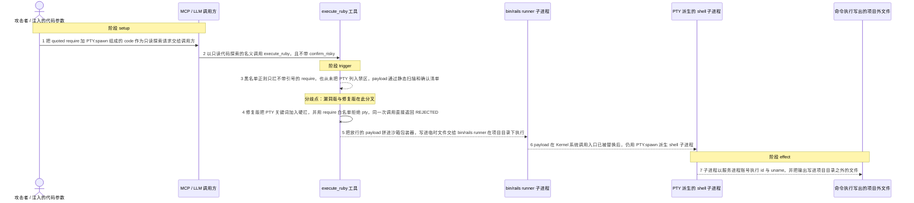
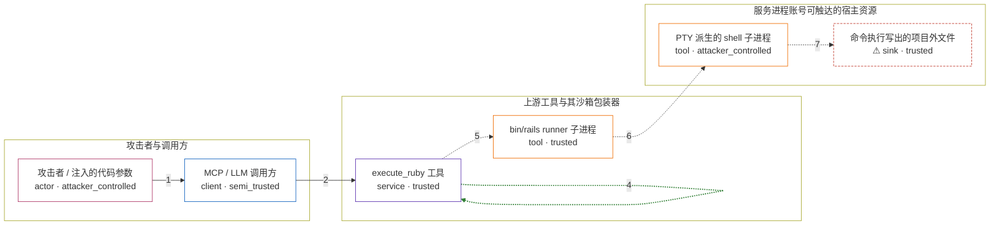

# rails-mcp-server / CVE-2026-81097

状态：草稿，未完成环境和复现。这个目录由模板生成，不构成漏洞确认。

图解的唯一来源是 `diagram.toml`：编辑后运行 `python3 -m runner diagram rails-mcp-server/CVE-2026-81097` 重新生成下方的图解区块。图解必须覆盖漏洞涉及的每个主体，并标出漏洞版/修复版的分歧步骤。

<!-- diagram:begin (generated from diagram.toml by `python3 -m runner diagram`; edit diagram.toml, not this block) -->
## 漏洞图解 — rails-mcp-server / CVE-2026-81097：execute_ruby 的 PTY 逃逸

execute_ruby 自称只读沙箱，靠正则黑名单和一层确认清单把关。黑名单里的 require 规则只拦不带引号的写法，而 PTY 从未出现在任何一道防线里；沙箱包装器替换了 Kernel#system/exec/spawn 与反引号，却拦不住走 pty 扩展自身 fork 路径的 PTY.spawn。于是攻击者可控的 code 参数以服务进程权限启动 shell 子进程，把命令执行落到项目目录之外。

### 涉及主体

| 主体 | 类型 | 信任级别 | 在漏洞里的作用 | 来源 |
| --- | --- | --- | --- | --- |
| 攻击者 / 注入的代码参数 (`attacker`) | `actor` | `attacker_controlled` | 只控制 execute_ruby 这次调用的 code 字段：用 quoted require 加 PTY.spawn 组成一段读起来像只读探索的代码，不申请 confirm_risky。 | — |
| MCP / LLM 调用方 (`mcp_client`) | `client` | `semi_trusted` | 把攻击者可控的 code 当作只读代码探索转交给 execute_ruby，不会替用户把关，也不会主动设置 confirm_risky。 | — |
| execute_ruby 工具 (`execute_ruby`) | `service` | `trusted` | 受影响的上游组件：先用 FORBIDDEN_PATTERNS 正则黑名单扫描代码，再过一遍双用途确认清单，最后把代码拼进沙箱包装器执行。 | lib/rails-mcp-server/tools/execute_ruby.rb |
| bin/rails runner 子进程 (`rails_runner`) | `tool` | `trusted` | 在项目目录下执行沙箱包装器；包装器把 Kernel#system、exec、spawn 和反引号替换成抛错方法，但整段代码仍以服务进程权限运行。 | — |
| PTY 派生的 shell 子进程 (`pty_shell`) | `tool` | `attacker_controlled` | PTY.spawn 通过 pty 扩展自己的 fork 路径启动，绕开被替换的 Kernel 系统调用入口，以服务进程账号执行攻击者给出的 shell 命令。 | — |
| ⚠ 命令执行写出的项目外文件 (`marker`) | `sink` | `trusted` | 子进程把 id 与 uname 的输出重定向到项目目录之外的文件，作为可核对的受控效果；它只是无害的命令执行载体，不是真实外部目标。 | — |

**信任边界**

- **攻击者与调用方** (`caller_side`)：成员 `attacker`、`mcp_client`。攻击者能控制的只有这次调用的 code 参数；调用方把它当只读探索转发，这不构成对宿主命令执行的授权。
- **上游工具与其沙箱包装器** (`tool_side`)：成员 `execute_ruby`、`rails_runner`。这道边界本该把不可信代码限制在只读探索内：黑名单挡住危险构造，包装器换掉 Kernel 的系统调用入口。PTY 两边都没覆盖。
- **服务进程账号可触达的宿主资源** (`host_side`)：成员 `pty_shell`、`marker`。漏洞穿透后到达的一侧：子进程继承服务进程的权限，可以在项目目录之外执行命令并写文件。

标 ⚠ 的主体是本仓库合成的替身或无害效果载体，不代表真实外部目标。

### 触发过程

### 主体与信任边界

箭头上的数字是上面的步骤编号；方框只标主体和信任级别，具体动作见「触发过程」。

**分歧点**：第 3 步（`vulnerable_only`）黑名单正则只拦不带引号的 require，也从未把 PTY 列入禁区，payload 通过静态扫描和确认清单。
**分歧点**：第 4 步（`patched_only`）修复版把 PTY 关键词加入硬拦，并用 require 白名单拒绝 pty，同一次调用直接返回 REJECTED。
<!-- diagram:end -->

## 公告与机制

TODO：官方公告、漏洞根因、Agent 信任边界、受影响范围和修复来源。

## 前提

TODO：认证要求、用户交互、已有批准、工具权限、攻击者能控制的内容。

## 版本与启动

TODO：补全 metadata、Dockerfile/镜像 digest 和 Compose，再写出精确启动命令。

Compose 中 `vulnerable` 与 `patched` profiles 分开使用；未指定 profile 不启动服务。镜像变量未配置时 Compose 会明确报错。此模板不暴露宿主端口，也不挂载主机数据。

## 机制复现

TODO：实现 `reproduce.py`，固定输入并执行真实漏洞路径，注明运行位置、参数和超时。

完成实现后使用 `python3 -m runner reproduce rails-mcp-server/CVE-2026-81097 --build --rounds 3`。
两脚本统一接受 `--context <context.json> --output <目录>`，详细字段见仓库 `docs/environment-contract.md`。
PoC 输出 `facts.json` 和效果文件；验证器只读证据，输出含 `target_ready` 及对应效果断言的 `verdict.json`。
镜像必须包含 Python 3 和 `/lab/` 下的脚本、fixtures；`runtime.mode` 选择 `oneshot` 或有 healthcheck 的 `service`。

## 端到端复现

TODO：实现 `end_to_end.py`；若不需要模型，明确写出不适用原因。真实模型的结果与机制复现分开统计。

## 验证与修复对照

TODO：实现 `verify.py`。记录漏洞版无害效果、修复版阻断和正常任务成功的证据，不能把服务启动失败当成阻断。

## 清理

默认运行器按每个测试的唯一 Compose project 清理容器、网络和 volume。
`--keep-on-failure` 保留失败项目，项目标识和 Compose 配置在结果目录中；仅清理该项目，不能使用全局 prune。

## 失败诊断

TODO：为本漏洞写出预期效果缺失、修复版仍有越界效果、正常任务失败及前提不满足时的具体排查路径。
启动失败、健康检查失败和超时都不能当作修复阻断。报告中应能定位到阶段、预期、实际和受控证据。

## 构建与输入

TODO：填写两版源码 archive、完整 commit，记录 `build.inputs` 中每个下载的 SHA-256；依赖安装必须支持禁网构建。
固定攻击和正常输入放入 `fixtures/` 并登记到 `fixtures/manifest.toml`。固定 seed、环境变量，说明无害效果与真实影响的关系。

## 隔离例外

默认无例外。确需例外时同时填写 `runtime.exceptions`、理由及最小范围，晋升由两位维护者审阅。

## 来源与许可

TODO：列出引用代码、fixtures 和镜像的来源及许可。
