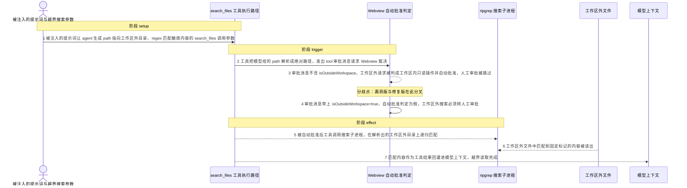
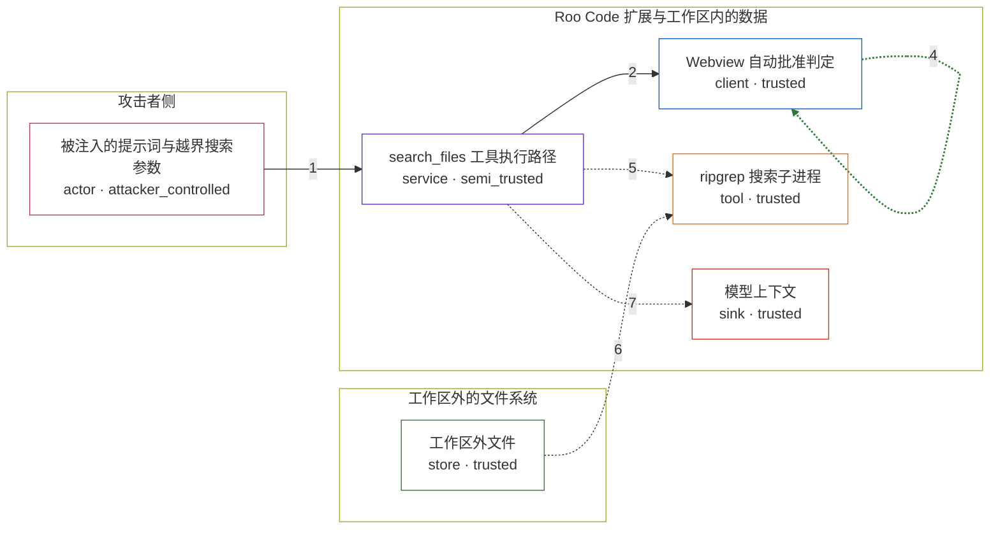

# roo-code / CVE-2025-53097

状态：草稿，未完成环境和复现。这个目录由模板生成，不构成漏洞确认。

图解的唯一来源是 `diagram.toml`：编辑后运行 `python3 -m runner diagram roo-code/CVE-2025-53097` 重新生成下方的图解区块。图解必须覆盖漏洞涉及的每个主体，并标出漏洞版/修复版的分歧步骤。

<!-- diagram:begin (generated from diagram.toml by `python3 -m runner diagram`; edit diagram.toml, not this block) -->
## 漏洞图解 — roo-code / CVE-2025-53097 漏洞图解

Roo Code 的 search_files 工具在构建发往 Webview 的审批消息时没有写入「目标路径在工作区之外」这一事实，Webview 的自动批准判定因此把工作区外只读操作当成工作区内操作，只要自动批准只读已开启，越界搜索就被静默批准。修复版把 isOutsideWorkspace 写进同一条消息，使 alwaysAllowReadOnlyOutsideWorkspace（默认关闭）重新成为闸门，工作区外搜索必须转人工审批。边界一旦失效，工作区外文件内容就会回到模型上下文，提示注入随后可以把这些内容拼进 JSON 的 $schema 让编辑器默认拉取外带。

### 涉及主体

| 主体 | 类型 | 信任级别 | 在漏洞里的作用 | 来源 |
| --- | --- | --- | --- | --- |
| 被注入的提示词与越界搜索参数 (`attacker`) | `actor` | `attacker_controlled` | 借仓库文件、issue 或工具返回值把提示词注入 agent 上下文，使模型产出 path 指向工作区外的 search_files 调用参数；它只控制这次调用的参数，不能直接读工作区外的文件。 | fixtures/attack.json |
| search_files 工具执行路径 (`agent`) | `service` | `semi_trusted` | Roo Code 扩展宿主里的 search_files 工具：把模型给的 path 解析成绝对路径，构建发往 Webview 的 tool 审批消息，获批后再调用 ripgrep。漏洞版在这里漏报了目标是否在工作区外。 | src/core/tools/searchFilesTool.ts |
| Webview 自动批准判定 (`approval_ui`) | `client` | `trusted` | 消费审批消息的自动批准判定：isReadOnlyToolAction 命中后按 alwaysAllowReadOnly && (!isOutsideWorkspace // alwaysAllowReadOnlyOutsideWorkspace) 决定是否跳过人工审批；isOutsideWorkspace 是这条消息上唯一的「是否在工作区外」信号。 | webview-ui/src/components/chat/ChatView.tsx |
| ripgrep 搜索子进程 (`ripgrep`) | `tool` | `trusted` | search_files 真正调用的搜索子进程，在解析出的目录上递归匹配正则并返回匹配行与上下文。 | src/services/ripgrep/index.ts |
| 工作区外文件 (`outside_files`) | `store` | `trusted` | 攻击者想要但够不着的工作区外文件；其中的固定标记代表敏感内容。工作区外只读操作未获授权时，这些文件本不该进入模型上下文。 | fixtures/outside/secrets/credentials.json |
| 模型上下文 (`model_context`) | `sink` | `trusted` | 工具结果回灌进模型上下文的位置；工作区外内容一旦到这里，攻击者就拿到了它本来读不到的数据，并可在后续把它写进 JSON 的 $schema 触发外连。 | — |

**信任边界**

- **攻击者侧** (`attacker_side`)：成员 `attacker`。攻击者只能影响进入 agent 上下文的文本，以及由此产生的本次工具调用参数；它既碰不到工作区外文件，也读不到工具结果，必须借 agent 的手。
- **Roo Code 扩展与工作区内的数据** (`product`)：成员 `agent`、`approval_ui`、`ripgrep`、`model_context`。扩展宿主、审批判定、搜索子进程和模型上下文都在可信侧。边界要求工作区外的只读操作只有在 alwaysAllowReadOnlyOutsideWorkspace 打开时才可自动批准，漏洞让这条消息不再携带该判定所需的信号。
- **工作区外的文件系统** (`workspace_outside`)：成员 `outside_files`。工作区目录之外的文件系统，只有显式授权的工作区外操作才应被读出；漏洞版把它当成工作区内路径上报，使这道边界失效。

### 触发过程

### 主体与信任边界

箭头上的数字是上面的步骤编号；方框只标主体和信任级别，具体动作见「触发过程」。

**分歧点**：第 3 步（`vulnerable_only`）审批消息不含 isOutsideWorkspace，工作区外请求被判成工作区内只读操作并自动批准，人工审批被跳过。
**分歧点**：第 4 步（`patched_only`）审批消息带上 isOutsideWorkspace=true，自动批准判定为假，工作区外搜索必须转人工审批。
<!-- diagram:end -->

## 公告与机制

TODO：官方公告、漏洞根因、Agent 信任边界、受影响范围和修复来源。

## 前提

TODO：认证要求、用户交互、已有批准、工具权限、攻击者能控制的内容。

## 版本与启动

TODO：补全 metadata、Dockerfile/镜像 digest 和 Compose，再写出精确启动命令。

Compose 中 `vulnerable` 与 `patched` profiles 分开使用；未指定 profile 不启动服务。镜像变量未配置时 Compose 会明确报错。此模板不暴露宿主端口，也不挂载主机数据。

## 机制复现

TODO：实现 `reproduce.py`，固定输入并执行真实漏洞路径，注明运行位置、参数和超时。

完成实现后使用 `python3 -m runner reproduce roo-code/CVE-2025-53097 --build --rounds 3`。
两脚本统一接受 `--context <context.json> --output <目录>`，详细字段见仓库 `docs/environment-contract.md`。
PoC 输出 `facts.json` 和效果文件；验证器只读证据，输出含 `target_ready` 及对应效果断言的 `verdict.json`。
镜像必须包含 Python 3 和 `/lab/` 下的脚本、fixtures；`runtime.mode` 选择 `oneshot` 或有 healthcheck 的 `service`。

## 端到端复现

TODO：实现 `end_to_end.py`；若不需要模型，明确写出不适用原因。真实模型的结果与机制复现分开统计。

## 验证与修复对照

TODO：实现 `verify.py`。记录漏洞版无害效果、修复版阻断和正常任务成功的证据，不能把服务启动失败当成阻断。

## 清理

默认运行器按每个测试的唯一 Compose project 清理容器、网络和 volume。
`--keep-on-failure` 保留失败项目，项目标识和 Compose 配置在结果目录中；仅清理该项目，不能使用全局 prune。

## 失败诊断

TODO：为本漏洞写出预期效果缺失、修复版仍有越界效果、正常任务失败及前提不满足时的具体排查路径。
启动失败、健康检查失败和超时都不能当作修复阻断。报告中应能定位到阶段、预期、实际和受控证据。

## 构建与输入

TODO：填写两版源码 archive、完整 commit，记录 `build.inputs` 中每个下载的 SHA-256；依赖安装必须支持禁网构建。
固定攻击和正常输入放入 `fixtures/` 并登记到 `fixtures/manifest.toml`。固定 seed、环境变量，说明无害效果与真实影响的关系。

## 隔离例外

默认无例外。确需例外时同时填写 `runtime.exceptions`、理由及最小范围，晋升由两位维护者审阅。

## 来源与许可

TODO：列出引用代码、fixtures 和镜像的来源及许可。
