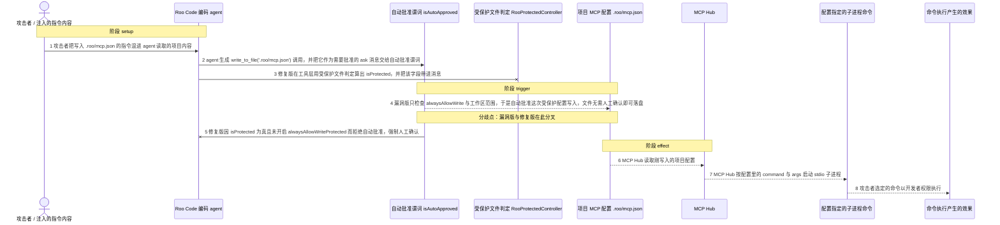

# roo-code / CVE-2025-53098

状态：草稿，未完成环境和复现。这个目录由模板生成，不构成漏洞确认。

图解的唯一来源是 `diagram.toml`：编辑后运行 `python3 -m runner diagram roo-code/CVE-2025-53098` 重新生成下方的图解区块。图解必须覆盖漏洞涉及的每个主体，并标出漏洞版/修复版的分歧步骤。

<!-- diagram:begin (generated from diagram.toml by `python3 -m runner diagram`; edit diagram.toml, not this block) -->
## 漏洞图解 — roo-code / CVE-2025-53098 漏洞图解

Roo Code 的自动批准谓词只按 alwaysAllowWrite 与工作区范围判断写入，不区分普通文件与 Roo 自身的配置文件。攻击者用注入的指令让 agent 写入工作区内的项目 MCP 配置 .roo/mcp.json，漏洞版会不加确认地自动批准，MCP Hub 随后按配置里的 command 启动子进程，形成任意命令执行。修复版新增受保护文件判定与独立的 alwaysAllowWriteProtected 开关，使同一写入必须经人工确认。

### 涉及主体

| 主体 | 类型 | 信任级别 | 在漏洞里的作用 | 来源 |
| --- | --- | --- | --- | --- |
| 攻击者 / 注入的指令内容 (`attacker_instruction`) | `actor` | `attacker_controlled` | 攻击者只能控制提交给编码 agent 的指令内容，用它触发一次对 .roo/mcp.json 的写入；它拿不到开发机的文件系统，也不能自己执行命令。 | fixtures/attack_input.json |
| Roo Code 编码 agent (`agent`) | `client` | `semi_trusted` | 把攻击者可控的指令变成 write_to_file 工具调用，并组装交给 webview 的 ask 消息；修复版还会用受保护文件判定给该消息带上 isProtected。 | src/core/tools/writeToFileTool.ts |
| 自动批准谓词 isAutoApproved (`auto_approval_gate`) | `service` | `trusted` | 决定一次工具调用是否需要人工确认。漏洞版对写入只检查 alwaysAllowWrite 与是否在工作区内，因此对受保护的 .roo/mcp.json 也返回自动批准。 | webview-ui/src/components/chat/ChatView.tsx |
| 受保护文件判定 RooProtectedController (`protected_controller`) | `service` | `trusted` | 修复新增的一层判定：按 .rooignore、.roomodes、.roorules*、.clinerules*、.roo/** 等模式把 .roo/mcp.json 判为写保护，让自动批准必须再检查 alwaysAllowWriteProtected。 | src/core/protect/RooProtectedController.ts |
| 项目 MCP 配置 .roo/mcp.json (`project_mcp_config`) | `store` | `trusted` | 工作区内的项目级 MCP 配置，schema 允许为 stdio 服务器指定任意 command；它是攻击者要写入的目标，也是命令执行的输入。 | fixtures/attack_input.json |
| MCP Hub (`mcp_hub`) | `service` | `trusted` | 读取工作区的 .roo/mcp.json，并为每个 stdio 服务器创建 StdioClientTransport，把配置里的 command 和 args 交给子进程。 | src/services/mcp/McpHub.ts |
| 配置指定的子进程命令 (`spawned_command`) | `tool` | `attacker_controlled` | 攻击者在 MCP 配置里选定的 command 与 args，被 MCP Hub 以开发者权限启动。 | fixtures/attack_input.json |
| ⚠ 命令执行产生的效果 (`rce_effect`) | `sink` | `trusted` | 自动批准的写入最终变成一次命令执行。落点用无害标记命令写出的文件表示，它不代表真实的外部目标。 | — |

**信任边界**

- **攻击者侧** (`attacker_side`)：成员 `attacker_instruction`。攻击者只能提交指令内容，并选择写进配置的命令字符串；它拿不到开发机文件，也不能直接启动进程。
- **工作区与扩展宿主** (`product_side`)：成员 `agent`、`auto_approval_gate`、`protected_controller`、`project_mcp_config`、`mcp_hub`、`spawned_command`、`rce_effect`。这道边界本应保证：写入 Roo 自身的受保护配置文件必须经过人工确认。漏洞让工作区内普通写入的自动批准直接适用于 .roo/mcp.json，配置里攻击者选定的命令随即被启动。

标 ⚠ 的主体是本仓库合成的替身或无害效果载体，不代表真实外部目标。

### 触发过程

### 主体与信任边界

箭头上的数字是上面的步骤编号；方框只标主体和信任级别，具体动作见「触发过程」。

```mermaid
%% roo-code / CVE-2025-53098 漏洞图解 — generated from diagram.toml
flowchart LR
  subgraph attacker_side["攻击者侧"]
    attacker_instruction["攻击者 / 注入的指令内容<br/>actor · attacker_controlled"]
  end
  subgraph product_side["工作区与扩展宿主"]
    agent["Roo Code 编码 agent<br/>client · semi_trusted"]
    auto_approval_gate["自动批准谓词 isAutoApproved<br/>service · trusted"]
    protected_controller["受保护文件判定 RooProtectedController<br/>service · trusted"]
    project_mcp_config["项目 MCP 配置 .roo/mcp.json<br/>store · trusted"]
    mcp_hub["MCP Hub<br/>service · trusted"]
    spawned_command["配置指定的子进程命令<br/>tool · attacker_controlled"]
    rce_effect["命令执行产生的效果<br/>⚠ sink · trusted"]
  end
  attacker_instruction -->|"1"| agent
  agent -->|"2"| auto_approval_gate
  agent -.->|"3"| protected_controller
  auto_approval_gate -.->|"4"| project_mcp_config
  auto_approval_gate -.->|"5"| agent
  project_mcp_config -.->|"6"| mcp_hub
  mcp_hub -.->|"7"| spawned_command
  spawned_command -.->|"8"| rce_effect
  classDef actor fill:transparent,stroke:#b03a6a
  classDef client fill:transparent,stroke:#1565c0
  classDef service fill:transparent,stroke:#5e35b1
  classDef tool fill:transparent,stroke:#ef6c00
  classDef sink fill:transparent,stroke:#c0392b
  classDef store fill:transparent,stroke:#2e7d32
  classDef synthetic stroke-dasharray: 4 2
  class attacker_instruction actor
  class agent client
  class auto_approval_gate service
  class protected_controller service
  class project_mcp_config store
  class mcp_hub service
  class spawned_command tool
  class rce_effect sink
  class rce_effect synthetic
  style attacker_side fill:transparent
  style product_side fill:transparent
  linkStyle 2 stroke:#2e7d32,stroke-width:2px
  linkStyle 3 stroke:#c0392b,stroke-width:2px
  linkStyle 4 stroke:#2e7d32,stroke-width:2px
```

**分歧点**：第 4 步（`vulnerable_only`）漏洞版只检查 alwaysAllowWrite 与工作区范围，于是自动批准这次受保护配置写入，文件无需人工确认即可落盘。
**分歧点**：第 5 步（`patched_only`）修复版因 isProtected 为真且未开启 alwaysAllowWriteProtected 而拒绝自动批准，强制人工确认。
<!-- diagram:end -->

## 公告与机制

TODO：官方公告、漏洞根因、Agent 信任边界、受影响范围和修复来源。

## 前提

TODO：认证要求、用户交互、已有批准、工具权限、攻击者能控制的内容。

## 版本与启动

TODO：补全 metadata、Dockerfile/镜像 digest 和 Compose，再写出精确启动命令。

Compose 中 `vulnerable` 与 `patched` profiles 分开使用；未指定 profile 不启动服务。镜像变量未配置时 Compose 会明确报错。此模板不暴露宿主端口，也不挂载主机数据。

## 机制复现

TODO：实现 `reproduce.py`，固定输入并执行真实漏洞路径，注明运行位置、参数和超时。

完成实现后使用 `python3 -m runner reproduce roo-code/CVE-2025-53098 --build --rounds 3`。
两脚本统一接受 `--context <context.json> --output <目录>`，详细字段见仓库 `docs/environment-contract.md`。
PoC 输出 `facts.json` 和效果文件；验证器只读证据，输出含 `target_ready` 及对应效果断言的 `verdict.json`。
镜像必须包含 Python 3 和 `/lab/` 下的脚本、fixtures；`runtime.mode` 选择 `oneshot` 或有 healthcheck 的 `service`。

## 端到端复现

TODO：实现 `end_to_end.py`；若不需要模型，明确写出不适用原因。真实模型的结果与机制复现分开统计。

## 验证与修复对照

TODO：实现 `verify.py`。记录漏洞版无害效果、修复版阻断和正常任务成功的证据，不能把服务启动失败当成阻断。

## 清理

默认运行器按每个测试的唯一 Compose project 清理容器、网络和 volume。
`--keep-on-failure` 保留失败项目，项目标识和 Compose 配置在结果目录中；仅清理该项目，不能使用全局 prune。

## 失败诊断

TODO：为本漏洞写出预期效果缺失、修复版仍有越界效果、正常任务失败及前提不满足时的具体排查路径。
启动失败、健康检查失败和超时都不能当作修复阻断。报告中应能定位到阶段、预期、实际和受控证据。

## 构建与输入

TODO：填写两版源码 archive、完整 commit，记录 `build.inputs` 中每个下载的 SHA-256；依赖安装必须支持禁网构建。
固定攻击和正常输入放入 `fixtures/` 并登记到 `fixtures/manifest.toml`。固定 seed、环境变量，说明无害效果与真实影响的关系。

## 隔离例外

默认无例外。确需例外时同时填写 `runtime.exceptions`、理由及最小范围，晋升由两位维护者审阅。

## 来源与许可

TODO：列出引用代码、fixtures 和镜像的来源及许可。
