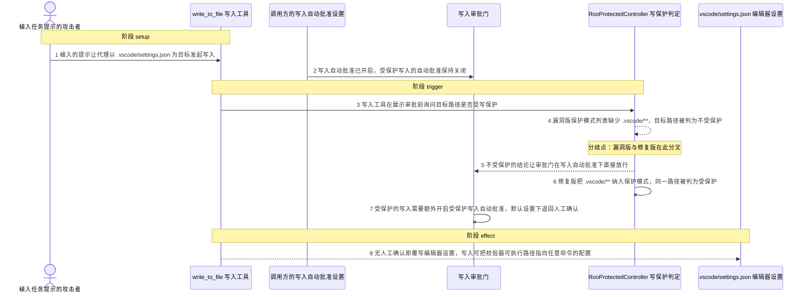
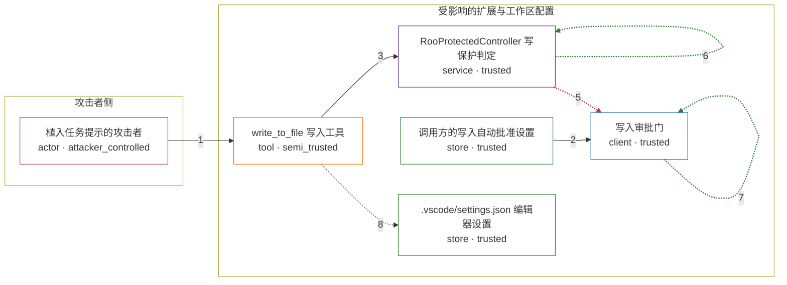

# roo-code / CVE-2025-53536

状态：草稿，未完成环境和复现。这个目录由模板生成，不构成漏洞确认。

图解的唯一来源是 `diagram.toml`：编辑后运行 `python3 -m runner diagram roo-code/CVE-2025-53536` 重新生成下方的图解区块。图解必须覆盖漏洞涉及的每个主体，并标出漏洞版/修复版的分歧步骤。

<!-- diagram:begin (generated from diagram.toml by `python3 -m runner diagram`; edit diagram.toml, not this block) -->
## 漏洞图解 — roo-code / CVE-2025-53536 写入保护绕过

Roo Code 用一份静态模式列表决定哪些路径即使开启 Write 自动批准也必须人工确认。3.22.5 的列表缺少 .vscode/**，被提示注入的代理于是把 .vscode/settings.json 当成普通工作区文件，在自动批准下被静默覆写；攻击者可借此把编辑器校验器的可执行路径指向任意命令，形成潜在远程代码执行。修复版把 .vscode/** 纳入保护模式，同一次写入因此退回人工确认。

### 涉及主体

| 主体 | 类型 | 信任级别 | 在漏洞里的作用 | 来源 |
| --- | --- | --- | --- | --- |
| 植入任务提示的攻击者 (`attacker`) | `actor` | `attacker_controlled` | 在仓库内容或对话里植入提示，诱导代理把 .vscode/settings.json 选为写入目标。它只影响这一次写入请求的路径与内容，既改不了写保护模式列表，也没有直接写该文件的权限。 | fixtures/attack.json |
| write_to_file 写入工具 (`write_tool`) | `tool` | `semi_trusted` | 把模型给出的相对路径与内容带进受信的写入流程，并在展示审批前向写入保护判定询问该路径是否受保护。 | — |
| 调用方的写入自动批准设置 (`policy`) | `store` | `trusted` | 漏洞前提：写入自动批准已开启，受保护写入的自动批准保持默认关闭。它不参与路径判定，只决定审批门拿到保护结论后是否放行。 | fixtures/policy.json |
| 写入审批门 (`gate`) | `client` | `trusted` | 综合写入自动批准设置与写入工具送来的受保护标记，决定是直接批准写入，还是转人工确认。 | — |
| RooProtectedController 写保护判定 (`controller`) | `service` | `trusted` | 用一份静态模式列表判定目标路径是否属于必须人工确认的敏感配置。它是这条链上唯一失效的检查，也是修复提交 3993406 改动的唯一一处。 | fixtures/upstream-provenance.json |
| .vscode/settings.json 编辑器设置 (`settings`) | `store` | `trusted` | 攻击者想覆写却够不着的敏感配置文件。被静默写入后，其中的校验器可执行路径配置足以让编辑器在打开文件时启动任意命令。 | — |

**信任边界**

- **攻击者侧** (`attacker_side`)：成员 `attacker`。攻击者只控制这次写入请求的目标路径与内容；写保护模式列表、审批门和该文件的实际写权限都在它够不着的一侧。
- **受影响的扩展与工作区配置** (`extension`)：成员 `write_tool`、`policy`、`gate`、`controller`、`settings`。写保护判定与审批门共同保证敏感配置只在人工确认后被改写。漏洞版遗漏 .vscode/**，使这道边界对编辑器设置整体失效。

### 触发过程

### 主体与信任边界

箭头上的数字是上面的步骤编号；方框只标主体和信任级别，具体动作见「触发过程」。

**分歧点**：第 4 步（`vulnerable_only`）漏洞版保护模式列表缺少 .vscode/**，目标路径被判为不受保护。
**分歧点**：第 5 步（`vulnerable_only`）不受保护的结论让审批门在写入自动批准下直接放行。
**分歧点**：第 6 步（`patched_only`）修复版把 .vscode/** 纳入保护模式，同一路径被判为受保护。
**分歧点**：第 7 步（`patched_only`）受保护的写入需要额外开启受保护写入自动批准，默认设置下退回人工确认。
<!-- diagram:end -->

## 公告与机制

TODO：官方公告、漏洞根因、Agent 信任边界、受影响范围和修复来源。

## 前提

TODO：认证要求、用户交互、已有批准、工具权限、攻击者能控制的内容。

## 版本与启动

TODO：补全 metadata、Dockerfile/镜像 digest 和 Compose，再写出精确启动命令。

Compose 中 `vulnerable` 与 `patched` profiles 分开使用；未指定 profile 不启动服务。镜像变量未配置时 Compose 会明确报错。此模板不暴露宿主端口，也不挂载主机数据。

## 机制复现

TODO：实现 `reproduce.py`，固定输入并执行真实漏洞路径，注明运行位置、参数和超时。

完成实现后使用 `python3 -m runner reproduce roo-code/CVE-2025-53536 --build --rounds 3`。
两脚本统一接受 `--context <context.json> --output <目录>`，详细字段见仓库 `docs/environment-contract.md`。
PoC 输出 `facts.json` 和效果文件；验证器只读证据，输出含 `target_ready` 及对应效果断言的 `verdict.json`。
镜像必须包含 Python 3 和 `/lab/` 下的脚本、fixtures；`runtime.mode` 选择 `oneshot` 或有 healthcheck 的 `service`。

## 端到端复现

TODO：实现 `end_to_end.py`；若不需要模型，明确写出不适用原因。真实模型的结果与机制复现分开统计。

## 验证与修复对照

TODO：实现 `verify.py`。记录漏洞版无害效果、修复版阻断和正常任务成功的证据，不能把服务启动失败当成阻断。

## 清理

默认运行器按每个测试的唯一 Compose project 清理容器、网络和 volume。
`--keep-on-failure` 保留失败项目，项目标识和 Compose 配置在结果目录中；仅清理该项目，不能使用全局 prune。

## 失败诊断

TODO：为本漏洞写出预期效果缺失、修复版仍有越界效果、正常任务失败及前提不满足时的具体排查路径。
启动失败、健康检查失败和超时都不能当作修复阻断。报告中应能定位到阶段、预期、实际和受控证据。

## 构建与输入

TODO：填写两版源码 archive、完整 commit，记录 `build.inputs` 中每个下载的 SHA-256；依赖安装必须支持禁网构建。
固定攻击和正常输入放入 `fixtures/` 并登记到 `fixtures/manifest.toml`。固定 seed、环境变量，说明无害效果与真实影响的关系。

## 隔离例外

默认无例外。确需例外时同时填写 `runtime.exceptions`、理由及最小范围，晋升由两位维护者审阅。

## 来源与许可

TODO：列出引用代码、fixtures 和镜像的来源及许可。
