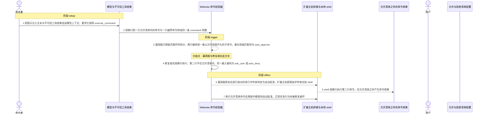
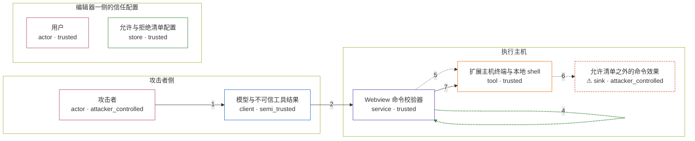

# roo-code / CVE-2025-54377

状态：草稿，未完成环境和复现。这个目录由模板生成，不构成漏洞确认。

图解的唯一来源是 `diagram.toml`：编辑后运行 `python3 -m runner diagram roo-code/CVE-2025-54377` 重新生成下方的图解区块。图解必须覆盖漏洞涉及的每个主体，并标出漏洞版/修复版的分歧步骤。

<!-- diagram:begin (generated from diagram.toml by `python3 -m runner diagram`; edit diagram.toml, not this block) -->
## 漏洞图解 — roo-code / CVE-2025-54377 漏洞图解

Roo Code 的 execute_command 在自动批准开启时，由 Webview 的命令校验器代替用户判断命令能否执行。 校验器用 shell-quote 把命令拆成子命令后做允许/拒绝最长前缀匹配，但它只认 &&、||、;、| 四种 链式操作符，不把换行当作分隔符，而 shell-quote 又把换行当普通空白，于是两行命令被拼成一条以 允许前缀开头的子命令。扩展主机把原始字符串交给 shell 执行时换行却是真正的命令分隔符，第二行 命令便在允许清单之外被静默执行，允许/拒绝边界被绕过。

### 涉及主体

| 主体 | 类型 | 信任级别 | 在漏洞里的作用 | 来源 |
| --- | --- | --- | --- | --- |
| 攻击者 (`attacker`) | `actor` | `attacker_controlled` | 攻击者只能控制进入 execute_command 的 command 字符串：它把一行允许清单内的命令与一行越界命令用 换行拼成同一次工具调用的参数。它拿不到用户允许清单，也不能直接操作本机 shell，因此必须借校验器 的粒度差异把第二行送进 shell。 | — |
| 模型与不可信工具结果 (`model`) | `client` | `semi_trusted` | 模型按提示与工具结果生成 execute_command 的 command 参数，是攻击者文本抵达工具调用的通道。 它本身是受信链路的调用方，但会把不可信内容原样带进受信流程，因此只是半可信。 | — |
| 用户 (`user`) | `actor` | `trusted` | 用户配置允许清单与拒绝清单并开启 alwaysAllowExecute，让校验器的自动判定取代每一次人工批准； 漏洞的前提正是这份信任被静默扩展到了校验器没有逐行看过的第二行命令。 | — |
| 允许与拒绝清单配置 (`allow_list`) | `store` | `trusted` | 用户维护的允许前缀、拒绝前缀与 alwaysAllowExecute 开关。它是判定命令能否自动执行的唯一依据， 漏洞版把它作用在整条多行字符串上而不是每一行上。 | — |
| Webview 命令校验器 (`validator`) | `service` | `trusted` | webview-ui/src/utils/command-validation.ts 的 getCommandDecision：先按链式操作符拆分子命令， 再对每条子命令取允许/拒绝清单的最长前缀匹配并给出 auto_approve / auto_deny / ask_user。它只认 &&、//、;、/，不认换行，所以多行输入被当成一条子命令，允许清单的前缀匹配通过了它。 | — |
| 扩展主机终端与本地 shell (`shell`) | `tool` | `trusted` | execute_command 获批后由扩展主机终端把命令字符串原样交给本机 shell。shell 按真实语法把换行视为 命令分隔符，于是第二行成为独立命令，在校验器判定为 auto_approve 之后被直接执行。 | — |
| ⚠ 允许清单之外的命令效果 (`marker`) | `sink` | `attacker_controlled` | 越界命令的受控落点：在受控目录里生成一个标记文件，用来证明第二行命令确实被执行。它只代表效果 方向，不是真实的外部目标。 | — |

**信任边界**

- **攻击者侧** (`attacker_side`)：成员 `attacker`、`model`。攻击者能控制的只有喂给模型、最终进入 execute_command 的文本；它看不到用户的允许与拒绝清单， 也不能直接读写执行主机上的文件。
- **编辑器一侧的信任配置** (`editor`)：成员 `user`、`allow_list`。允许与拒绝清单和 alwaysAllowExecute 表达用户愿意自动放行的命令范围，是校验器自动判定的依据。
- **执行主机** (`execution`)：成员 `validator`、`shell`、`marker`。这道边界本应保证只有允许清单内的命令被自动执行：校验器按子命令逐个判定，shell 按真实语法逐条 执行。两者的拆分粒度不一致时，边界就不再约束实际执行的那条命令。

标 ⚠ 的主体是本仓库合成的替身或无害效果载体，不代表真实外部目标。

### 触发过程

### 主体与信任边界

箭头上的数字是上面的步骤编号；方框只标主体和信任级别，具体动作见「触发过程」。

**分歧点**：第 3 步（`vulnerable_only`）漏洞版只按链式操作符拆分，两行被拼成一条以允许前缀开头的子命令，最长前缀匹配判为 auto_approve。
**分歧点**：第 4 步（`patched_only`）修复版先按换行拆行，第二行不在允许清单内，同一输入被判为 ask_user 或 auto_deny。
<!-- diagram:end -->

## 公告与机制

TODO：官方公告、漏洞根因、Agent 信任边界、受影响范围和修复来源。

## 前提

TODO：认证要求、用户交互、已有批准、工具权限、攻击者能控制的内容。

## 版本与启动

TODO：补全 metadata、Dockerfile/镜像 digest 和 Compose，再写出精确启动命令。

Compose 中 `vulnerable` 与 `patched` profiles 分开使用；未指定 profile 不启动服务。镜像变量未配置时 Compose 会明确报错。此模板不暴露宿主端口，也不挂载主机数据。

## 机制复现

TODO：实现 `reproduce.py`，固定输入并执行真实漏洞路径，注明运行位置、参数和超时。

完成实现后使用 `python3 -m runner reproduce roo-code/CVE-2025-54377 --build --rounds 3`。
两脚本统一接受 `--context <context.json> --output <目录>`，详细字段见仓库 `docs/environment-contract.md`。
PoC 输出 `facts.json` 和效果文件；验证器只读证据，输出含 `target_ready` 及对应效果断言的 `verdict.json`。
镜像必须包含 Python 3 和 `/lab/` 下的脚本、fixtures；`runtime.mode` 选择 `oneshot` 或有 healthcheck 的 `service`。

## 端到端复现

TODO：实现 `end_to_end.py`；若不需要模型，明确写出不适用原因。真实模型的结果与机制复现分开统计。

## 验证与修复对照

TODO：实现 `verify.py`。记录漏洞版无害效果、修复版阻断和正常任务成功的证据，不能把服务启动失败当成阻断。

## 清理

默认运行器按每个测试的唯一 Compose project 清理容器、网络和 volume。
`--keep-on-failure` 保留失败项目，项目标识和 Compose 配置在结果目录中；仅清理该项目，不能使用全局 prune。

## 失败诊断

TODO：为本漏洞写出预期效果缺失、修复版仍有越界效果、正常任务失败及前提不满足时的具体排查路径。
启动失败、健康检查失败和超时都不能当作修复阻断。报告中应能定位到阶段、预期、实际和受控证据。

## 构建与输入

TODO：填写两版源码 archive、完整 commit，记录 `build.inputs` 中每个下载的 SHA-256；依赖安装必须支持禁网构建。
固定攻击和正常输入放入 `fixtures/` 并登记到 `fixtures/manifest.toml`。固定 seed、环境变量，说明无害效果与真实影响的关系。

## 隔离例外

默认无例外。确需例外时同时填写 `runtime.exceptions`、理由及最小范围，晋升由两位维护者审阅。

## 来源与许可

TODO：列出引用代码、fixtures 和镜像的来源及许可。
