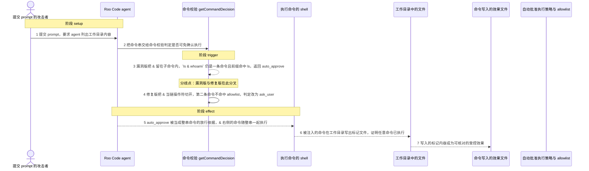
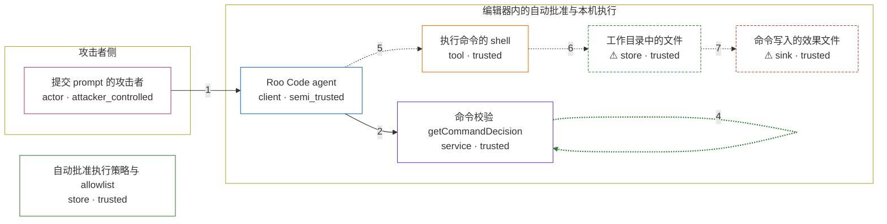

# roo-code / CVE-2025-57771

状态：草稿，未完成环境和复现。这个目录由模板生成，不构成漏洞确认。

图解的唯一来源是 `diagram.toml`：编辑后运行 `python3 -m runner diagram roo-code/CVE-2025-57771` 重新生成下方的图解区块。图解必须覆盖漏洞涉及的每个主体，并标出漏洞版/修复版的分歧步骤。

<!-- diagram:begin (generated from diagram.toml by `python3 -m runner diagram`; edit diagram.toml, not this block) -->
## 漏洞图解 — roo-code / CVE-2025-57771 自动批准命令的链切分缺陷

Roo Code 在决定是否免确认执行 agent 生成的 shell 命令时，用 shell-quote 把命令串切成子命令，但链操作符白名单只有 &&、||、;、|，漏掉了单个 &。于是 `ls & whoami` 被当成一条命令，前缀匹配命中 allowlist 里的 `ls` 后返回 auto_approve；随后 shell 把 & 解释成命令分隔符，被前缀掩盖的第二条命令也一起执行。修复版把 & 也当作链操作符切开，第二条命令不再命中 allowlist，判定从 auto_approve 变成 ask_user，自动批准这道边界因此挡住注入。

### 涉及主体

| 主体 | 类型 | 信任级别 | 在漏洞里的作用 | 来源 |
| --- | --- | --- | --- | --- |
| 提交 prompt 的攻击者 (`attacker`) | `actor` | `attacker_controlled` | 向编辑器里的 agent 提交一段 prompt，使 agent 生成的命令以被允许前缀开头、后面用单个 & 接上任意命令；攻击者能控制的只有这段输入文本。 | — |
| Roo Code agent (`agent`) | `client` | `semi_trusted` | 把 prompt 变成待执行的 shell 命令串，并在执行前调用命令校验；它自己不判断串里的链操作符，只把判定结果交给自动批准策略。 | — |
| 命令校验 getCommandDecision (`validator`) | `service` | `trusted` | 上游 webview-ui/src/utils/command-validation.ts 里的纯函数：先 parseCommand 切分子命令，再对每条子命令做 allowlist/denylist 前缀匹配并汇总判定。单个 & 不在切分白名单里，整串被当成一条命令。 | — |
| 自动批准执行策略与 allowlist (`policy`) | `store` | `trusted` | 漏洞前提：用户显式开启 auto-approve execute，并在 allowlist 里留下可被前缀命中的命令（如 ls）。默认关闭，它不是攻击者的动作，而是这条链得以成立的环境条件。 | — |
| 执行命令的 shell (`shell`) | `tool` | `trusted` | 收到 auto_approve 后执行整条命令串；shell 自己把 & 解释成命令分隔符，因此校验通过的那条串里其实还带着第二条命令。 | — |
| ⚠ 工作目录中的文件 (`workdir`) | `store` | `trusted` | 被执行的命令真正读写的落点。图中用一个写入工作目录的效果文件表示命令已经执行，写入的只是固定标记内容，不是真实外部目标。 | — |
| ⚠ 命令写入的效果文件 (`effect_file`) | `sink` | `trusted` | auto_approve 之后 & 右侧命令执行所产生、可被独立核对的受控效果。 | — |

**信任边界**

- **攻击者侧** (`attacker_side`)：成员 `attacker`。攻击者只能提交 prompt 文本，既不能替 agent 选择命令，也不能改 allowlist 或自动批准开关。
- **编辑器内的自动批准与本机执行** (`product`)：成员 `agent`、`validator`、`shell`、`workdir`、`effect_file`。自动批准策略本来保证：只有整条命令都命中 allowlist 才免确认执行。命令校验把 & 留在同一条命令里，前缀匹配因此命中了 ls，这道保证失效，shell 随后执行了串里真正的第二条命令。
- 未列入上述边界：`policy`。

标 ⚠ 的主体是本仓库合成的替身或无害效果载体，不代表真实外部目标。

### 触发过程

### 主体与信任边界

箭头上的数字是上面的步骤编号；方框只标主体和信任级别，具体动作见「触发过程」。

**分歧点**：第 3 步（`vulnerable_only`）漏洞版把 & 留在子命令内，`ls & whoami` 仍是一条命令且前缀命中 ls，返回 auto_approve。
**分歧点**：第 4 步（`patched_only`）修复版把 & 当链操作符切开，第二条命令不命中 allowlist，判定改为 ask_user。
<!-- diagram:end -->

## 公告与机制

TODO：官方公告、漏洞根因、Agent 信任边界、受影响范围和修复来源。

## 前提

TODO：认证要求、用户交互、已有批准、工具权限、攻击者能控制的内容。

## 版本与启动

TODO：补全 metadata、Dockerfile/镜像 digest 和 Compose，再写出精确启动命令。

Compose 中 `vulnerable` 与 `patched` profiles 分开使用；未指定 profile 不启动服务。镜像变量未配置时 Compose 会明确报错。此模板不暴露宿主端口，也不挂载主机数据。

## 机制复现

TODO：实现 `reproduce.py`，固定输入并执行真实漏洞路径，注明运行位置、参数和超时。

完成实现后使用 `python3 -m runner reproduce roo-code/CVE-2025-57771 --build --rounds 3`。
两脚本统一接受 `--context <context.json> --output <目录>`，详细字段见仓库 `docs/environment-contract.md`。
PoC 输出 `facts.json` 和效果文件；验证器只读证据，输出含 `target_ready` 及对应效果断言的 `verdict.json`。
镜像必须包含 Python 3 和 `/lab/` 下的脚本、fixtures；`runtime.mode` 选择 `oneshot` 或有 healthcheck 的 `service`。

## 端到端复现

TODO：实现 `end_to_end.py`；若不需要模型，明确写出不适用原因。真实模型的结果与机制复现分开统计。

## 验证与修复对照

TODO：实现 `verify.py`。记录漏洞版无害效果、修复版阻断和正常任务成功的证据，不能把服务启动失败当成阻断。

## 清理

默认运行器按每个测试的唯一 Compose project 清理容器、网络和 volume。
`--keep-on-failure` 保留失败项目，项目标识和 Compose 配置在结果目录中；仅清理该项目，不能使用全局 prune。

## 失败诊断

TODO：为本漏洞写出预期效果缺失、修复版仍有越界效果、正常任务失败及前提不满足时的具体排查路径。
启动失败、健康检查失败和超时都不能当作修复阻断。报告中应能定位到阶段、预期、实际和受控证据。

## 构建与输入

TODO：填写两版源码 archive、完整 commit，记录 `build.inputs` 中每个下载的 SHA-256；依赖安装必须支持禁网构建。
固定攻击和正常输入放入 `fixtures/` 并登记到 `fixtures/manifest.toml`。固定 seed、环境变量，说明无害效果与真实影响的关系。

## 隔离例外

默认无例外。确需例外时同时填写 `runtime.exceptions`、理由及最小范围，晋升由两位维护者审阅。

## 来源与许可

TODO：列出引用代码、fixtures 和镜像的来源及许可。
