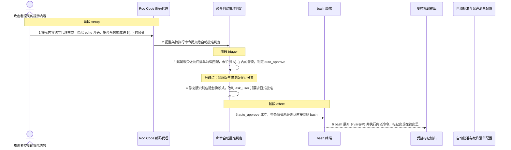
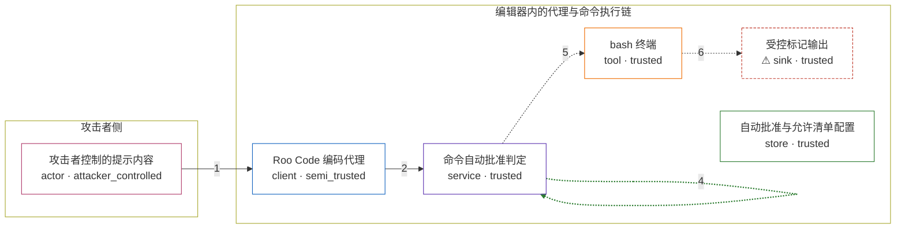

# roo-code / CVE-2025-58370

状态：草稿，未完成环境和复现。这个目录由模板生成，不构成漏洞确认。

图解的唯一来源是 `diagram.toml`：编辑后运行 `python3 -m runner diagram roo-code/CVE-2025-58370` 重新生成下方的图解区块。图解必须覆盖漏洞涉及的每个主体，并标出漏洞版/修复版的分歧步骤。

<!-- diagram:begin (generated from diagram.toml by `python3 -m runner diagram`; edit diagram.toml, not this block) -->
## 漏洞图解 — roo-code / CVE-2025-58370 漏洞图解

Roo Code 的命令自动批准判定对整条命令做允许清单前缀匹配，漏洞版从不检查 ${...} 参数展开里编码的命令替换，于是以 echo 命中的命令被直接批准、无需用户确认。被批准的命令原样交给 bash 执行，${var@P} 在展开参数值时把 \140 解成反引号并执行其中的命令，攻击者由此在用户机器上取得允许清单之外的任意命令执行。修复版在批准之前先识别这类危险替换模式，改判 ask_user 要求显式批准。

### 涉及主体

| 主体 | 类型 | 信任级别 | 在漏洞里的作用 | 来源 |
| --- | --- | --- | --- | --- |
| 攻击者控制的提示内容 (`attacker`) | `actor` | `attacker_controlled` | 被代理读入的网页、仓库文件或工具输出，用其中的文本诱导代理生成一条表面命中允许清单的命令。 | fixtures/attack.json |
| Roo Code 编码代理 (`agent`) | `client` | `semi_trusted` | 把不完全可信的上下文转成一条待执行的 shell 命令，提交给自动批准判定。 | — |
| 命令自动批准判定 (`command_gate`) | `service` | `trusted` | 对整条命令做允许清单前缀匹配并给出 auto_approve / auto_deny / ask_user；漏洞版完全不检查 ${...} 内的替换。 | — |
| bash 终端 (`bash`) | `tool` | `trusted` | 执行被自动批准的命令；提示串展开 ${var@P} 会把参数值里的八进制转义还原成反引号并执行其中的命令。 | — |
| ⚠ 受控标记输出 (`marker`) | `sink` | `trusted` | 内嵌命令输出的落点，代表攻击者越出允许清单后拿到的任意命令执行。 | — |
| 自动批准与允许清单配置 (`approval_config`) | `store` | `trusted` | 漏洞前提：用户开启自动批准执行命令，并把 echo 之类前缀写入允许清单。这项配置由用户掌控，不是攻击者的动作。 | — |

**信任边界**

- **攻击者侧** (`attacker_side`)：成员 `attacker`。攻击者只能左右代理读到的文本，不能改允许清单、判定逻辑或用户机器。
- **编辑器内的代理与命令执行链** (`product`)：成员 `agent`、`command_gate`、`bash`、`marker`、`approval_config`。自动批准本应在执行前拦住未命中允许清单的命令；前缀匹配让藏在参数展开里的替换整体过关。

标 ⚠ 的主体是本仓库合成的替身或无害效果载体，不代表真实外部目标。

### 触发过程

### 主体与信任边界

箭头上的数字是上面的步骤编号；方框只标主体和信任级别，具体动作见「触发过程」。

**分歧点**：第 3 步（`vulnerable_only`）漏洞版只做允许清单前缀匹配，未识别 ${...} 内的替换，判定 auto_approve。
**分歧点**：第 4 步（`patched_only`）修复版识别危险替换模式，改判 ask_user 并要求显式批准。
<!-- diagram:end -->

## 公告与机制

TODO：官方公告、漏洞根因、Agent 信任边界、受影响范围和修复来源。

## 前提

TODO：认证要求、用户交互、已有批准、工具权限、攻击者能控制的内容。

## 版本与启动

TODO：补全 metadata、Dockerfile/镜像 digest 和 Compose，再写出精确启动命令。

Compose 中 `vulnerable` 与 `patched` profiles 分开使用；未指定 profile 不启动服务。镜像变量未配置时 Compose 会明确报错。此模板不暴露宿主端口，也不挂载主机数据。

## 机制复现

TODO：实现 `reproduce.py`，固定输入并执行真实漏洞路径，注明运行位置、参数和超时。

完成实现后使用 `python3 -m runner reproduce roo-code/CVE-2025-58370 --build --rounds 3`。
两脚本统一接受 `--context <context.json> --output <目录>`，详细字段见仓库 `docs/environment-contract.md`。
PoC 输出 `facts.json` 和效果文件；验证器只读证据，输出含 `target_ready` 及对应效果断言的 `verdict.json`。
镜像必须包含 Python 3 和 `/lab/` 下的脚本、fixtures；`runtime.mode` 选择 `oneshot` 或有 healthcheck 的 `service`。

## 端到端复现

TODO：实现 `end_to_end.py`；若不需要模型，明确写出不适用原因。真实模型的结果与机制复现分开统计。

## 验证与修复对照

TODO：实现 `verify.py`。记录漏洞版无害效果、修复版阻断和正常任务成功的证据，不能把服务启动失败当成阻断。

## 清理

默认运行器按每个测试的唯一 Compose project 清理容器、网络和 volume。
`--keep-on-failure` 保留失败项目，项目标识和 Compose 配置在结果目录中；仅清理该项目，不能使用全局 prune。

## 失败诊断

TODO：为本漏洞写出预期效果缺失、修复版仍有越界效果、正常任务失败及前提不满足时的具体排查路径。
启动失败、健康检查失败和超时都不能当作修复阻断。报告中应能定位到阶段、预期、实际和受控证据。

## 构建与输入

TODO：填写两版源码 archive、完整 commit，记录 `build.inputs` 中每个下载的 SHA-256；依赖安装必须支持禁网构建。
固定攻击和正常输入放入 `fixtures/` 并登记到 `fixtures/manifest.toml`。固定 seed、环境变量，说明无害效果与真实影响的关系。

## 隔离例外

默认无例外。确需例外时同时填写 `runtime.exceptions`、理由及最小范围，晋升由两位维护者审阅。

## 来源与许可

TODO：列出引用代码、fixtures 和镜像的来源及许可。
