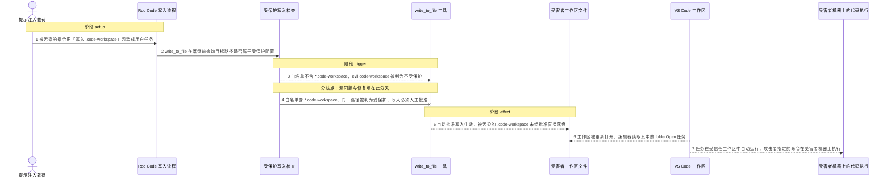
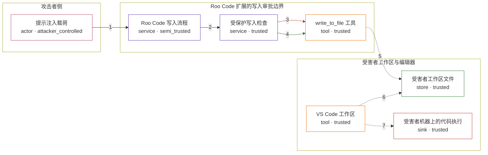

# roo-code / CVE-2025-58372

状态：草稿，未完成环境和复现。这个目录由模板生成，不构成漏洞确认。

图解的唯一来源是 `diagram.toml`：编辑后运行 `python3 -m runner diagram roo-code/CVE-2025-58372` 重新生成下方的图解区块。图解必须覆盖漏洞涉及的每个主体，并标出漏洞版/修复版的分歧步骤。

<!-- diagram:begin (generated from diagram.toml by `python3 -m runner diagram`; edit diagram.toml, not this block) -->
## 漏洞图解 — roo-code / CVE-2025-58372 漏洞图解

Roo Code 在落盘前用 RooProtectedController 的受保护模式白名单判断目标文件是否需要额外人工批准，该白名单覆盖 .vscode/**，却漏掉了 *.code-workspace。用户在开启自动批准写入后，被提示注入操纵的 agent 可以把带 folderOpen 自动任务的 .code-workspace 直接写进受害者工作区，绕过这道审批边界。工作区下次被打开时编辑器自动执行该任务，攻击者由此在受害者机器上获得任意代码执行。

### 涉及主体

| 主体 | 类型 | 信任级别 | 在漏洞里的作用 | 来源 |
| --- | --- | --- | --- | --- |
| 提示注入载荷 (`injection`) | `actor` | `attacker_controlled` | 攻击者够不到受害者工作区，只能通过被污染的内容影响 agent 的指令，让它对 evil.code-workspace 发起一次写入。 | fixtures/attack.json |
| Roo Code 写入流程 (`agent`) | `service` | `semi_trusted` | 把提示注入内容当成正常任务，按 write_to_file 的流程先查询受保护状态、再决定是否落盘。 | — |
| 受保护写入检查 (`guard`) | `service` | `trusted` | RooProtectedController 的 PROTECTED_PATTERNS 决定目标是否属于必须显式批准的配置文件；它漏掉 *.code-workspace，正是漏洞根因。 | src/core/protect/RooProtectedController.ts |
| write_to_file 工具 (`write_tool`) | `tool` | `trusted` | 用户开启自动批准写入时，按检查结果决定直接落盘还是请求人工批准。 | src/core/tools/writeToFileTool.ts |
| 受害者工作区文件 (`workspace`) | `store` | `trusted` | 被写入的 .code-workspace 保存 VS Code 工作区设置与 folderOpen 自动任务，是这道审批边界原本要保护的关键资源。 | fixtures/evil.code-workspace |
| VS Code 工作区 (`editor`) | `tool` | `trusted` | 重新打开工作区时读取 .code-workspace，并按 runOptions.runOn = folderOpen 自动运行其中的任务。 | — |
| 受害者机器上的代码执行 (`exec`) | `sink` | `trusted` | 自动任务落地的效果：攻击者指定的命令在受害者环境中执行。 | — |

**信任边界**

- **攻击者侧** (`attacker_side`)：成员 `injection`。攻击者能控制的只有进入 agent 的指令内容与写入请求参数，不能直接读写受害者工作区。
- **Roo Code 扩展的写入审批边界** (`extension`)：成员 `agent`、`guard`、`write_tool`。这道边界原本要求：受保护的配置文件即使用户开启了自动批准写入，也必须再次人工批准；白名单漏掉 *.code-workspace 使该检查对这个文件失效。
- **受害者工作区与编辑器** (`host`)：成员 `workspace`、`editor`、`exec`。工作区文件、编辑器自动任务和最终代码执行都在受害者一侧，攻击者够不到，只能通过写入内容间接影响。

### 触发过程

### 主体与信任边界

箭头上的数字是上面的步骤编号；方框只标主体和信任级别，具体动作见「触发过程」。

**分歧点**：第 3 步（`vulnerable_only`）白名单不含 *.code-workspace，evil.code-workspace 被判为不受保护。
**分歧点**：第 4 步（`patched_only`）白名单含 *.code-workspace，同一路径被判为受保护，写入必须人工批准。
<!-- diagram:end -->

## 公告与机制

TODO：官方公告、漏洞根因、Agent 信任边界、受影响范围和修复来源。

## 前提

TODO：认证要求、用户交互、已有批准、工具权限、攻击者能控制的内容。

## 版本与启动

TODO：补全 metadata、Dockerfile/镜像 digest 和 Compose，再写出精确启动命令。

Compose 中 `vulnerable` 与 `patched` profiles 分开使用；未指定 profile 不启动服务。镜像变量未配置时 Compose 会明确报错。此模板不暴露宿主端口，也不挂载主机数据。

## 机制复现

TODO：实现 `reproduce.py`，固定输入并执行真实漏洞路径，注明运行位置、参数和超时。

完成实现后使用 `python3 -m runner reproduce roo-code/CVE-2025-58372 --build --rounds 3`。
两脚本统一接受 `--context <context.json> --output <目录>`，详细字段见仓库 `docs/environment-contract.md`。
PoC 输出 `facts.json` 和效果文件；验证器只读证据，输出含 `target_ready` 及对应效果断言的 `verdict.json`。
镜像必须包含 Python 3 和 `/lab/` 下的脚本、fixtures；`runtime.mode` 选择 `oneshot` 或有 healthcheck 的 `service`。

## 端到端复现

TODO：实现 `end_to_end.py`；若不需要模型，明确写出不适用原因。真实模型的结果与机制复现分开统计。

## 验证与修复对照

TODO：实现 `verify.py`。记录漏洞版无害效果、修复版阻断和正常任务成功的证据，不能把服务启动失败当成阻断。

## 清理

默认运行器按每个测试的唯一 Compose project 清理容器、网络和 volume。
`--keep-on-failure` 保留失败项目，项目标识和 Compose 配置在结果目录中；仅清理该项目，不能使用全局 prune。

## 失败诊断

TODO：为本漏洞写出预期效果缺失、修复版仍有越界效果、正常任务失败及前提不满足时的具体排查路径。
启动失败、健康检查失败和超时都不能当作修复阻断。报告中应能定位到阶段、预期、实际和受控证据。

## 构建与输入

TODO：填写两版源码 archive、完整 commit，记录 `build.inputs` 中每个下载的 SHA-256；依赖安装必须支持禁网构建。
固定攻击和正常输入放入 `fixtures/` 并登记到 `fixtures/manifest.toml`。固定 seed、环境变量，说明无害效果与真实影响的关系。

## 隔离例外

默认无例外。确需例外时同时填写 `runtime.exceptions`、理由及最小范围，晋升由两位维护者审阅。

## 来源与许可

TODO：列出引用代码、fixtures 和镜像的来源及许可。
