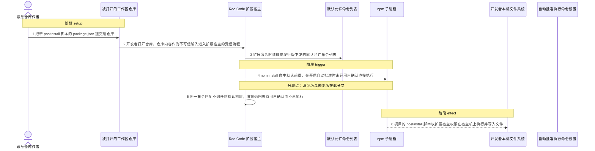
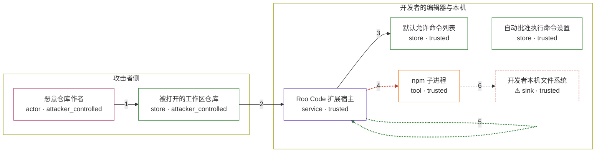

# roo-code / CVE-2025-58374

状态：草稿，未完成环境和复现。这个目录由模板生成，不构成漏洞确认。

图解的唯一来源是 `diagram.toml`：编辑后运行 `python3 -m runner diagram roo-code/CVE-2025-58374` 重新生成下方的图解区块。图解必须覆盖漏洞涉及的每个主体，并标出漏洞版/修复版的分歧步骤。

<!-- diagram:begin (generated from diagram.toml by `python3 -m runner diagram`; edit diagram.toml, not this block) -->
## 漏洞图解 — Roo Code 默认允许 npm install 导致 postinstall 任意代码执行

Roo Code 3.25.23 及更早版本把 npm install 写进 roo-cline.allowedCommands 的默认值，而命令自动批准用大小写不敏感的最长前缀匹配来判定是否放行。用户开启自动批准执行命令后，工作区里以 npm install 开头的命令都会命中这个默认前缀，不再等待用户确认。恶意仓库只要在 package.json 里写一个 postinstall 脚本，npm install 就会在扩展宿主权限下把它执行掉，形成任意代码执行。修复版把 npm install、npm test、tsc 从默认列表里删除，并对已经落盘的旧默认值做一次性精确过滤，同一命令于是退回等待用户确认。

### 涉及主体

| 主体 | 类型 | 信任级别 | 在漏洞里的作用 | 来源 |
| --- | --- | --- | --- | --- |
| 恶意仓库作者 (`attacker`) | `actor` | `attacker_controlled` | 编写并发布仓库内容。它只能决定仓库里放什么文件，控制不了扩展的默认配置、允许命令列表或宿主机。 | — |
| 被打开的工作区仓库 (`workspace_repo`) | `store` | `attacker_controlled` | 仓库里的 package.json 带有 scripts.postinstall；该脚本是要在开发者本机执行的命令，且项目不声明任何依赖。 | fixtures/attack/workspace/package.json |
| Roo Code 扩展宿主 (`extension`) | `service` | `trusted` | 把随发行版下发的默认允许命令读进配置，并用大小写不敏感的最长前缀匹配决定候选命令是否自动批准；命中允许列表且开启自动批准时不再询问用户。 | — |
| 默认允许命令列表 (`allowlist`) | `store` | `trusted` | 配置项 roo-cline.allowedCommands 的默认值。漏洞版包含 npm install、npm test 和 tsc，修复版只保留只读的 git 子命令。 | — |
| 自动批准执行命令设置 (`auto_approve_setting`) | `store` | `trusted` | 用户已开启 alwaysAllowExecute。这是漏洞生效的前提而不是攻击者的动作；未开启时命中允许列表的命令仍会等待用户确认。 | — |
| npm 子进程 (`npm`) | `tool` | `trusted` | 由扩展宿主启动，除解析依赖外还会执行项目自身的 preinstall、install、postinstall、prepare 生命周期脚本。 | — |
| ⚠ 开发者本机文件系统 (`host_fs`) | `sink` | `trusted` | 生命周期脚本以扩展宿主权限写入的落点。这里用无害标记文件代表任意代码执行的效果，它不是真实的外部目标。 | — |

**信任边界**

- **攻击者侧** (`attacker_side`)：成员 `attacker`、`workspace_repo`。攻击者只能决定仓库里放什么文件，碰不到扩展的默认配置、允许命令列表和宿主机。
- **开发者的编辑器与本机** (`product`)：成员 `extension`、`allowlist`、`auto_approve_setting`、`npm`、`host_fs`。原本只有用户在确认框里点过同意，命令才能在宿主机上执行；默认允许列表把 npm install 变成无需确认的命令，这道边界因此失效。

标 ⚠ 的主体是本仓库合成的替身或无害效果载体，不代表真实外部目标。

### 触发过程

### 主体与信任边界

箭头上的数字是上面的步骤编号；方框只标主体和信任级别，具体动作见「触发过程」。

**分歧点**：第 4 步（`vulnerable_only`）npm install 命中默认前缀，在开启自动批准时未经用户确认直接执行。
**分歧点**：第 5 步（`patched_only`）同一命令匹配不到任何默认前缀，决策退回等待用户确认而不再执行。
<!-- diagram:end -->

## 公告与机制

TODO：官方公告、漏洞根因、Agent 信任边界、受影响范围和修复来源。

## 前提

TODO：认证要求、用户交互、已有批准、工具权限、攻击者能控制的内容。

## 版本与启动

TODO：补全 metadata、Dockerfile/镜像 digest 和 Compose，再写出精确启动命令。

Compose 中 `vulnerable` 与 `patched` profiles 分开使用；未指定 profile 不启动服务。镜像变量未配置时 Compose 会明确报错。此模板不暴露宿主端口，也不挂载主机数据。

## 机制复现

`reproduce.py` 调用固定修订的上游本体，不重写匹配逻辑：

- 默认允许/拒绝命令列表从该变体镜像内固定修订的 `src/package.json`
  （`contributes.configuration.properties["roo-cline.allowedCommands"].default`）读出；
- 决策由固定修订的 `webview-ui/src/utils/command-validation.ts` 经 Node 执行
  `getCommandDecision` 得到，与 `webview-ui/src/components/chat/ChatView.tsx` 的
  `alwaysAllowExecute && isAllowedCommand(message)` 门控一致；
- 当上游决策为 `auto_approve` 且 `always_allow_execute` 为真时，命令在场景工作区里真实执行，
  因此 npm 自己会运行工作区的生命周期脚本。漏洞版攻击写出 `postinstall-marker.txt` 标记，
  修复版攻击决策为 `ask_user`、命令不执行、没有标记。正常任务用两版默认列表都包含的
  `git log`，验证批准并执行这条通路在修复后仍然可用。

镜像必须满足的约定（供 build 阶段实现）：该变体的完整上游源码树放在可发现的根目录
（默认 `/opt/roo-code`，可用 `ROO_CODE_SRC` 覆盖）；`node` 在 PATH 上且支持
`--experimental-transform-types`（Node >= 22.7，建议 24），因为决策模块是 TypeScript；
该模块的固定运行时依赖 `shell-quote@1.8.2` 能从 `<root>/node_modules/shell-quote` 解析；
`git` 在 PATH 上，正常任务会执行默认允许的 `git log`。攻击输入不声明任何依赖，
整条链路可以在 `--network none` 下运行。

完成实现后使用 `python3 -m runner reproduce roo-code/CVE-2025-58374 --build --rounds 3`。
两脚本统一接受 `--context <context.json> --output <目录>`，详细字段见仓库 `docs/environment-contract.md`。
PoC 输出 `facts.json` 和效果文件；验证器只读证据，输出含 `target_ready` 及对应效果断言的 `verdict.json`。
镜像必须包含 Python 3 和 `/lab/` 下的脚本、fixtures；`runtime.mode` 选择 `oneshot` 或有 healthcheck 的 `service`。

## 端到端复现

TODO：实现 `end_to_end.py`；若不需要模型，明确写出不适用原因。真实模型的结果与机制复现分开统计。

## 验证与修复对照

TODO：实现 `verify.py`。记录漏洞版无害效果、修复版阻断和正常任务成功的证据，不能把服务启动失败当成阻断。

## 清理

默认运行器按每个测试的唯一 Compose project 清理容器、网络和 volume。
`--keep-on-failure` 保留失败项目，项目标识和 Compose 配置在结果目录中；仅清理该项目，不能使用全局 prune。

## 失败诊断

TODO：为本漏洞写出预期效果缺失、修复版仍有越界效果、正常任务失败及前提不满足时的具体排查路径。
启动失败、健康检查失败和超时都不能当作修复阻断。报告中应能定位到阶段、预期、实际和受控证据。

## 构建与输入

TODO：填写两版源码 archive、完整 commit，记录 `build.inputs` 中每个下载的 SHA-256；依赖安装必须支持禁网构建。
固定攻击和正常输入放入 `fixtures/` 并登记到 `fixtures/manifest.toml`。固定 seed、环境变量，说明无害效果与真实影响的关系。

## 隔离例外

默认无例外。确需例外时同时填写 `runtime.exceptions`、理由及最小范围，晋升由两位维护者审阅。

## 来源与许可

TODO：列出引用代码、fixtures 和镜像的来源及许可。
