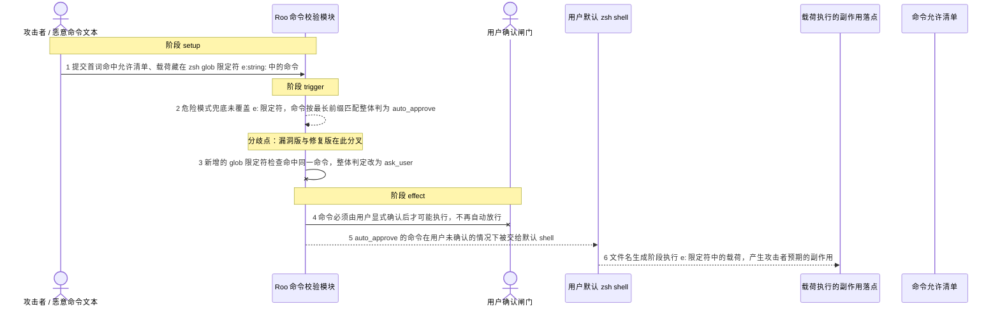
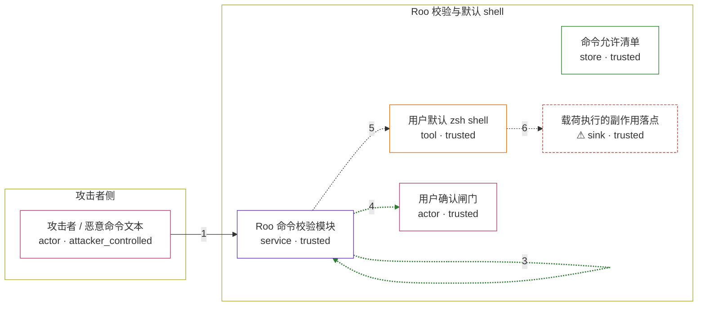

# roo-code / CVE-2025-65946

状态：草稿，未完成环境和复现。这个目录由模板生成，不构成漏洞确认。

图解的唯一来源是 `diagram.toml`：编辑后运行 `python3 -m runner diagram roo-code/CVE-2025-65946` 重新生成下方的图解区块。图解必须覆盖漏洞涉及的每个主体，并标出漏洞版/修复版的分歧步骤。

<!-- diagram:begin (generated from diagram.toml by `python3 -m runner diagram`; edit diagram.toml, not this block) -->
## 漏洞图解 — roo-code / CVE-2025-65946 漏洞图解

Roo 的命令校验先用最长前缀匹配判断每个子命令是否命中允许清单，再用 containsDangerousSubstitution 作为永不自动批准的安全网。该安全网覆盖 ${var@P}、${!var}、<<<$(...) 与 zsh 进程替换 =(...) 等模式，却没有覆盖 zsh 专有的 glob 限定符 e:string:。攻击者让命令首词命中允许清单，把真正的载荷放进 e: 限定符，校验层因此返回 auto_approve，命令未经用户确认即交给默认 shell，在文件名生成阶段执行限定符中的载荷。

### 涉及主体

| 主体 | 类型 | 信任级别 | 在漏洞里的作用 | 来源 |
| --- | --- | --- | --- | --- |
| 攻击者 / 恶意命令文本 (`attacker`) | `actor` | `attacker_controlled` | 构造首词命中允许清单、真正载荷藏在 zsh glob 限定符 e:string: 里的命令；它无法修改允许清单，也无法直接写受害主机的文件。 | fixtures/attack.json |
| Roo 命令校验模块 (`validator`) | `service` | `trusted` | getCommandDecision 先对每个子命令做最长前缀匹配，再用 containsDangerousSubstitution 兜底；兜底规则缺少 e: 限定符，于是把夹带载荷的命令判为 auto_approve。 | webview-ui/src/utils/command-validation.ts |
| 命令允许清单 (`allowlist`) | `store` | `trusted` | 用户配置的允许自动执行的命令前缀。攻击者只能让子命令首词命中它，不能让它覆盖 e: 限定符里的载荷。 | — |
| 用户默认 zsh shell (`shell`) | `tool` | `trusted` | 执行被自动批准的命令；在文件名生成阶段展开 glob，并执行 e: 限定符中的载荷。 | — |
| ⚠ 载荷执行的副作用落点 (`effect`) | `sink` | `trusted` | e: 限定符中的载荷以用户权限执行后产生的副作用；以无害的标记文件承载，不代表真实外部目标。 | — |
| 用户确认闸门 (`user`) | `actor` | `trusted` | 本应在命令命中危险模式时收到确认请求；漏洞版因为整体被判为 auto_approve，完全绕过这道确认。 | — |

**信任边界**

- **攻击者侧** (`attacker_side`)：成员 `attacker`。攻击者只控制进入校验的命令字符串；允许清单与受害主机文件都在它够不着的一侧。
- **Roo 校验与默认 shell** (`victim_side`)：成员 `validator`、`allowlist`、`shell`、`effect`、`user`。这道边界本来保证只有命中允许清单且不含危险模式的命令才会免确认执行；漏洞让它对 e: 限定符失效。

标 ⚠ 的主体是本仓库合成的替身或无害效果载体，不代表真实外部目标。

### 触发过程

### 主体与信任边界

箭头上的数字是上面的步骤编号；方框只标主体和信任级别，具体动作见「触发过程」。

**分歧点**：第 2 步（`vulnerable_only`）危险模式兜底未覆盖 e: 限定符，命令按最长前缀匹配整体判为 auto_approve。
**分歧点**：第 3 步（`patched_only`）新增的 glob 限定符检查命中同一命令，整体判定改为 ask_user。
<!-- diagram:end -->

## 公告与机制

TODO：官方公告、漏洞根因、Agent 信任边界、受影响范围和修复来源。

## 前提

TODO：认证要求、用户交互、已有批准、工具权限、攻击者能控制的内容。

## 版本与启动

TODO：补全 metadata、Dockerfile/镜像 digest 和 Compose，再写出精确启动命令。

Compose 中 `vulnerable` 与 `patched` profiles 分开使用；未指定 profile 不启动服务。镜像变量未配置时 Compose 会明确报错。此模板不暴露宿主端口，也不挂载主机数据。

## 机制复现

TODO：实现 `reproduce.py`，固定输入并执行真实漏洞路径，注明运行位置、参数和超时。

完成实现后使用 `python3 -m runner reproduce roo-code/CVE-2025-65946 --build --rounds 3`。
两脚本统一接受 `--context <context.json> --output <目录>`，详细字段见仓库 `docs/environment-contract.md`。
PoC 输出 `facts.json` 和效果文件；验证器只读证据，输出含 `target_ready` 及对应效果断言的 `verdict.json`。
镜像必须包含 Python 3 和 `/lab/` 下的脚本、fixtures；`runtime.mode` 选择 `oneshot` 或有 healthcheck 的 `service`。

## 端到端复现

TODO：实现 `end_to_end.py`；若不需要模型，明确写出不适用原因。真实模型的结果与机制复现分开统计。

## 验证与修复对照

TODO：实现 `verify.py`。记录漏洞版无害效果、修复版阻断和正常任务成功的证据，不能把服务启动失败当成阻断。

## 清理

默认运行器按每个测试的唯一 Compose project 清理容器、网络和 volume。
`--keep-on-failure` 保留失败项目，项目标识和 Compose 配置在结果目录中；仅清理该项目，不能使用全局 prune。

## 失败诊断

TODO：为本漏洞写出预期效果缺失、修复版仍有越界效果、正常任务失败及前提不满足时的具体排查路径。
启动失败、健康检查失败和超时都不能当作修复阻断。报告中应能定位到阶段、预期、实际和受控证据。

## 构建与输入

TODO：填写两版源码 archive、完整 commit，记录 `build.inputs` 中每个下载的 SHA-256；依赖安装必须支持禁网构建。
固定攻击和正常输入放入 `fixtures/` 并登记到 `fixtures/manifest.toml`。固定 seed、环境变量，说明无害效果与真实影响的关系。

## 隔离例外

默认无例外。确需例外时同时填写 `runtime.exceptions`、理由及最小范围，晋升由两位维护者审阅。

## 来源与许可

TODO：列出引用代码、fixtures 和镜像的来源及许可。
