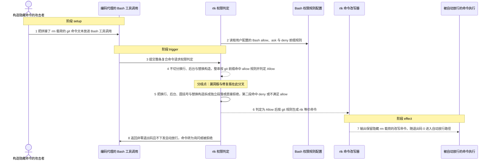
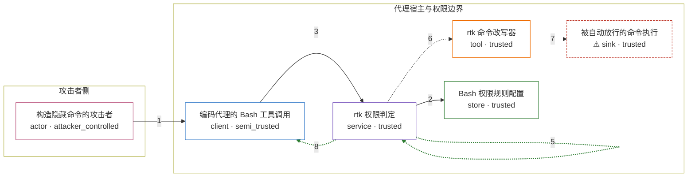

# rtk / CVE-2026-54555

状态：草稿，未完成环境和复现。这个目录由模板生成，不构成漏洞确认。

图解的唯一来源是 `diagram.toml`：编辑后运行 `python3 -m runner diagram rtk/CVE-2026-54555` 重新生成下方的图解区块。图解必须覆盖漏洞涉及的每个主体，并标出漏洞版/修复版的分歧步骤。

<!-- diagram:begin (generated from diagram.toml by `python3 -m runner diagram`; edit diagram.toml, not this block) -->
## 漏洞图解 — rtk / CVE-2026-54555 权限分割器放过隐藏命令

rtk 作为 PreToolUse 分诊器，把 Claude Code 的 allow/deny 权限规则翻译成退出码，但它的权限分割器只按 &&、||、; 与 | 切断复合命令。换行、后台 &、命令替换与文件重定向因此留在同一段里，整段前缀命中了 git allow 规则，本应触发 deny 或询问的 rm 载荷被一起判为 Allow。进程随即以退出码 0 通知宿主自动放行，改写后的命令仍带着隐藏载荷，用户既没有收到确认，deny 规则也被绕过。

### 涉及主体

| 主体 | 类型 | 信任级别 | 在漏洞里的作用 | 来源 |
| --- | --- | --- | --- | --- |
| 构造隐藏命令的攻击者 (`attacker`) | `actor` | `attacker_controlled` | 在交给编码代理的命令文本里，把 rm 载荷拼接到一条命中 allow 前缀的 git 命令之后。它只能控制这一次 Bash 工具调用的命令字符串，够不着判定代码、用户规则和最终执行结果。 | fixtures/attack_cases.json |
| 编码代理的 Bash 工具调用 (`agent`) | `client` | `semi_trusted` | 把不可信内容转写成一个 Bash 工具调用，并在执行前把整条命令交给 PreToolUse 权限判定，按退出码决定是否需要用户确认。 | — |
| rtk 权限判定 (`permission_gate`) | `service` | `trusted` | 读取用户规则，把命令切成段落并逐段匹配 allow/deny。它只按 &&、//、; 与 / 切断命令，换行、后台与命令替换构造留在同一段内，这正是错误授权的根因。 | — |
| rtk 命令改写器 (`command_rewriter`) | `tool` | `trusted` | 命中改写规则后，按去掉的前缀把余下文本原样拼成 rtk 等价命令。它不做安全检查，因此前缀之外的隐藏载荷被完整保留。 | — |
| Bash 权限规则配置 (`permission_rules`) | `store` | `trusted` | 用户声明的 allow、ask 与 deny 前缀规则，是判定本来要守住的授权依据。 | fixtures/settings.json |
| ⚠ 被自动放行的命令执行 (`bash_exec`) | `sink` | `trusted` | 收到带隐藏载荷的改写命令并直接执行，不再向用户请求确认。复现时命令里的目标是无害标记路径，不是真实的破坏性目标。 | — |

**信任边界**

- **攻击者侧** (`attacker_side`)：成员 `attacker`。攻击者只控制这次工具调用的命令文本，不能修改判定代码，也不能改写用户配置的权限规则。
- **代理宿主与权限边界** (`agent_host`)：成员 `agent`、`permission_gate`、`command_rewriter`、`permission_rules`、`bash_exec`。这道边界本应让未命中 allow 的段落触发确认或拒绝。漏洞让它失效：整条命令被当成一个段落命中 git allow 前缀，隐藏的 rm 载荷随之进入自动放行路径。

标 ⚠ 的主体是本仓库合成的替身或无害效果载体，不代表真实外部目标。

### 触发过程

### 主体与信任边界

箭头上的数字是上面的步骤编号；方框只标主体和信任级别，具体动作见「触发过程」。

**分歧点**：第 4 步（`vulnerable_only`）不切分换行、后台与替换构造，整串按 git 前缀命中 allow 规则并判定 Allow。
**分歧点**：第 5 步（`patched_only`）把换行、后台、圆括号与替换构造拆成独立段落或直接拒绝，第二段命中 deny 或不满足 allow。
<!-- diagram:end -->

## 公告与机制

TODO：官方公告、漏洞根因、Agent 信任边界、受影响范围和修复来源。

## 前提

TODO：认证要求、用户交互、已有批准、工具权限、攻击者能控制的内容。

## 版本与启动

TODO：补全 metadata、Dockerfile/镜像 digest 和 Compose，再写出精确启动命令。

Compose 中 `vulnerable` 与 `patched` profiles 分开使用；未指定 profile 不启动服务。镜像变量未配置时 Compose 会明确报错。此模板不暴露宿主端口，也不挂载主机数据。

## 机制复现

TODO：实现 `reproduce.py`，固定输入并执行真实漏洞路径，注明运行位置、参数和超时。

完成实现后使用 `python3 -m runner reproduce rtk/CVE-2026-54555 --build --rounds 3`。
两脚本统一接受 `--context <context.json> --output <目录>`，详细字段见仓库 `docs/environment-contract.md`。
PoC 输出 `facts.json` 和效果文件；验证器只读证据，输出含 `target_ready` 及对应效果断言的 `verdict.json`。
镜像必须包含 Python 3 和 `/lab/` 下的脚本、fixtures；`runtime.mode` 选择 `oneshot` 或有 healthcheck 的 `service`。

## 端到端复现

TODO：实现 `end_to_end.py`；若不需要模型，明确写出不适用原因。真实模型的结果与机制复现分开统计。

## 验证与修复对照

TODO：实现 `verify.py`。记录漏洞版无害效果、修复版阻断和正常任务成功的证据，不能把服务启动失败当成阻断。

## 清理

默认运行器按每个测试的唯一 Compose project 清理容器、网络和 volume。
`--keep-on-failure` 保留失败项目，项目标识和 Compose 配置在结果目录中；仅清理该项目，不能使用全局 prune。

## 失败诊断

TODO：为本漏洞写出预期效果缺失、修复版仍有越界效果、正常任务失败及前提不满足时的具体排查路径。
启动失败、健康检查失败和超时都不能当作修复阻断。报告中应能定位到阶段、预期、实际和受控证据。

## 构建与输入

TODO：填写两版源码 archive、完整 commit，记录 `build.inputs` 中每个下载的 SHA-256；依赖安装必须支持禁网构建。
固定攻击和正常输入放入 `fixtures/` 并登记到 `fixtures/manifest.toml`。固定 seed、环境变量，说明无害效果与真实影响的关系。

## 隔离例外

默认无例外。确需例外时同时填写 `runtime.exceptions`、理由及最小范围，晋升由两位维护者审阅。

## 来源与许可

TODO：列出引用代码、fixtures 和镜像的来源及许可。
