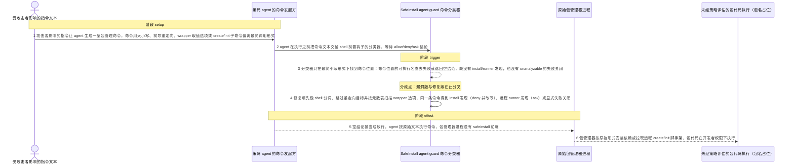
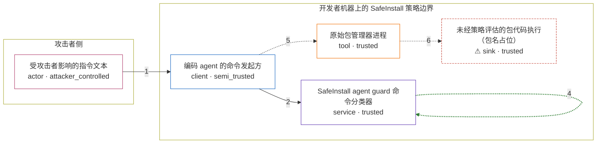

# safeinstall / GHSA-XRMC-C5CG-RV7X

状态：草稿，未完成环境和复现。这个目录由模板生成，不构成漏洞确认。

图解的唯一来源是 `diagram.toml`：编辑后运行 `python3 -m runner diagram safeinstall/GHSA-XRMC-C5CG-RV7X` 重新生成下方的图解区块。图解必须覆盖漏洞涉及的每个主体，并标出漏洞版/修复版的分歧步骤。

<!-- diagram:begin (generated from diagram.toml by `python3 -m runner diagram`; edit diagram.toml, not this block) -->
## 漏洞图解 — safeinstall / GHSA-XRMC-C5CG-RV7X 漏洞图解

SafeInstall 的 agent guard 在把 coding agent 的 shell 命令交给策略判定之前先做命令分类，但漏洞版分类器只识别最简小写、无前导重定向、无 wrapper 取值选项的包管理器调用。大小写变体、命令位置之前的重定向、wrapper 的取值选项以及 create/init 远程脚手架都会让分类在命令位置停下并返回空结论，guard 静默放行。被绕过的正是「任何原始包管理调用都必须先经 SafeInstall 策略判定并改写成 safeinstall 路由」这道边界，后果是未经策略评估、也未禁用 lifecycle scripts 的安装或脚手架命令在开发者权限下执行。

### 涉及主体

| 主体 | 类型 | 信任级别 | 在漏洞里的作用 | 来源 |
| --- | --- | --- | --- | --- |
| 受攻击者影响的指令文本 (`attacker`) | `actor` | `attacker_controlled` | 构造会被 coding agent 执行的包管理命令文本：用大小写变体、命令位置之前的重定向、wrapper 的取值选项或 create/init 子命令，让调用形式偏离 guard 建模的最简形态。 | fixtures/attack.json |
| 编码 agent 的命令发起方 (`coding_agent`) | `client` | `semi_trusted` | 把不可信指令转成 shell 命令，在执行前调用 guard 做前置判定，并信任 guard 返回的 allow/deny/ask 结论。 | fixtures/attack.json |
| SafeInstall agent guard 命令分类器 (`guard`) | `service` | `trusted` | 解析命令文本，定位命令位置、识别包管理器与 wrapper，产出 install/runner/unanalyzable 发现并据此 deny、ask 或改写成 safeinstall 路由；漏洞版对未建模的 shell 语法返回空结论。 | fixtures/attack.json |
| 原始包管理器进程 (`package_manager`) | `tool` | `trusted` | 在命令没有被改写成 safeinstall 前缀时以原始形式启动，执行 install 或拉取远程 create/init 脚手架。 | fixtures/attack.json |
| ⚠ 未经策略评估的包代码执行（包名占位） (`package_code`) | `sink` | `trusted` | 漏洞效果的落点：包代码在开发者账户权限下执行，SafeInstall 的策略拒绝与 lifecycle scripts 禁用都不再生效；这里只用包名占位，不会真的下载或执行外部包。 | fixtures/attack.json |

**信任边界**

- **攻击者侧** (`attacker_side`)：成员 `attacker`。攻击者只能左右被诱导执行的指令文本，对开发机、guard 的安装状态和目标包都没有写权限。
- **开发者机器上的 SafeInstall 策略边界** (`guard_boundary`)：成员 `coding_agent`、`guard`、`package_manager`、`package_code`。guard 本应在任何原始包管理调用进入 shell 之前做策略判定，并把 install 改写成 safeinstall 路由；未建模的 shell 语法让判定在命令位置停下并返回空结论，这道边界因此静默失效。

标 ⚠ 的主体是本仓库合成的替身或无害效果载体，不代表真实外部目标。

### 触发过程

### 主体与信任边界

箭头上的数字是上面的步骤编号；方框只标主体和信任级别，具体动作见「触发过程」。

**分歧点**：第 3 步（`vulnerable_only`）分类器只在最简小写形式下找到命令位置：命令位置的可执行名查表失败就返回空结论，既没有 install/runner 发现，也没有 unanalyzable 的失败关闭。
**分歧点**：第 4 步（`patched_only`）修复版先做 shell 分词、跳过重定向目标并按元数表扫描 wrapper 选项，同一条命令得到 install 发现（deny 并改写）、远程 runner 发现（ask）或显式失败关闭。
<!-- diagram:end -->

## 公告与机制

TODO：官方公告、漏洞根因、Agent 信任边界、受影响范围和修复来源。

## 前提

TODO：认证要求、用户交互、已有批准、工具权限、攻击者能控制的内容。

## 版本与启动

TODO：补全 metadata、Dockerfile/镜像 digest 和 Compose，再写出精确启动命令。

Compose 中 `vulnerable` 与 `patched` profiles 分开使用；未指定 profile 不启动服务。镜像变量未配置时 Compose 会明确报错。此模板不暴露宿主端口，也不挂载主机数据。

## 机制复现

TODO：实现 `reproduce.py`，固定输入并执行真实漏洞路径，注明运行位置、参数和超时。

完成实现后使用 `python3 -m runner reproduce safeinstall/GHSA-XRMC-C5CG-RV7X --build --rounds 3`。
两脚本统一接受 `--context <context.json> --output <目录>`，详细字段见仓库 `docs/environment-contract.md`。
PoC 输出 `facts.json` 和效果文件；验证器只读证据，输出含 `target_ready` 及对应效果断言的 `verdict.json`。
镜像必须包含 Python 3 和 `/lab/` 下的脚本、fixtures；`runtime.mode` 选择 `oneshot` 或有 healthcheck 的 `service`。

## 端到端复现

TODO：实现 `end_to_end.py`；若不需要模型，明确写出不适用原因。真实模型的结果与机制复现分开统计。

## 验证与修复对照

TODO：实现 `verify.py`。记录漏洞版无害效果、修复版阻断和正常任务成功的证据，不能把服务启动失败当成阻断。

## 清理

默认运行器按每个测试的唯一 Compose project 清理容器、网络和 volume。
`--keep-on-failure` 保留失败项目，项目标识和 Compose 配置在结果目录中；仅清理该项目，不能使用全局 prune。

## 失败诊断

TODO：为本漏洞写出预期效果缺失、修复版仍有越界效果、正常任务失败及前提不满足时的具体排查路径。
启动失败、健康检查失败和超时都不能当作修复阻断。报告中应能定位到阶段、预期、实际和受控证据。

## 构建与输入

TODO：填写两版源码 archive、完整 commit，记录 `build.inputs` 中每个下载的 SHA-256；依赖安装必须支持禁网构建。
固定攻击和正常输入放入 `fixtures/` 并登记到 `fixtures/manifest.toml`。固定 seed、环境变量，说明无害效果与真实影响的关系。

## 隔离例外

默认无例外。确需例外时同时填写 `runtime.exceptions`、理由及最小范围，晋升由两位维护者审阅。

## 来源与许可

TODO：列出引用代码、fixtures 和镜像的来源及许可。
