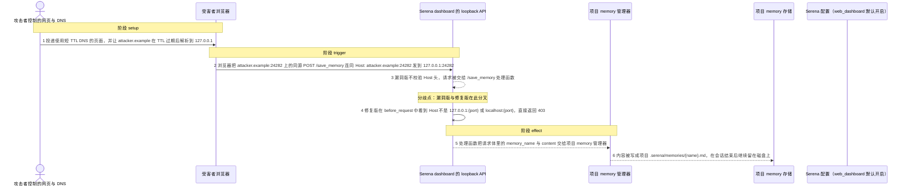
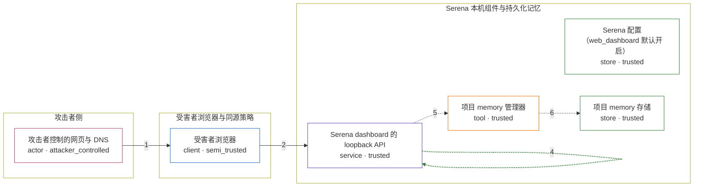

# serena / CVE-2026-49471

状态：草稿，未完成环境和复现。这个目录由模板生成，不构成漏洞确认。

图解的唯一来源是 `diagram.toml`：编辑后运行 `python3 -m runner diagram serena/CVE-2026-49471` 重新生成下方的图解区块。图解必须覆盖漏洞涉及的每个主体，并标出漏洞版/修复版的分歧步骤。

<!-- diagram:begin (generated from diagram.toml by `python3 -m runner diagram`; edit diagram.toml, not this block) -->
## 漏洞图解 — Serena dashboard：DNS 重绑定触发未认证的 memory 写入

Serena 的内置 web dashboard 绑定在 loopback 的固定端口 24282 上，却不要求任何凭证，也不校验 Host 头。攻击者用短 TTL DNS 把自己的域名重绑定到 127.0.0.1，浏览器按同源策略把 POST /save_memory 连同 Host: attacker.example:24282 发往本机 dashboard，请求因此穿过本机边界。漏洞版的 dashboard 直接把请求体交给项目 memory 管理器，攻击者内容被写进项目的持久化记忆目录，在会话结束后继续留在磁盘上。v1.5.2 在每个请求前校验 Host 与端口，只放行 127.0.0.1:{port} 与 localhost:{port}，其余一律 403。

### 涉及主体

| 主体 | 类型 | 信任级别 | 在漏洞里的作用 | 来源 |
| --- | --- | --- | --- | --- |
| 攻击者控制的网页与 DNS (`attacker`) | `actor` | `attacker_controlled` | 控制一个使用短 TTL DNS 的页面，并控制该域名的权威应答；攻击者没有到受害者 loopback 端口的直接通路。 | fixtures/rebind_page.html |
| 受害者浏览器 (`victim_browser`) | `client` | `semi_trusted` | 访问攻击者页面，并在 DNS 重绑定后把同源 fetch 发往本机 dashboard；同源策略是它唯一执行的隔离。 | — |
| Serena 配置（web_dashboard 默认开启） (`dashboard_config`) | `store` | `trusted` | web_dashboard 默认开启，dashboard 因此始终监听 127.0.0.1 上以 24282 为起点的端口；这是漏洞成立的前提，不是攻击者的动作。 | — |
| Serena dashboard 的 loopback API (`dashboard_api`) | `service` | `trusted` | 承载无认证的 /save_memory 等 Flask 路由；漏洞版不校验 Host，修复版用 before_request 只放行 loopback 的 Host 与端口。 | — |
| 项目 memory 管理器 (`memory_manager`) | `tool` | `trusted` | 接收 /save_memory 的请求体，决定 memory 文件的落点并把内容写进项目 .serena/memories。 | — |
| 项目 memory 存储 (`memory_store`) | `store` | `trusted` | 项目持久化记忆，跨会话被 Agent 读取，本来只应由 Agent 会话写入；只有存在 active project 时才有落点。 | — |

**信任边界**

- **攻击者侧** (`attacker_zone`)：成员 `attacker`。攻击者控制自己的页面和 DNS 应答，但没有任何到受害者 loopback 端口的直接通路。
- **受害者浏览器与同源策略** (`browser_zone`)：成员 `victim_browser`。浏览器只按 scheme、host、port 判断同源；DNS 重绑定让攻击者源在解析层落到 127.0.0.1，于是跨源请求被当成同源请求发出。
- **Serena 本机组件与持久化记忆** (`serena_zone`)：成员 `dashboard_config`、`dashboard_api`、`memory_manager`、`memory_store`。dashboard 只监听 loopback 却不校验 Host，无法区分真正来自 127.0.0.1 的调用与重绑定域名发来的调用；memory 存储本来只接受 Agent 会话写入。

### 触发过程

### 主体与信任边界

箭头上的数字是上面的步骤编号；方框只标主体和信任级别，具体动作见「触发过程」。

**分歧点**：第 3 步（`vulnerable_only`）漏洞版不校验 Host 头，请求被交给 /save_memory 处理函数。
**分歧点**：第 4 步（`patched_only`）修复版在 before_request 中看到 Host 不是 127.0.0.1:{port} 或 localhost:{port}，直接返回 403。
<!-- diagram:end -->

## 公告与机制

TODO：官方公告、漏洞根因、Agent 信任边界、受影响范围和修复来源。

## 前提

TODO：认证要求、用户交互、已有批准、工具权限、攻击者能控制的内容。

## 版本与启动

TODO：补全 metadata、Dockerfile/镜像 digest 和 Compose，再写出精确启动命令。

Compose 中 `vulnerable` 与 `patched` profiles 分开使用；未指定 profile 不启动服务。镜像变量未配置时 Compose 会明确报错。此模板不暴露宿主端口，也不挂载主机数据。

## 机制复现

TODO：实现 `reproduce.py`，固定输入并执行真实漏洞路径，注明运行位置、参数和超时。

完成实现后使用 `python3 -m runner reproduce serena/CVE-2026-49471 --build --rounds 3`。
两脚本统一接受 `--context <context.json> --output <目录>`，详细字段见仓库 `docs/environment-contract.md`。
PoC 输出 `facts.json` 和效果文件；验证器只读证据，输出含 `target_ready` 及对应效果断言的 `verdict.json`。
镜像必须包含 Python 3 和 `/lab/` 下的脚本、fixtures；`runtime.mode` 选择 `oneshot` 或有 healthcheck 的 `service`。

## 端到端复现

TODO：实现 `end_to_end.py`；若不需要模型，明确写出不适用原因。真实模型的结果与机制复现分开统计。

## 验证与修复对照

TODO：实现 `verify.py`。记录漏洞版无害效果、修复版阻断和正常任务成功的证据，不能把服务启动失败当成阻断。

## 清理

默认运行器按每个测试的唯一 Compose project 清理容器、网络和 volume。
`--keep-on-failure` 保留失败项目，项目标识和 Compose 配置在结果目录中；仅清理该项目，不能使用全局 prune。

## 失败诊断

TODO：为本漏洞写出预期效果缺失、修复版仍有越界效果、正常任务失败及前提不满足时的具体排查路径。
启动失败、健康检查失败和超时都不能当作修复阻断。报告中应能定位到阶段、预期、实际和受控证据。

## 构建与输入

TODO：填写两版源码 archive、完整 commit，记录 `build.inputs` 中每个下载的 SHA-256；依赖安装必须支持禁网构建。
固定攻击和正常输入放入 `fixtures/` 并登记到 `fixtures/manifest.toml`。固定 seed、环境变量，说明无害效果与真实影响的关系。

## 隔离例外

默认无例外。确需例外时同时填写 `runtime.exceptions`、理由及最小范围，晋升由两位维护者审阅。

## 来源与许可

TODO：列出引用代码、fixtures 和镜像的来源及许可。
