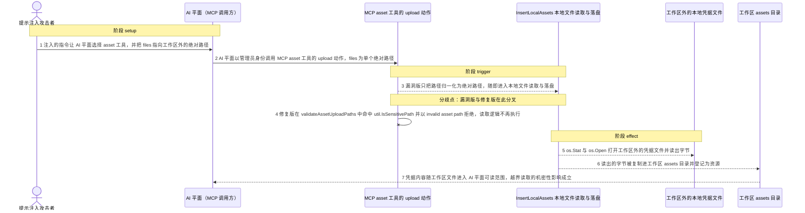
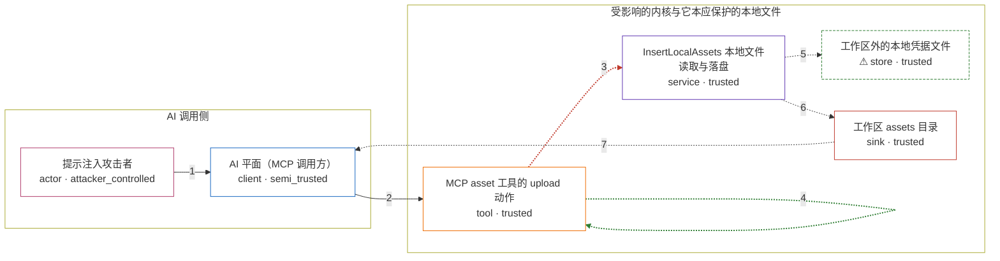

# siyuan / CVE-2026-82233

状态：草稿，未完成环境和复现。这个目录由模板生成，不构成漏洞确认。

图解的唯一来源是 `diagram.toml`：编辑后运行 `python3 -m runner diagram siyuan/CVE-2026-82233` 重新生成下方的图解区块。图解必须覆盖漏洞涉及的每个主体，并标出漏洞版/修复版的分歧步骤。

<!-- diagram:begin (generated from diagram.toml by `python3 -m runner diagram`; edit diagram.toml, not this block) -->
## 漏洞图解 — siyuan / CVE-2026-82233 漏洞图解

内置 MCP 服务的 asset 工具 upload 动作接受逗号分隔的任意绝对路径：漏洞版只做 filepath.Abs 归一化就把路径交给 InsertLocalAssets，os.Stat/os.Open 直接读出工作区外的凭据文件，并把字节复制进目标文档所属的工作区 assets 目录。被绕过的是工作区边界——工具的文件读取本应限制在工作区内，而修复只在归一化之后新增 util.IsSensitivePath 敏感路径黑名单，命中时以 invalid asset path 拒绝，读取逻辑不再执行，非敏感的工作区外路径仍然允许。效果是机密性损失：AI 平面本来读不到的工作区外凭据字节进入工作区，随后可经笔记、导出或同步外泄。

### 涉及主体

| 主体 | 类型 | 信任级别 | 在漏洞里的作用 | 来源 |
| --- | --- | --- | --- | --- |
| 提示注入攻击者 (`injected_prompt`) | `actor` | `attacker_controlled` | 在 AI 平面的上下文中植入指令，诱导它选择 asset 工具的 upload 动作，并把 files 参数指向工作区外的绝对路径。攻击者能控制的只有这次调用的参数，它没有宿主文件系统权限，也读不到工作区外的凭据。 | fixtures/attack.json |
| AI 平面（MCP 调用方） (`ai_plane`) | `client` | `semi_trusted` | 被注入指令影响的 AI 平面，以管理员身份调用内置 MCP 服务，把攻击者给出的绝对路径原样转发给 asset 工具。它既是攻击路径的入口，也是最终能读到工作区内容的角色。 | — |
| MCP asset 工具的 upload 动作 (`mcp_asset_tool`) | `tool` | `trusted` | 受影响的上游工具入口 assetUpload：漏洞版只把每个路径 filepath.Abs 归一化后直接调用本地文件读取；修复版把它抽成 validateAssetUploadPaths，并在归一化之后用 util.IsSensitivePath 拒绝敏感路径。 | — |
| InsertLocalAssets 本地文件读取与落盘 (`insert_local_assets`) | `service` | `trusted` | 对归一化后的绝对路径执行 os.Stat 与 os.Open，把文件字节复制进目标文档所属的工作区 assets 目录，并登记资源记录。它是读取侧真正缺少工作区边界的地方。 | — |
| ⚠ 工作区外的本地凭据文件 (`sensitive_file`) | `store` | `trusted` | 攻击者想要但够不着的数据，例如内核用户家目录下的 SSH 私钥。图中标 ⚠ 表示被读取的是合成标记内容，不代表真实凭据或真实外部目标。 | — |
| 工作区 assets 目录 (`workspace_assets`) | `sink` | `trusted` | 受控效果落点：被读出的凭据字节被复制到工作区内的 assets 目录，此后可经笔记、导出或同步外泄，也可被 AI 平面用工作区文件接口读回。 | — |

**信任边界**

- **AI 调用侧** (`attacker_side`)：成员 `injected_prompt`、`ai_plane`。攻击者只能控制注入指令和这次工具调用的参数；AI 平面持有管理员身份并转发这些参数，但它自己并不具备读取工作区外凭据的正当能力。
- **受影响的内核与它本应保护的本地文件** (`host_side`)：成员 `mcp_asset_tool`、`insert_local_assets`、`sensitive_file`、`workspace_assets`。工作区边界本应把工具的文件读取限制在工作区内。asset 工具的 upload 动作接受任意绝对路径，修复前读取侧没有任何工作区边界校验，修复后也只增加了敏感路径黑名单，而不是真正的工作区边界。

标 ⚠ 的主体是本仓库合成的替身或无害效果载体，不代表真实外部目标。

### 触发过程

### 主体与信任边界

箭头上的数字是上面的步骤编号；方框只标主体和信任级别，具体动作见「触发过程」。

**分歧点**：第 3 步（`vulnerable_only`）漏洞版只把路径归一化为绝对路径，随即进入本地文件读取与落盘。
**分歧点**：第 4 步（`patched_only`）修复版在 validateAssetUploadPaths 中命中 util.IsSensitivePath 并以 invalid asset path 拒绝，读取逻辑不再执行。
<!-- diagram:end -->

## 公告与机制

TODO：官方公告、漏洞根因、Agent 信任边界、受影响范围和修复来源。

## 前提

TODO：认证要求、用户交互、已有批准、工具权限、攻击者能控制的内容。

## 版本与启动

TODO：补全 metadata、Dockerfile/镜像 digest 和 Compose，再写出精确启动命令。

Compose 中 `vulnerable` 与 `patched` profiles 分开使用；未指定 profile 不启动服务。镜像变量未配置时 Compose 会明确报错。此模板不暴露宿主端口，也不挂载主机数据。

## 机制复现

TODO：实现 `reproduce.py`，固定输入并执行真实漏洞路径，注明运行位置、参数和超时。

完成实现后使用 `python3 -m runner reproduce siyuan/CVE-2026-82233 --build --rounds 3`。
两脚本统一接受 `--context <context.json> --output <目录>`，详细字段见仓库 `docs/environment-contract.md`。
PoC 输出 `facts.json` 和效果文件；验证器只读证据，输出含 `target_ready` 及对应效果断言的 `verdict.json`。
镜像必须包含 Python 3 和 `/lab/` 下的脚本、fixtures；`runtime.mode` 选择 `oneshot` 或有 healthcheck 的 `service`。

## 端到端复现

TODO：实现 `end_to_end.py`；若不需要模型，明确写出不适用原因。真实模型的结果与机制复现分开统计。

## 验证与修复对照

TODO：实现 `verify.py`。记录漏洞版无害效果、修复版阻断和正常任务成功的证据，不能把服务启动失败当成阻断。

## 清理

默认运行器按每个测试的唯一 Compose project 清理容器、网络和 volume。
`--keep-on-failure` 保留失败项目，项目标识和 Compose 配置在结果目录中；仅清理该项目，不能使用全局 prune。

## 失败诊断

TODO：为本漏洞写出预期效果缺失、修复版仍有越界效果、正常任务失败及前提不满足时的具体排查路径。
启动失败、健康检查失败和超时都不能当作修复阻断。报告中应能定位到阶段、预期、实际和受控证据。

## 构建与输入

TODO：填写两版源码 archive、完整 commit，记录 `build.inputs` 中每个下载的 SHA-256；依赖安装必须支持禁网构建。
固定攻击和正常输入放入 `fixtures/` 并登记到 `fixtures/manifest.toml`。固定 seed、环境变量，说明无害效果与真实影响的关系。

## 隔离例外

默认无例外。确需例外时同时填写 `runtime.exceptions`、理由及最小范围，晋升由两位维护者审阅。

## 来源与许可

TODO：列出引用代码、fixtures 和镜像的来源及许可。
