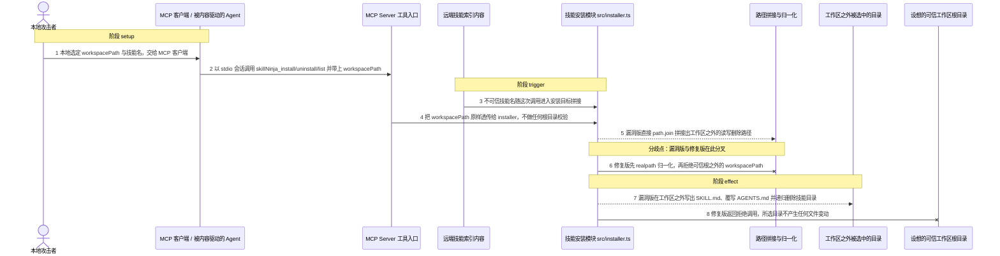
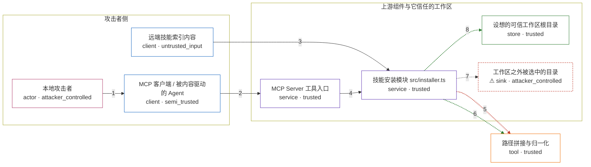

# skill-ninja-mcp-server / CVE-2026-19328

状态：草稿，未完成环境和复现。这个目录由模板生成，不构成漏洞确认。

图解的唯一来源是 `diagram.toml`：编辑后运行 `python3 -m runner diagram skill-ninja-mcp-server/CVE-2026-19328` 重新生成下方的图解区块。图解必须覆盖漏洞涉及的每个主体，并标出漏洞版/修复版的分歧步骤。

<!-- diagram:begin (generated from diagram.toml by `python3 -m runner diagram`; edit diagram.toml, not this block) -->
## 漏洞图解 — skill-ninja-mcp-server / CVE-2026-19328 工作区路径穿越

0.1.0 版 src/installer.ts 把 MCP 工具入参 workspacePath 当作可信工作区根目录，直接用 path.join 拼接 .github/skills 下的读写删除路径，既不做 realpath 归一化，也不校验结果是否仍在允许的工作区内，path.join 还会把路径里的 .. 段静默归一化掉；skillName 同样只被当作路径片段，没有限制为单层目录名。攻击者只要在本地 stdio 会话里把 workspacePath 指向工作区之外，installSkill 就会在攻击者选定的目录写入 SKILL.md 与 AGENTS.md，uninstallSkill 会递归删除该目录下的技能目录，getInstalledSkills 会枚举该目录。0.1.1 版新增 src/workspace.ts，在 installer 与 tools 的每个入口先做 realpath 与可信根校验，越界输入在触碰文件系统之前被拒绝。

### 涉及主体

| 主体 | 类型 | 信任级别 | 在漏洞里的作用 | 来源 |
| --- | --- | --- | --- | --- |
| 本地攻击者 (`attacker`) | `actor` | `attacker_controlled` | 选择本次工具调用的 workspacePath，把目标指向工作区之外的目录；该调用以受害者自身权限执行。 | — |
| MCP 客户端 / 被内容驱动的 Agent (`mcp_client`) | `client` | `semi_trusted` | 把攻击者选定或不可信内容诱导出的工具入参发进 stdio 会话；它只能控制这次调用的参数。 | — |
| 远端技能索引内容 (`untrusted_index`) | `client` | `untrusted_input` | 提供与这次调用同行的敌对技能名；它随不可信内容进入会话，本身不构成穿越，穿越由调用方给的 workspacePath 完成。 | fixtures/attack.json |
| MCP Server 工具入口 (`server_harness`) | `service` | `trusted` | 注册 skillNinja_install/uninstall/list/recommend 四个工具，workspacePath 只是必填字符串，schema 里没有根目录约束，取出后直接透传给 installer。 | src/index.ts |
| 技能安装模块 src/installer.ts (`skill_installer`) | `service` | `trusted` | 用 path.join(workspacePath, '.github', 'skills', skillName) 拼路径并执行写入、递归删除与目录枚举，缺少归一化后的边界校验。 | src/installer.ts |
| 设想的可信工作区根目录 (`trusted_workspace`) | `store` | `trusted` | 本应被限制在 .github/skills 之内的读写目标，也是漏洞越过的那道边界的内侧数据。 | — |
| 路径拼接与归一化 (`path_resolution`) | `tool` | `trusted` | path.join 把 .. 段原地归一化，于是越界路径根本不会被察觉；修复版在这里先 realpath 再要求结果位于可信根之内。 | — |
| ⚠ 工作区之外被选中的目录 (`out_of_root_target`) | `sink` | `attacker_controlled` | 攻击者选定的越界落点；越界写入的演示文件放在这里，用来观察效果，它不代表真实外部目标。 | — |

**信任边界**

- **攻击者侧** (`attacker_side`)：成员 `attacker`、`mcp_client`、`untrusted_index`。攻击者只能控制本次工具调用的 workspacePath，以及进入会话的不可信技能内容；容器本身没有被攻陷。
- **上游组件与它信任的工作区** (`product`)：成员 `server_harness`、`skill_installer`、`trusted_workspace`、`out_of_root_target`。这道边界本应把文件操作限制在同一个工作区的 .github/skills 之内，漏洞让调用方提供的路径成了新的根。
- 未列入上述边界：`path_resolution`。

标 ⚠ 的主体是本仓库合成的替身或无害效果载体，不代表真实外部目标。

### 触发过程

### 主体与信任边界

箭头上的数字是上面的步骤编号；方框只标主体和信任级别，具体动作见「触发过程」。

**分歧点**：第 5 步（`vulnerable_only`）漏洞版直接 path.join 拼接出工作区之外的读写删除路径。
**分歧点**：第 6 步（`patched_only`）修复版先 realpath 归一化，再拒绝可信根之外的 workspacePath。
<!-- diagram:end -->

## 公告与机制

TODO：官方公告、漏洞根因、Agent 信任边界、受影响范围和修复来源。

## 前提

TODO：认证要求、用户交互、已有批准、工具权限、攻击者能控制的内容。

## 版本与启动

TODO：补全 metadata、Dockerfile/镜像 digest 和 Compose，再写出精确启动命令。

Compose 中 `vulnerable` 与 `patched` profiles 分开使用；未指定 profile 不启动服务。镜像变量未配置时 Compose 会明确报错。此模板不暴露宿主端口，也不挂载主机数据。

## 机制复现

TODO：实现 `reproduce.py`，固定输入并执行真实漏洞路径，注明运行位置、参数和超时。

完成实现后使用 `python3 -m runner reproduce skill-ninja-mcp-server/CVE-2026-19328 --build --rounds 3`。
两脚本统一接受 `--context <context.json> --output <目录>`，详细字段见仓库 `docs/environment-contract.md`。
PoC 输出 `facts.json` 和效果文件；验证器只读证据，输出含 `target_ready` 及对应效果断言的 `verdict.json`。
镜像必须包含 Python 3 和 `/lab/` 下的脚本、fixtures；`runtime.mode` 选择 `oneshot` 或有 healthcheck 的 `service`。

## 端到端复现

TODO：实现 `end_to_end.py`；若不需要模型，明确写出不适用原因。真实模型的结果与机制复现分开统计。

## 验证与修复对照

TODO：实现 `verify.py`。记录漏洞版无害效果、修复版阻断和正常任务成功的证据，不能把服务启动失败当成阻断。

## 清理

默认运行器按每个测试的唯一 Compose project 清理容器、网络和 volume。
`--keep-on-failure` 保留失败项目，项目标识和 Compose 配置在结果目录中；仅清理该项目，不能使用全局 prune。

## 失败诊断

TODO：为本漏洞写出预期效果缺失、修复版仍有越界效果、正常任务失败及前提不满足时的具体排查路径。
启动失败、健康检查失败和超时都不能当作修复阻断。报告中应能定位到阶段、预期、实际和受控证据。

## 构建与输入

TODO：填写两版源码 archive、完整 commit，记录 `build.inputs` 中每个下载的 SHA-256；依赖安装必须支持禁网构建。
固定攻击和正常输入放入 `fixtures/` 并登记到 `fixtures/manifest.toml`。固定 seed、环境变量，说明无害效果与真实影响的关系。

## 隔离例外

默认无例外。确需例外时同时填写 `runtime.exceptions`、理由及最小范围，晋升由两位维护者审阅。

## 来源与许可

TODO：列出引用代码、fixtures 和镜像的来源及许可。
