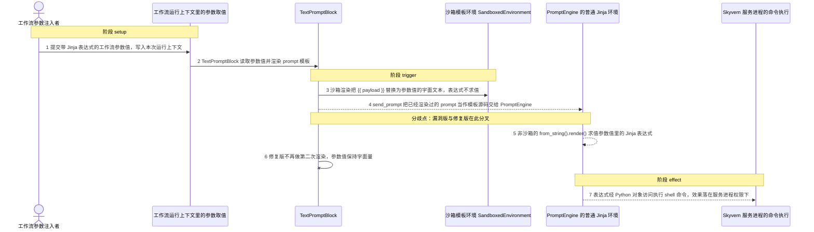
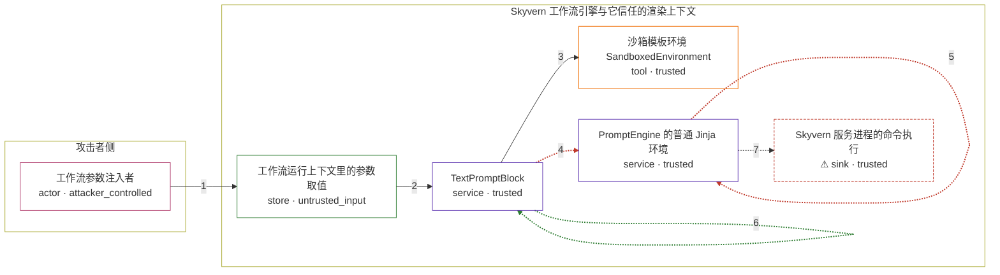

# skyvern / CVE-2026-82447

状态：草稿，未完成环境和复现。这个目录由模板生成，不构成漏洞确认。

图解的唯一来源是 `diagram.toml`：编辑后运行 `python3 -m runner diagram skyvern/CVE-2026-82447` 重新生成下方的图解区块。图解必须覆盖漏洞涉及的每个主体，并标出漏洞版/修复版的分歧步骤。

<!-- diagram:begin (generated from diagram.toml by `python3 -m runner diagram`; edit diagram.toml, not this block) -->
## 漏洞图解 — skyvern / CVE-2026-82447 漏洞图解

TextPromptBlock 先把 prompt 模板交给沙箱环境渲染，把工作流参数值当作惰性文本替换进去；漏洞版的 send_prompt 随后又把这段已经渲染过的文本交给 PromptEngine 的非沙箱 jinja2.Environment 再渲染一次。于是参数值里的 Jinja 表达式在第二次渲染中被当作模板源码求值，穿透 Python 对象访问，并以 Skyvern 服务进程权限执行操作系统命令。修复版只保留那次沙箱渲染，参数值因此保持字面量。

### 涉及主体

| 主体 | 类型 | 信任级别 | 在漏洞里的作用 | 来源 |
| --- | --- | --- | --- | --- |
| 工作流参数注入者 (`attacker`) | `actor` | `attacker_controlled` | 构造带有 Jinja 表达式的工作流参数值，让它作为 prompt 模板变量进入 TextPromptBlock。 | — |
| 工作流运行上下文里的参数取值 (`run_context`) | `store` | `untrusted_input` | 保存本次运行的工作流参数取值。值由攻击者控制，但渲染器只应把它当数据。 | fixtures/attack_input.json |
| TextPromptBlock (`text_prompt_block`) | `service` | `trusted` | 收集参数值、先用沙箱环境渲染 prompt，漏洞版再把渲染结果交给第二次渲染。 | skyvern/forge/sdk/workflow/models/block.py |
| 沙箱模板环境 SandboxedEnvironment (`sandbox_render`) | `tool` | `trusted` | 第一次渲染：把 {{ payload }} 替换为参数值的字面文本，不对替换结果再做模板解析。 | skyvern/forge/sdk/workflow/models/block.py |
| PromptEngine 的普通 Jinja 环境 (`prompt_engine`) | `service` | `trusted` | 第二次渲染：用非沙箱的 jinja2.Environment 把已渲染文本当作模板源码解析并求值。 | skyvern/forge/sdk/prompting.py |
| ⚠ Skyvern 服务进程的命令执行 (`process`) | `sink` | `trusted` | 被求值的表达式经 Python 对象访问触达执行能力，命令以服务进程权限运行；这里由无害 marker 承载效果。 | — |

**信任边界**

- **攻击者侧** (`attacker_side`)：成员 `attacker`。攻击者只能控制工作流参数取值，不能控制 Skyvern 进程、渲染环境或模板源码本身。
- **Skyvern 工作流引擎与它信任的渲染上下文** (`engine`)：成员 `run_context`、`text_prompt_block`、`sandbox_render`、`prompt_engine`、`process`。沙箱渲染保证参数值只作为惰性文本进入 prompt；漏洞版额外触发的非沙箱渲染让这段文本重新变成可执行的模板源码，边界因此失效。

标 ⚠ 的主体是本仓库合成的替身或无害效果载体，不代表真实外部目标。

### 触发过程

### 主体与信任边界

箭头上的数字是上面的步骤编号；方框只标主体和信任级别，具体动作见「触发过程」。

**分歧点**：第 4 步（`vulnerable_only`）send_prompt 把已经渲染过的 prompt 当作模板源码交给 PromptEngine。
**分歧点**：第 5 步（`vulnerable_only`）非沙箱的 from_string().render() 求值参数值里的 Jinja 表达式。
**分歧点**：第 6 步（`patched_only`）修复版不再做第二次渲染，参数值保持字面量。
<!-- diagram:end -->

## 公告与机制

TODO：官方公告、漏洞根因、Agent 信任边界、受影响范围和修复来源。

## 前提

TODO：认证要求、用户交互、已有批准、工具权限、攻击者能控制的内容。

## 版本与启动

TODO：补全 metadata、Dockerfile/镜像 digest 和 Compose，再写出精确启动命令。

Compose 中 `vulnerable` 与 `patched` profiles 分开使用；未指定 profile 不启动服务。镜像变量未配置时 Compose 会明确报错。此模板不暴露宿主端口，也不挂载主机数据。

## 机制复现

TODO：实现 `reproduce.py`，固定输入并执行真实漏洞路径，注明运行位置、参数和超时。

完成实现后使用 `python3 -m runner reproduce skyvern/CVE-2026-82447 --build --rounds 3`。
两脚本统一接受 `--context <context.json> --output <目录>`，详细字段见仓库 `docs/environment-contract.md`。
PoC 输出 `facts.json` 和效果文件；验证器只读证据，输出含 `target_ready` 及对应效果断言的 `verdict.json`。
镜像必须包含 Python 3 和 `/lab/` 下的脚本、fixtures；`runtime.mode` 选择 `oneshot` 或有 healthcheck 的 `service`。

## 端到端复现

TODO：实现 `end_to_end.py`；若不需要模型，明确写出不适用原因。真实模型的结果与机制复现分开统计。

## 验证与修复对照

TODO：实现 `verify.py`。记录漏洞版无害效果、修复版阻断和正常任务成功的证据，不能把服务启动失败当成阻断。

## 清理

默认运行器按每个测试的唯一 Compose project 清理容器、网络和 volume。
`--keep-on-failure` 保留失败项目，项目标识和 Compose 配置在结果目录中；仅清理该项目，不能使用全局 prune。

## 失败诊断

TODO：为本漏洞写出预期效果缺失、修复版仍有越界效果、正常任务失败及前提不满足时的具体排查路径。
启动失败、健康检查失败和超时都不能当作修复阻断。报告中应能定位到阶段、预期、实际和受控证据。

## 构建与输入

TODO：填写两版源码 archive、完整 commit，记录 `build.inputs` 中每个下载的 SHA-256；依赖安装必须支持禁网构建。
固定攻击和正常输入放入 `fixtures/` 并登记到 `fixtures/manifest.toml`。固定 seed、环境变量，说明无害效果与真实影响的关系。

## 隔离例外

默认无例外。确需例外时同时填写 `runtime.exceptions`、理由及最小范围，晋升由两位维护者审阅。

## 来源与许可

TODO：列出引用代码、fixtures 和镜像的来源及许可。
