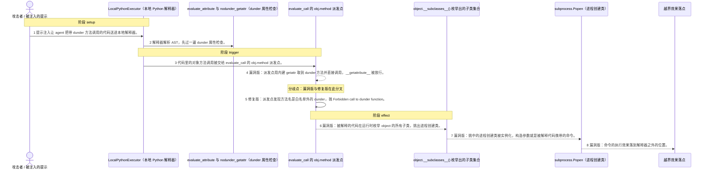
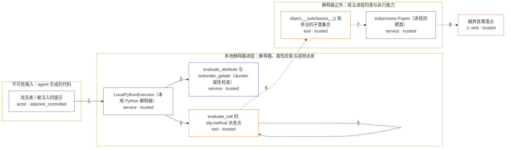

# smolagents / CVE-2025-9959

状态：草稿，未完成环境和复现。这个目录由模板生成，不构成漏洞确认。

图解的唯一来源是 `diagram.toml`：编辑后运行 `python3 -m runner diagram smolagents/CVE-2025-9959` 重新生成下方的图解区块。图解必须覆盖漏洞涉及的每个主体，并标出漏洞版/修复版的分歧步骤。

<!-- diagram:begin (generated from diagram.toml by `python3 -m runner diagram`; edit diagram.toml, not this block) -->
## 漏洞图解 — smolagents 本地 Python 解释器 dunder 方法调用沙箱逃逸

LocalPythonExecutor 对 dunder 的校验只覆盖属性读取，没有覆盖方法调用：通过 getattr(a, '__class__') 或 a.__class__ 取 dunder 会被拦，但 evaluate_call() 对 obj.__getattribute__('__class__') 这类调用目标使用内建 getattr 派发，不经过那道检查。攻击者因此能顺着函数对象的类层次取到 __bases__，再用 __subclasses__() 枚举出进程创建类，在宿主进程里执行任意命令，越过本地解释器本该提供的隔离。修复版在 evaluate_call() 里拒绝白名单之外的 dunder 方法调用，链条在第一个 __getattribute__ 处就被截断。

### 涉及主体

| 主体 | 类型 | 信任级别 | 在漏洞里的作用 | 来源 |
| --- | --- | --- | --- | --- |
| 攻击者 / 被注入的提示 (`attacker`) | `actor` | `attacker_controlled` | 攻击者。它想要在 agent 宿主进程里执行任意代码，但只能影响 agent 生成的那段代码——它自己够不到宿主进程，所以要让本地解释器替它把 dunder 方法调用放行。 | fixtures/attack.json |
| LocalPythonExecutor（本地 Python 解释器） (`executor`) | `service` | `trusted` | 受影响的上游组件。它在宿主进程内以 AST 白名单方式解释 agent 代码，本该是拦截危险操作的关口；它给出的隔离承诺就落在这里。 | src/smolagents/local_python_executor.py |
| evaluate_attribute 与 nodunder_getattr（dunder 属性检查） (`ast_guard`) | `service` | `trusted` | 解释器里已有的 dunder 属性防护。它对语法形式 obj.__class__ 和内建 getattr(obj, '__class__') 都抛 Forbidden access to dunder attribute，但它只拦属性读取，不看方法调用，因此被整条绕过。 | src/smolagents/local_python_executor.py |
| evaluate_call 的 obj.method 派发点 (`call_dispatch`) | `tool` | `trusted` | 把 obj.method(...) 变成一次真实调用的地方。漏洞版在这里用内建 getattr(obj, func_name) 取方法，不经过 dunder 属性检查，也不检查方法名本身；修复版在这里拒绝白名单之外的 dunder 方法名。两版的分叉就在这里。 | src/smolagents/local_python_executor.py |
| object.__subclasses__() 枚举出的子类集合 (`class_hierarchy`) | `tool` | `trusted` | Python 运行时的进程内对象关系。攻击者拿到 __getattribute__ 与 __bases__ 后就能枚举整个解释器的子类，从中挑出进程创建类；它不是产品提供的接口，而是语言本身暴露的能力。 | fixtures/attack.json |
| subprocess.Popen（进程创建类） (`process_spawner`) | `service` | `trusted` | 宿主侧有能力执行命令的类。解释器本不该让被解释的代码拿到它；拿到之后，被解释的代码就获得了本地解释器承诺隔离掉的那部分能力。 | fixtures/attack.json |
| ⚠ 越界效果落点 (`effect_sink`) | `sink` | `trusted` | 沙箱外代码实际作用的位置。它由执行结果携带的命令指定；这里用受控的无害标记文件表示，不代表图中的链条只能产生这一种效果。 | — |

**信任边界**

- **不可信输入：agent 生成的代码** (`untrusted_input`)：成员 `attacker`。攻击者能控制的只有被注入的提示，以及由此生成的代码文本。它自己不能在宿主进程里执行代码——能执行就不用绕这一圈。
- **本地解释器进程：解释器、属性检查与调用派发** (`local_interpreter`)：成员 `executor`、`ast_guard`、`call_dispatch`。这道边界本该把「被解释的代码」和「宿主进程的能力」隔开。属性检查只覆盖读取，调用派发却走了另一条取方法的路径，边界因此失效。
- **解释器之外：宿主进程的类与执行能力** (`host_capability`)：成员 `class_hierarchy`、`process_spawner`。越界后才够得到的东西：运行时的完整子类集合与真正能起进程的类。解释器没打算让被解释的代码走到这里。
- 未列入上述边界：`effect_sink`。

标 ⚠ 的主体是本仓库合成的替身或无害效果载体，不代表真实外部目标。

### 触发过程

### 主体与信任边界

箭头上的数字是上面的步骤编号；方框只标主体和信任级别，具体动作见「触发过程」。

**分歧点**：第 4 步（`vulnerable_only`）漏洞版：派发点用内建 getattr 取到 dunder 方法并直接调用，__getattribute__ 被放行。。
**分歧点**：第 5 步（`patched_only`）修复版：派发点发现方法名是白名单外的 dunder，抛 Forbidden call to dunder function。。
<!-- diagram:end -->

## 公告与机制

TODO：官方公告、漏洞根因、Agent 信任边界、受影响范围和修复来源。

## 前提

TODO：认证要求、用户交互、已有批准、工具权限、攻击者能控制的内容。

## 版本与启动

TODO：补全 metadata、Dockerfile/镜像 digest 和 Compose，再写出精确启动命令。

Compose 中 `vulnerable` 与 `patched` profiles 分开使用；未指定 profile 不启动服务。镜像变量未配置时 Compose 会明确报错。此模板不暴露宿主端口，也不挂载主机数据。

## 机制复现

TODO：实现 `reproduce.py`，固定输入并执行真实漏洞路径，注明运行位置、参数和超时。

完成实现后使用 `python3 -m runner reproduce smolagents/CVE-2025-9959 --build --rounds 3`。
两脚本统一接受 `--context <context.json> --output <目录>`，详细字段见仓库 `docs/environment-contract.md`。
PoC 输出 `facts.json` 和效果文件；验证器只读证据，输出含 `target_ready` 及对应效果断言的 `verdict.json`。
镜像必须包含 Python 3 和 `/lab/` 下的脚本、fixtures；`runtime.mode` 选择 `oneshot` 或有 healthcheck 的 `service`。

## 端到端复现

TODO：实现 `end_to_end.py`；若不需要模型，明确写出不适用原因。真实模型的结果与机制复现分开统计。

## 验证与修复对照

TODO：实现 `verify.py`。记录漏洞版无害效果、修复版阻断和正常任务成功的证据，不能把服务启动失败当成阻断。

## 清理

默认运行器按每个测试的唯一 Compose project 清理容器、网络和 volume。
`--keep-on-failure` 保留失败项目，项目标识和 Compose 配置在结果目录中；仅清理该项目，不能使用全局 prune。

## 失败诊断

TODO：为本漏洞写出预期效果缺失、修复版仍有越界效果、正常任务失败及前提不满足时的具体排查路径。
启动失败、健康检查失败和超时都不能当作修复阻断。报告中应能定位到阶段、预期、实际和受控证据。

## 构建与输入

TODO：填写两版源码 archive、完整 commit，记录 `build.inputs` 中每个下载的 SHA-256；依赖安装必须支持禁网构建。
固定攻击和正常输入放入 `fixtures/` 并登记到 `fixtures/manifest.toml`。固定 seed、环境变量，说明无害效果与真实影响的关系。

## 隔离例外

默认无例外。确需例外时同时填写 `runtime.exceptions`、理由及最小范围，晋升由两位维护者审阅。

## 来源与许可

TODO：列出引用代码、fixtures 和镜像的来源及许可。
