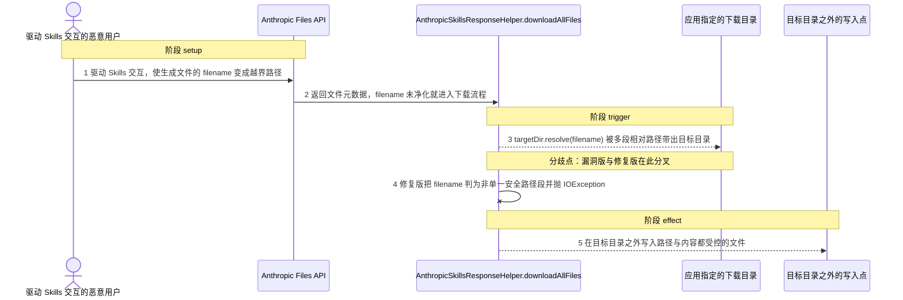
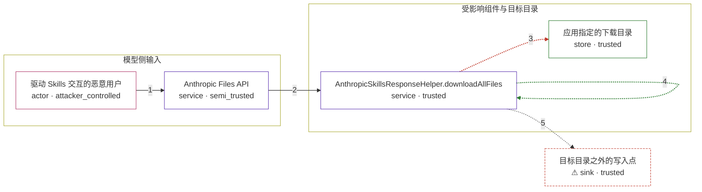

# spring-ai-s-support-for-anthropic-s-skills-api-u / CVE-2026-41863

状态：草稿，未完成环境和复现。这个目录由模板生成，不构成漏洞确认。

图解的唯一来源是 `diagram.toml`：编辑后运行 `python3 -m runner diagram spring-ai-s-support-for-anthropic-s-skills-api-u/CVE-2026-41863` 重新生成下方的图解区块。图解必须覆盖漏洞涉及的每个主体，并标出漏洞版/修复版的分歧步骤。

<!-- diagram:begin (generated from diagram.toml by `python3 -m runner diagram`; edit diagram.toml, not this block) -->
## 漏洞图解 — CVE-2026-41863 Anthropic Skills 文件名未净化导致越界写入

Anthropic Files API 返回的文件元数据里 filename 由模型侧决定，而 AnthropicSkillsResponseHelper.downloadAllFiles 直接把 targetDir.resolve(metadata.filename()) 当作写入路径，写盘前不做任何校验。resolve 遇到绝对路径会丢弃 targetDir，遇到含 `..` 的多段相对路径会向上越出 targetDir，于是「只写进目标目录」这道边界被绕过。攻击者由此可以在目标目录之外写入路径和内容都受控的文件；修复版先把 filename 校验为单一安全路径段，越界名一律抛 IOException 阻断写入。

### 涉及主体

| 主体 | 类型 | 信任级别 | 在漏洞里的作用 | 来源 |
| --- | --- | --- | --- | --- |
| 驱动 Skills 交互的恶意用户 (`attacker`) | `actor` | `attacker_controlled` | 决定 Skills 执行时创建的文件名，使 Files API 返回的 filename 成为越界路径载荷；它只能影响这一次交互产生的文件元数据，不能直接操作目标主机文件系统。 | — |
| Anthropic Files API (`files_api`) | `service` | `semi_trusted` | getFileMetadata 把模型侧决定、未经净化的 filename 原样交给下游，是本漏洞不可信输入进入受信流程的入口。 | fixtures/attack/files.json |
| AnthropicSkillsResponseHelper.downloadAllFiles (`download_helper`) | `service` | `trusted` | 唯一实质缺陷点：用 targetDir.resolve(metadata.filename()) 直接得到写入路径，之前没有绝对路径、路径分段、`.`/`..` 或规范化兜底校验。 | models/spring-ai-anthropic/src/main/java/org/springframework/ai/anthropic/AnthropicSkillsResponseHelper.java |
| 应用指定的下载目录 (`target_dir`) | `store` | `trusted` | 本应限制写入范围的目录；漏洞版允许解析结果落在它之外，写出目录边界的文件。 | — |
| ⚠ 目标目录之外的写入点 (`escaped_file`) | `sink` | `trusted` | 越界写入的落点：路径由 filename 决定，内容来自被下载文件的字节，因此攻击者同时控制落点与内容。此处只用无害的合成标记文件，不代表真实的受限目录。 | — |

**信任边界**

- **模型侧输入** (`model_side`)：成员 `attacker`、`files_api`。filename 由模型侧生成后经 Files API 返回，属于外部输入；这一侧对文件名的安全性没有任何保证，攻击者能控制的也只是这次交互产生的元数据。
- **受影响组件与目标目录** (`app_side`)：成员 `download_helper`、`target_dir`。downloadAllFiles 本应只把文件写进 targetDir；resolve 对绝对路径丢弃 targetDir、对 `..` 段允许向上越出，使这道边界在写盘前就失效。
- 未列入上述边界：`escaped_file`。

标 ⚠ 的主体是本仓库合成的替身或无害效果载体，不代表真实外部目标。

### 触发过程

### 主体与信任边界

箭头上的数字是上面的步骤编号；方框只标主体和信任级别，具体动作见「触发过程」。

**分歧点**：第 3 步（`vulnerable_only`）targetDir.resolve(filename) 被多段相对路径带出目标目录。
**分歧点**：第 4 步（`patched_only`）修复版把 filename 判为非单一安全路径段并抛 IOException。
<!-- diagram:end -->

## 公告与机制

TODO：官方公告、漏洞根因、Agent 信任边界、受影响范围和修复来源。

## 前提

TODO：认证要求、用户交互、已有批准、工具权限、攻击者能控制的内容。

## 版本与启动

TODO：补全 metadata、Dockerfile/镜像 digest 和 Compose，再写出精确启动命令。

Compose 中 `vulnerable` 与 `patched` profiles 分开使用；未指定 profile 不启动服务。镜像变量未配置时 Compose 会明确报错。此模板不暴露宿主端口，也不挂载主机数据。

## 机制复现

TODO：实现 `reproduce.py`，固定输入并执行真实漏洞路径，注明运行位置、参数和超时。

完成实现后使用 `python3 -m runner reproduce spring-ai-s-support-for-anthropic-s-skills-api-u/CVE-2026-41863 --build --rounds 3`。
两脚本统一接受 `--context <context.json> --output <目录>`，详细字段见仓库 `docs/environment-contract.md`。
PoC 输出 `facts.json` 和效果文件；验证器只读证据，输出含 `target_ready` 及对应效果断言的 `verdict.json`。
镜像必须包含 Python 3 和 `/lab/` 下的脚本、fixtures；`runtime.mode` 选择 `oneshot` 或有 healthcheck 的 `service`。

## 端到端复现

TODO：实现 `end_to_end.py`；若不需要模型，明确写出不适用原因。真实模型的结果与机制复现分开统计。

## 验证与修复对照

TODO：实现 `verify.py`。记录漏洞版无害效果、修复版阻断和正常任务成功的证据，不能把服务启动失败当成阻断。

## 清理

默认运行器按每个测试的唯一 Compose project 清理容器、网络和 volume。
`--keep-on-failure` 保留失败项目，项目标识和 Compose 配置在结果目录中；仅清理该项目，不能使用全局 prune。

## 失败诊断

TODO：为本漏洞写出预期效果缺失、修复版仍有越界效果、正常任务失败及前提不满足时的具体排查路径。
启动失败、健康检查失败和超时都不能当作修复阻断。报告中应能定位到阶段、预期、实际和受控证据。

## 构建与输入

TODO：填写两版源码 archive、完整 commit，记录 `build.inputs` 中每个下载的 SHA-256；依赖安装必须支持禁网构建。
固定攻击和正常输入放入 `fixtures/` 并登记到 `fixtures/manifest.toml`。固定 seed、环境变量，说明无害效果与真实影响的关系。

## 隔离例外

默认无例外。确需例外时同时填写 `runtime.exceptions`、理由及最小范围，晋升由两位维护者审阅。

## 来源与许可

TODO：列出引用代码、fixtures 和镜像的来源及许可。
