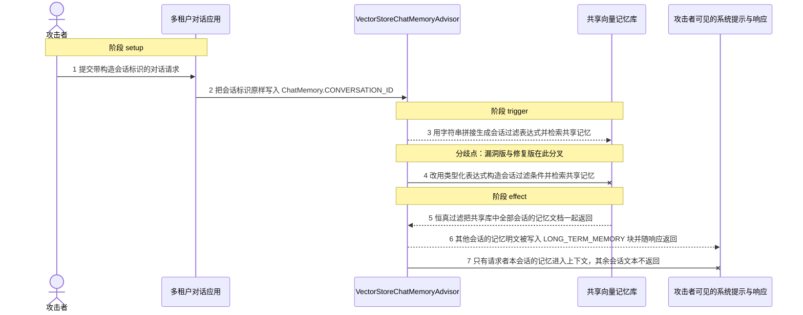
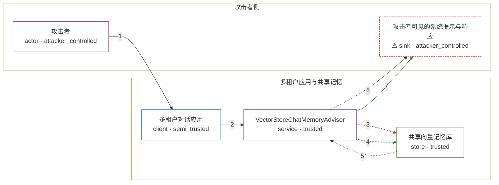

# spring-ai-s-vectorstorechatmemoryadvisor-convers / CVE-2026-40966

状态：草稿，未完成环境和复现。这个目录由模板生成，不构成漏洞确认。

图解的唯一来源是 `diagram.toml`：编辑后运行 `python3 -m runner diagram spring-ai-s-vectorstorechatmemoryadvisor-convers/CVE-2026-40966` 重新生成下方的图解区块。图解必须覆盖漏洞涉及的每个主体，并标出漏洞版/修复版的分歧步骤。

<!-- diagram:begin (generated from diagram.toml by `python3 -m runner diagram`; edit diagram.toml, not this block) -->
## 漏洞图解 — spring-ai-s-vectorstorechatmemoryadvisor-convers / CVE-2026-40966 漏洞图解

VectorStoreChatMemoryAdvisor 在检索长期记忆前，用字符串拼接把调用方提供的 conversationId 嵌进过滤表达式文本，未对引号或元字符做任何转义。攻击者只要在会话标识里闭合引号并追加一个恒真的布尔分支，过滤条件就会整体塌缩，共享向量库随即返回其他租户的全部会话记忆。检索到的文本被写入系统提示的 LONG_TERM_MEMORY 块并随响应返回，攻击者因此读到他人会话的明文记忆。修复版本改用类型化表达式构造器，使会话标识只能作为字面值参与比较。

### 涉及主体

| 主体 | 类型 | 信任级别 | 在漏洞里的作用 | 来源 |
| --- | --- | --- | --- | --- |
| 攻击者 (`attacker`) | `actor` | `attacker_controlled` | 构造本次对话请求，并把会话标识字段当成注入点；它既不知道其他租户的会话标识，也无法直接读取共享记忆库。 | — |
| 多租户对话应用 (`chat_client`) | `client` | `semi_trusted` | 把调用方提交的会话标识原样写入 ChatMemory.CONVERSATION_ID 上下文再交给记忆顾问，相信该字段只用于选择自己的会话，不做服务端归属校验。 | — |
| VectorStoreChatMemoryAdvisor (`memory_advisor`) | `service` | `trusted` | 在检索共享记忆前构造过滤表达式：受影响的版本用字符串拼接，修复后的版本用类型化表达式树构造器，两者对同一个会话标识的处理不同。 | advisors/spring-ai-advisors-vector-store/src/main/java/org/springframework/ai/chat/client/advisor/vectorstore/VectorStoreChatMemoryAdvisor.java |
| 共享向量记忆库 (`memory_store`) | `store` | `trusted` | 保存所有租户的会话记忆文档，并以 conversationId 元数据区分会话归属；过滤表达式一旦恒真，它就会把全部会话的文档交给检索方。 | fixtures/memory-store.json |
| ⚠ 攻击者可见的系统提示与响应 (`attacker_context`) | `sink` | `attacker_controlled` | 检索到的记忆文本在这里被写入 LONG_TERM_MEMORY 块并随响应返回，攻击者由此读到其他会话的明文记忆；承载内容是无害的标记文本。 | — |

**信任边界**

- **攻击者侧** (`attacker_side`)：成员 `attacker`、`attacker_context`。攻击者只能控制自己这次请求的会话标识与查询文本；其他租户的会话标识和记忆内容都在它的控制范围之外。
- **多租户应用与共享记忆** (`tenant_side`)：成员 `chat_client`、`memory_advisor`、`memory_store`。会话隔离本应由 conversationId 过滤保证：应用以为该字段只是会话选择器，记忆顾问以为拼接出的过滤表达式一定按字面值比较。

标 ⚠ 的主体是本仓库合成的替身或无害效果载体，不代表真实外部目标。

### 触发过程

### 主体与信任边界

箭头上的数字是上面的步骤编号；方框只标主体和信任级别，具体动作见「触发过程」。

**分歧点**：第 3 步（`vulnerable_only`）用字符串拼接生成会话过滤表达式并检索共享记忆。
**分歧点**：第 4 步（`patched_only`）改用类型化表达式构造会话过滤条件并检索共享记忆。
<!-- diagram:end -->

## 公告与机制

TODO：官方公告、漏洞根因、Agent 信任边界、受影响范围和修复来源。

## 前提

TODO：认证要求、用户交互、已有批准、工具权限、攻击者能控制的内容。

## 版本与启动

TODO：补全 metadata、Dockerfile/镜像 digest 和 Compose，再写出精确启动命令。

Compose 中 `vulnerable` 与 `patched` profiles 分开使用；未指定 profile 不启动服务。镜像变量未配置时 Compose 会明确报错。此模板不暴露宿主端口，也不挂载主机数据。

## 机制复现

TODO：实现 `reproduce.py`，固定输入并执行真实漏洞路径，注明运行位置、参数和超时。

完成实现后使用 `python3 -m runner reproduce spring-ai-s-vectorstorechatmemoryadvisor-convers/CVE-2026-40966 --build --rounds 3`。
两脚本统一接受 `--context <context.json> --output <目录>`，详细字段见仓库 `docs/environment-contract.md`。
PoC 输出 `facts.json` 和效果文件；验证器只读证据，输出含 `target_ready` 及对应效果断言的 `verdict.json`。
镜像必须包含 Python 3 和 `/lab/` 下的脚本、fixtures；`runtime.mode` 选择 `oneshot` 或有 healthcheck 的 `service`。

## 端到端复现

TODO：实现 `end_to_end.py`；若不需要模型，明确写出不适用原因。真实模型的结果与机制复现分开统计。

## 验证与修复对照

TODO：实现 `verify.py`。记录漏洞版无害效果、修复版阻断和正常任务成功的证据，不能把服务启动失败当成阻断。

## 清理

默认运行器按每个测试的唯一 Compose project 清理容器、网络和 volume。
`--keep-on-failure` 保留失败项目，项目标识和 Compose 配置在结果目录中；仅清理该项目，不能使用全局 prune。

## 失败诊断

TODO：为本漏洞写出预期效果缺失、修复版仍有越界效果、正常任务失败及前提不满足时的具体排查路径。
启动失败、健康检查失败和超时都不能当作修复阻断。报告中应能定位到阶段、预期、实际和受控证据。

## 构建与输入

TODO：填写两版源码 archive、完整 commit，记录 `build.inputs` 中每个下载的 SHA-256；依赖安装必须支持禁网构建。
固定攻击和正常输入放入 `fixtures/` 并登记到 `fixtures/manifest.toml`。固定 seed、环境变量，说明无害效果与真实影响的关系。

## 隔离例外

默认无例外。确需例外时同时填写 `runtime.exceptions`、理由及最小范围，晋升由两位维护者审阅。

## 来源与许可

TODO：列出引用代码、fixtures 和镜像的来源及许可。
