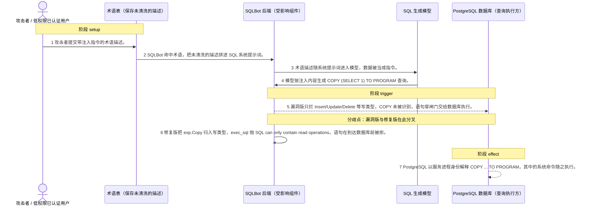
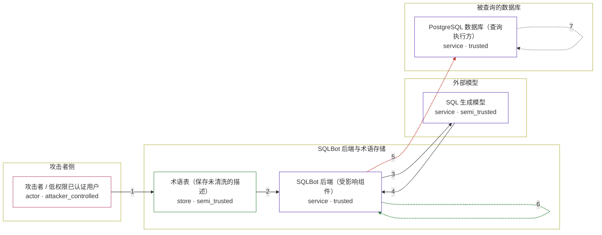

# sqlbot / CVE-2026-32622

状态：草稿，未完成环境和复现。这个目录由模板生成，不构成漏洞确认。

图解的唯一来源是 `diagram.toml`：编辑后运行 `python3 -m runner diagram sqlbot/CVE-2026-32622` 重新生成下方的图解区块。图解必须覆盖漏洞涉及的每个主体，并标出漏洞版/修复版的分歧步骤。

<!-- diagram:begin (generated from diagram.toml by `python3 -m runner diagram`; edit diagram.toml, not this block) -->
## 漏洞图解 — SQLBot 术语存储型提示注入导致 COPY ... TO PROGRAM 命令执行

SQLBot 把术语导入接口开放给普通已认证用户，并把术语 description 原样拼进 SQL 系统提示词：to_xml_string() 反向还原全部 XML 转义，攻击者可以在描述里闭合 </terminology> 并伪造新的 <terminology> 块，把指令塞进本应是数据的位置。模型随后按注入内容生成 COPY (SELECT 1) TO PROGRAM '...'。漏洞版的 check_sql_read() 只把 Insert/Update/Delete 等当作写操作，COPY 因此穿过唯一的只读闸门交给 PostgreSQL 执行，COPY ... TO PROGRAM 会以数据库服务进程身份运行系统命令；修复版把 exp.Copy 加入写类型，同一语句在到达数据库前被拒。

### 涉及主体

| 主体 | 类型 | 信任级别 | 在漏洞里的作用 | 来源 |
| --- | --- | --- | --- | --- |
| 攻击者 / 低权限已认证用户 (`attacker`) | `actor` | `attacker_controlled` | 攻击者。它想要的是数据库主机上的命令执行，但自己既不是工作区管理员，也不能直接连数据库或执行命令。它能控制的只有通过术语导入接口提交的描述文本，漏洞版的导入接口不校验管理员角色，这就是它唯一够得着的注入点。 | fixtures/terminology_attack.json |
| 术语表（保存未清洗的描述） (`terminology_store`) | `store` | `semi_trusted` | 保存术语的关系表。word 是键，description 是自由文本，导入与存储两侧都不做内容过滤，攻击者的注入文本原样落在这里，等后续检索命中。 | backend/apps/terminology/models/terminology_model.py |
| SQLBot 后端（受影响组件） (`sqlbot_backend`) | `service` | `trusted` | 出问题的上游组件。uploadExcel 在漏洞版没有权限装饰器；to_xml_string() 把 XML 转义整体反向还原，sql_sys_question() 再把这段文本塞进 template.sql.system 的 {terminologies} 占位符；落点上 exec_sql() 只靠 check_sql_read() 这一道只读检查。 | backend/apps/db/db.py |
| SQL 生成模型 (`llm`) | `service` | `semi_trusted` | 按系统提示词生成 SQL 的模型。注入文本与真正的指令处在同一个 system role 里，模型无法区分哪一段是数据，于是把注入内容当成必须执行的步骤，输出 COPY ... TO PROGRAM。机制对照用固定的模型输出把这一段钉死，不把「提示词里出现注入文本」当成注入成功。 | fixtures/model_output_attack.sql |
| PostgreSQL 数据库（查询执行方） (`postgres_executor`) | `service` | `trusted` | 被查询的数据源。它拿到什么语句就执行什么语句；COPY ... TO PROGRAM 让它从跑查询变成在数据库主机上以服务进程身份运行系统命令，这是 RCE 的最后一步。 | — |

**信任边界**

- **攻击者侧** (`attacker_side`)：成员 `attacker`。攻击者只有一个有效账号和术语导入接口这个入口。它拿不到管理员角色，也不能直接读写数据库或执行系统命令——能直接执行就不用绕这一圈了。
- **SQLBot 后端与术语存储** (`product`)：成员 `sqlbot_backend`、`terminology_store`。这道边界本该把不可信的术语数据挡在 SQL 系统提示词之外，也本该把非只读 SQL 挡在数据库之外。漏洞版两处都没有拦住。
- **外部模型** (`model`)：成员 `llm`。模型按拿到的系统提示词工作，没有能力分辨哪一段是被提升为指令的用户数据。
- **被查询的数据库** (`datasource`)：成员 `postgres_executor`。数据库按收到的语句执行。语句是只读查询还是 COPY ... TO PROGRAM，由产品侧的只读检查决定，数据库自己不会再拦一次。

### 触发过程

### 主体与信任边界

箭头上的数字是上面的步骤编号；方框只标主体和信任级别，具体动作见「触发过程」。

**分歧点**：第 5 步（`vulnerable_only`）漏洞版只拦 Insert/Update/Delete 等写类型，COPY 未被识别，语句穿闸门交给数据库执行。。
**分歧点**：第 6 步（`patched_only`）修复版把 exp.Copy 归入写类型，exec_sql 抛 SQL can only contain read operations，语句在到达数据库前被拒。。
<!-- diagram:end -->

## 公告与机制

TODO：官方公告、漏洞根因、Agent 信任边界、受影响范围和修复来源。

## 前提

TODO：认证要求、用户交互、已有批准、工具权限、攻击者能控制的内容。

## 版本与启动

TODO：补全 metadata、Dockerfile/镜像 digest 和 Compose，再写出精确启动命令。

Compose 中 `vulnerable` 与 `patched` profiles 分开使用；未指定 profile 不启动服务。镜像变量未配置时 Compose 会明确报错。此模板不暴露宿主端口，也不挂载主机数据。

## 机制复现

TODO：实现 `reproduce.py`，固定输入并执行真实漏洞路径，注明运行位置、参数和超时。

完成实现后使用 `python3 -m runner reproduce sqlbot/CVE-2026-32622 --build --rounds 3`。
两脚本统一接受 `--context <context.json> --output <目录>`，详细字段见仓库 `docs/environment-contract.md`。
PoC 输出 `facts.json` 和效果文件；验证器只读证据，输出含 `target_ready` 及对应效果断言的 `verdict.json`。
镜像必须包含 Python 3 和 `/lab/` 下的脚本、fixtures；`runtime.mode` 选择 `oneshot` 或有 healthcheck 的 `service`。

## 端到端复现

TODO：实现 `end_to_end.py`；若不需要模型，明确写出不适用原因。真实模型的结果与机制复现分开统计。

## 验证与修复对照

TODO：实现 `verify.py`。记录漏洞版无害效果、修复版阻断和正常任务成功的证据，不能把服务启动失败当成阻断。

## 清理

默认运行器按每个测试的唯一 Compose project 清理容器、网络和 volume。
`--keep-on-failure` 保留失败项目，项目标识和 Compose 配置在结果目录中；仅清理该项目，不能使用全局 prune。

## 失败诊断

TODO：为本漏洞写出预期效果缺失、修复版仍有越界效果、正常任务失败及前提不满足时的具体排查路径。
启动失败、健康检查失败和超时都不能当作修复阻断。报告中应能定位到阶段、预期、实际和受控证据。

## 构建与输入

TODO：填写两版源码 archive、完整 commit，记录 `build.inputs` 中每个下载的 SHA-256；依赖安装必须支持禁网构建。
固定攻击和正常输入放入 `fixtures/` 并登记到 `fixtures/manifest.toml`。固定 seed、环境变量，说明无害效果与真实影响的关系。

## 隔离例外

默认无例外。确需例外时同时填写 `runtime.exceptions`、理由及最小范围，晋升由两位维护者审阅。

## 来源与许可

TODO：列出引用代码、fixtures 和镜像的来源及许可。
