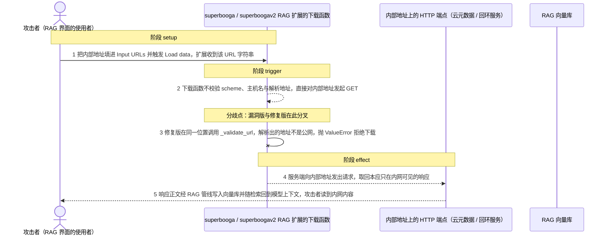
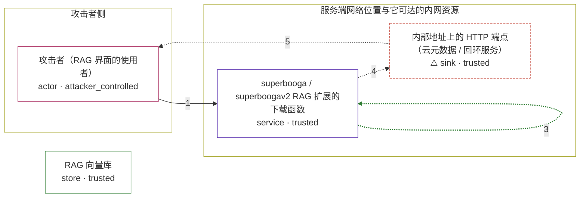

# text-generation-webui / CVE-2026-35486

状态：草稿，未完成环境和复现。这个目录由模板生成，不构成漏洞确认。

图解的唯一来源是 `diagram.toml`：编辑后运行 `python3 -m runner diagram text-generation-webui/CVE-2026-35486` 重新生成下方的图解区块。图解必须覆盖漏洞涉及的每个主体，并标出漏洞版/修复版的分歧步骤。

<!-- diagram:begin (generated from diagram.toml by `python3 -m runner diagram`; edit diagram.toml, not this block) -->
## 漏洞图解 — text-generation-webui / CVE-2026-35486 漏洞图解

superbooga 与 superboogav2 两个 RAG 扩展把「用户填写的 URL」直接交给 requests.get()，既不校验 scheme，也不过问目标地址是不是公网：没有 scheme 白名单、没有 IP 过滤、没有主机名允许列表。于是一个能访问该界面的攻击者可以让服务端替它访问 169.254.169.254、127.0.0.1 或任意内网地址，并把响应取回。修复在下载函数入口插入 _validate_url()，要求 scheme 为 http/https、主机名存在、且 DNS 解析出的每个地址都满足 ipaddress.is_global，非公网地址抛 ValueError，该次下载被上层丢弃。

### 涉及主体

| 主体 | 类型 | 信任级别 | 在漏洞里的作用 | 来源 |
| --- | --- | --- | --- | --- |
| 攻击者（RAG 界面的使用者） (`attacker`) | `actor` | `attacker_controlled` | 攻击者只能控制一件事：填进 Input URLs 文本框的 URL 字符串。它不能直接读写服务端文件，也不能直接访问 169.254.169.254 或回环地址，因此需要让服务端替它发出请求。 | fixtures/attack_urls.json |
| superbooga / superboogav2 RAG 扩展的下载函数 (`rag_extension`) | `service` | `trusted` | 受影响的上游组件。download_single() 与 _download_single() 接收调用方传入的 url，直接 requests.get(url) 取回内容，是整条链上唯一的 HTTP 出口，也是补丁插入 _validate_url(url) 的位置。 | extensions/superbooga/download_urls.py |
| ⚠ 内部地址上的 HTTP 端点（云元数据 / 回环服务） (`internal_service`) | `sink` | `trusted` | 攻击者真正想读、但自己够不着的目标：位于服务端网络位置可达、外部不可达的地址上的 HTTP 端点，例如云元数据服务。这里用受控的回环端点承载它的角色，因此图中标 ⚠。 | fixtures/internal_endpoint.json |
| RAG 向量库 (`vector_store`) | `store` | `trusted` | superboogav2 把下载到的正文经 BeautifulSoup 清洗后写入向量库；superbooga 则作为字符串返回给调用方。被取回的内容随后由 RAG 检索带进模型上下文，攻击者因此能读到响应正文。 | — |

**信任边界**

- **攻击者侧** (`attacker_side`)：成员 `attacker`。攻击者唯一能控制的是 URL 字符串本身：它不能读服务端文件，也不能直接访问云元数据或回环地址，只能请求服务端代发。
- **服务端网络位置与它可达的内网资源** (`server_side`)：成员 `rag_extension`、`internal_service`。这道边界本来只允许扩展抓取公网 URL，把内网与云元数据地址挡在外面；漏洞让它失效，因为下载函数对传进来的 URL 不做任何 scheme、主机名或地址校验。
- 未列入上述边界：`vector_store`。

标 ⚠ 的主体是本仓库合成的替身或无害效果载体，不代表真实外部目标。

### 触发过程

### 主体与信任边界

箭头上的数字是上面的步骤编号；方框只标主体和信任级别，具体动作见「触发过程」。

**分歧点**：第 2 步（`vulnerable_only`）下载函数不校验 scheme、主机名与解析地址，直接对内部地址发起 GET。
**分歧点**：第 3 步（`patched_only`）修复版在同一位置调用 _validate_url，解析出的地址不是公网，抛 ValueError 拒绝下载。
<!-- diagram:end -->

## 公告与机制

TODO：官方公告、漏洞根因、Agent 信任边界、受影响范围和修复来源。

## 前提

TODO：认证要求、用户交互、已有批准、工具权限、攻击者能控制的内容。

## 版本与启动

TODO：补全 metadata、Dockerfile/镜像 digest 和 Compose，再写出精确启动命令。

Compose 中 `vulnerable` 与 `patched` profiles 分开使用；未指定 profile 不启动服务。镜像变量未配置时 Compose 会明确报错。此模板不暴露宿主端口，也不挂载主机数据。

## 机制复现

`reproduce.py` 加载镜像里解包好的上游源码，直接调用被固定的 sink 本体，不重写也不抽取漏洞函数：
`extensions/superbooga/download_urls.py` 的 `download_single()`（`AVH_RAG_ADAPTER=superboogav2` 时改用
`extensions/superboogav2/download_urls.py` 的 `_download_single()`）。上游源码根目录由 `AVH_UPSTREAM_ROOT`
指定，默认 `/lab/upstream`；构建阶段把源码归档解到该目录即可。

- **attack**：读 `fixtures/attack_urls.json`，把其中的 `127.0.0.1:<port>` 交给 sink；同进程内起一个受控
  HTTP 端点（`fixtures/internal_endpoint.json`）扮演云元数据/内网服务，返回固定的合成凭据文档。漏洞版会把
  请求发出去并取回正文，修复版在 `_validate_url` 处抛出 `ValueError: Access to non-public address 127.0.0.1
  is blocked`，请求根本没离开进程。
- **benign**：读 `fixtures/benign_public_url.json`，对公网字面量 `http://1.1.1.1:80/` 调用同一个 sink。正常
  任务要求校验放行、读取路径照常执行；容器禁网，所以 TCP 连接本身会失败，`fetch_outcome=request_failed`
  属于预期，判定只看「没有被校验拦下」。
- 观测写进 `observation.json` 与效果文件（`fetched_response.body`、或未取到内容时的 `exfiltrated.txt`），
  并记录实际执行的模块路径，证明跑的是上游代码。`verify.py` 只读哈希校验过的事实，其判定关键位是
  「请求是否离开进程」与「响应正文里有没有 marker」，因此不会把连不上外网、超时或容器启动失败误判成修复阻断。

`requests.get` 与 `requests.Session.get` 只被包了一层观测钩子（记录本次调用是否真的发起了 HTTP 请求），
钩子本身调用真正的 `requests.get`，不加任何策略。`modules.web_search` 在模块级 `from modules import shared`
与 `from modules.logging_colors import logger`；前者会把 gradio、user-data 目录和模型状态整套拖进来，而
`_validate_url` 只用到 `ipaddress`/`socket`/`urllib.parse`，因此只替换 `modules.shared` 这一个无关运行时名
（`modules.logging_colors` 是廉价的真文件，仍从上游树加载）。

**等价子集说明**：机制复现限定在 `download_single` / `_download_single` 这一真实 sink 上。没有走完整的
`feed_url_into_collector` → `process_and_add_to_collector`（ChromaDB / sentence-transformers）链路，因为那会
引入与漏洞无关的重依赖；superboogav2 的 sink 在模块顶层还 `from .data_processor import
process_and_add_to_collector`，因此默认适配器是依赖只有 `requests` 的 superbooga，两处 sink 与补丁都是同一
行 `_validate_url(url)`。这一等价子集关系必须在下游报告里保持，不能表述成完整 RAG 管线复现。

完成后运行 `python3 -m runner reproduce text-generation-webui/CVE-2026-35486 --build --rounds 3`。
两脚本统一接受 `--context <context.json> --output <目录>`，详细字段见仓库 `docs/environment-contract.md`。
PoC 输出 `facts.json` 和效果文件；验证器只读证据，输出含 `target_ready` 及对应效果断言的 `verdict.json`。
镜像必须包含 Python 3 和 `/lab/` 下的脚本、fixtures；`runtime.mode` 选择 `oneshot` 或有 healthcheck 的 `service`。

## 端到端复现

TODO：实现 `end_to_end.py`；若不需要模型，明确写出不适用原因。真实模型的结果与机制复现分开统计。

## 验证与修复对照

`verify.py` 只读 `facts.json`、`observation.json` 与效果文件，不重跑攻击、不访问网络，按场景给出一个断言：

| 场景 | check_id | 判定依据 |
| --- | --- | --- |
| 漏洞版 attack | `vulnerable_effect_observed` | `requests.get` 确实被调用、受控端点被命中、效果文件里出现 `fixtures/internal_endpoint.json` 的 marker |
| 修复版 attack | `patched_effect_blocked` | 有 `_validate_url` 的非公网拒绝信息，且没有任何出站请求、没有取到 marker 文档 |
| 漏洞版 benign | `benign_task_passed` | 公网 URL 未被校验拦下，读取路径照常执行 |
| 修复版 benign | `benign_task_passed` | 同上：补丁放行公网 URL，没有把正常任务一并拒掉 |

判定只认「请求是否离开进程」和「效果文件里有没有 marker」，因此缺少效果文件、超时、连不上外网或容器启动失败
都不会被读成修复阻断。加固时用对抗样本验证过：删掉 `fetched_response.body`、把正文换成不含 marker 的正文、
把 `observation.json` 的 `request_attempted` 改成 `false`，三条都会让 `vulnerable_effect_observed` 判为 false；
改动效果文件而不更新哈希会被 `lab_support` 的哈希链直接拒绝。

## 清理

默认运行器按每个测试的唯一 Compose project 清理容器、网络和 volume。
`--keep-on-failure` 保留失败项目，项目标识和 Compose 配置在结果目录中；仅清理该项目，不能使用全局 prune。

## 失败诊断

TODO：为本漏洞写出预期效果缺失、修复版仍有越界效果、正常任务失败及前提不满足时的具体排查路径。
启动失败、健康检查失败和超时都不能当作修复阻断。报告中应能定位到阶段、预期、实际和受控证据。

## 构建与输入

TODO：填写两版源码 archive、完整 commit，记录 `build.inputs` 中每个下载的 SHA-256；依赖安装必须支持禁网构建。
固定攻击和正常输入放入 `fixtures/` 并登记到 `fixtures/manifest.toml`。固定 seed、环境变量，说明无害效果与真实影响的关系。

## 隔离例外

默认无例外。确需例外时同时填写 `runtime.exceptions`、理由及最小范围，晋升由两位维护者审阅。

## 来源与许可

TODO：列出引用代码、fixtures 和镜像的来源及许可。
