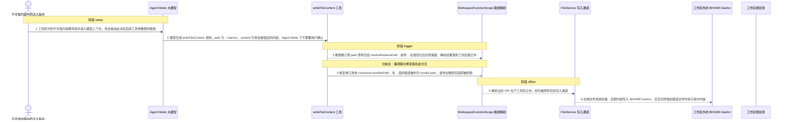

# theia / CVE-2026-82217

状态：草稿，未完成环境和复现。这个目录由模板生成，不构成漏洞确认。

图解的唯一来源是 `diagram.toml`：编辑后运行 `python3 -m runner diagram theia/CVE-2026-82217` 重新生成下方的图解区块。图解必须覆盖漏洞涉及的每个主体，并标出漏洞版/修复版的分歧步骤。

<!-- diagram:begin (generated from diagram.toml by `python3 -m runner diagram`; edit diagram.toml, not this block) -->
## 漏洞图解 — theia / CVE-2026-82217 漏洞图解

Eclipse Theia 1.73.0 起至 1.75.0 之前，Agent Mode 的 writeFileContent 工具把模型给出的 path 直接交给 resolveRelativePath 解析，而该解析器只做工作区根与相对路径的拼接，既不折叠前导 .. 段也不判断结果是否仍在根内。于是 ../.bashrc 被解析成工作区根之外的 URI 并立即落盘到 $HOME/.bashrc，集成终端加载该文件即把越界写入升级为后端用户权限的代码执行。修复版先拒绝含 .. 段的路径，再要求目标位于工作区根、贡献根或白名单之内。

### 涉及主体

| 主体 | 类型 | 信任级别 | 在漏洞里的作用 | 来源 |
| --- | --- | --- | --- | --- |
| 不可信内容中的注入指令 (`injected_content`) | `actor` | `attacker_controlled` | 攻击者唯一可控的入口：工作区文档、issue 或抓取到的网页里夹带指令，诱导模型生成越界写入的工具参数；攻击者无法直接触碰后端文件系统。 | — |
| Agent Mode 大模型 (`agent_model`) | `service` | `semi_trusted` | 把注入内容转述为 writeFileContent 的工具参数，其中 path 完全由注入内容决定；模型本身不做任何路径校验，也无法判断该路径是否会越出工作区。 | — |
| writeFileContent 工具 (`write_tool`) | `tool` | `trusted` | Agent Mode 下立即落盘且不弹确认框；脆弱修订把模型给的 path 直接交给 resolveRelativePath，既没有调用同文件里已有的 ensureWithinWorkspace / ensureAccessible，也没有走会拒绝 .. 段的 resolveToUri。 | https://raw.githubusercontent.com/eclipse-theia/theia/10e45bf1ec96ae7abd1b658a31db952a94a0df2d/packages/ai-ide/src/browser/file-changeset-functions.ts |
| WorkspaceFunctionScope 路径解析 (`path_resolver`) | `service` | `trusted` | resolveRelativePath 的单根分支只做 roots[0].resolve(normalizedPath)，Path.normalize 保留前导 ..，URI.resolve 也不折叠它；修复版的 resolveAccessiblePath 与 ensureAccessible 组成单一入口，先以 hasParentSegment 拒绝 .. 段，再要求目标位于工作区根之内。 | https://raw.githubusercontent.com/eclipse-theia/theia/72573426f320fefc89a96ba55ce05c752d182123/packages/ai-ide/src/browser/workspace-functions.ts |
| FileService 写入通道 (`file_service`) | `service` | `trusted` | 把解析后的 URI 转交后端文件系统提供者并执行写入，在这一层同样没有包含性校验，因此它照着 URI 里残留的 .. 落盘。 | — |
| 工作区根目录 (`workspace_root`) | `store` | `trusted` | AI 写入本应被限制在该目录之下；它是漏洞绕过的边界本身，但触发链路上没有任何一步对它做过检查。 | — |
| ⚠ 工作区外的 $HOME/.bashrc (`home_bashrc`) | `sink` | `trusted` | 越界写入的落点：集成终端在 Linux 上以非登录交互 shell 启动并 source ~/.bashrc，因此该文件承载的内容会在用户打开终端时执行。这里只放一段无害的标记内容，不指向真实外部目标。 | — |

**信任边界**

- **不可信内容侧** (`attacker_side`)：成员 `injected_content`。攻击者只能往模型上下文里投递文本，不能直接调用工具，也不能指定最终写入位置之外的任意系统操作。
- **Theia AI 运行时与工作区** (`agent_runtime`)：成员 `agent_model`、`write_tool`、`path_resolver`、`file_service`、`workspace_root`。这道边界本应保证 AI 的文件变更工具只作用于工作区根之下，但写工具绕过了已有的包含性检查，使根目录约束形同虚设。
- **后端操作系统文件系统** (`host_filesystem`)：成员 `home_bashrc`。工作区之外的真实文件；只有越界写入成功时才会被触及，终端启动时的 shell 加载是它升级为代码执行的触发点。

标 ⚠ 的主体是本仓库合成的替身或无害效果载体，不代表真实外部目标。

### 触发过程

### 主体与信任边界

箭头上的数字是上面的步骤编号；方框只标主体和信任级别，具体动作见「触发过程」。

```mermaid
%% theia / CVE-2026-82217 漏洞图解 — generated from diagram.toml
flowchart LR
  subgraph attacker_side["不可信内容侧"]
    injected_content["不可信内容中的注入指令<br/>actor · attacker_controlled"]
  end
  subgraph agent_runtime["Theia AI 运行时与工作区"]
    agent_model["Agent Mode 大模型<br/>service · semi_trusted"]
    write_tool["writeFileContent 工具<br/>tool · trusted"]
    path_resolver["WorkspaceFunctionScope 路径解析<br/>service · trusted"]
    file_service["FileService 写入通道<br/>service · trusted"]
    workspace_root["工作区根目录<br/>store · trusted"]
  end
  subgraph host_filesystem["后端操作系统文件系统"]
    home_bashrc["工作区外的 $HOME/.bashrc<br/>⚠ sink · trusted"]
  end
  injected_content -->|"1"| agent_model
  agent_model -->|"2"| write_tool
  write_tool -.->|"3"| path_resolver
  write_tool -.->|"4"| path_resolver
  path_resolver -.->|"5"| file_service
  file_service -.->|"6"| home_bashrc
  classDef actor fill:transparent,stroke:#b03a6a
  classDef client fill:transparent,stroke:#1565c0
  classDef service fill:transparent,stroke:#5e35b1
  classDef tool fill:transparent,stroke:#ef6c00
  classDef sink fill:transparent,stroke:#c0392b
  classDef store fill:transparent,stroke:#2e7d32
  classDef synthetic stroke-dasharray: 4 2
  class injected_content actor
  class agent_model service
  class write_tool tool
  class path_resolver service
  class file_service service
  class workspace_root store
  class home_bashrc sink
  class home_bashrc synthetic
  style attacker_side fill:transparent
  style agent_runtime fill:transparent
  style host_filesystem fill:transparent
  linkStyle 2 stroke:#c0392b,stroke-width:2px
  linkStyle 3 stroke:#2e7d32,stroke-width:2px
```

**分歧点**：第 3 步（`vulnerable_only`）脆弱修订把 path 原样交给 resolveRelativePath：前导 .. 在规范化后仍然保留，解析结果落到工作区根之外。
**分歧点**：第 4 步（`patched_only`）修复修订改用 resolveAccessiblePath：含 .. 段的路径被判为 Invalid path，请求在解析阶段即被拒绝。
<!-- diagram:end -->

## 公告与机制

TODO：官方公告、漏洞根因、Agent 信任边界、受影响范围和修复来源。

## 前提

TODO：认证要求、用户交互、已有批准、工具权限、攻击者能控制的内容。

## 版本与启动

TODO：补全 metadata、Dockerfile/镜像 digest 和 Compose，再写出精确启动命令。

Compose 中 `vulnerable` 与 `patched` profiles 分开使用；未指定 profile 不启动服务。镜像变量未配置时 Compose 会明确报错。此模板不暴露宿主端口，也不挂载主机数据。

## 机制复现

TODO：实现 `reproduce.py`，固定输入并执行真实漏洞路径，注明运行位置、参数和超时。

完成实现后使用 `python3 -m runner reproduce theia/CVE-2026-82217 --build --rounds 3`。
两脚本统一接受 `--context <context.json> --output <目录>`，详细字段见仓库 `docs/environment-contract.md`。
PoC 输出 `facts.json` 和效果文件；验证器只读证据，输出含 `target_ready` 及对应效果断言的 `verdict.json`。
镜像必须包含 Python 3 和 `/lab/` 下的脚本、fixtures；`runtime.mode` 选择 `oneshot` 或有 healthcheck 的 `service`。

## 端到端复现

TODO：实现 `end_to_end.py`；若不需要模型，明确写出不适用原因。真实模型的结果与机制复现分开统计。

## 验证与修复对照

TODO：实现 `verify.py`。记录漏洞版无害效果、修复版阻断和正常任务成功的证据，不能把服务启动失败当成阻断。

## 清理

默认运行器按每个测试的唯一 Compose project 清理容器、网络和 volume。
`--keep-on-failure` 保留失败项目，项目标识和 Compose 配置在结果目录中；仅清理该项目，不能使用全局 prune。

## 失败诊断

TODO：为本漏洞写出预期效果缺失、修复版仍有越界效果、正常任务失败及前提不满足时的具体排查路径。
启动失败、健康检查失败和超时都不能当作修复阻断。报告中应能定位到阶段、预期、实际和受控证据。

## 构建与输入

TODO：填写两版源码 archive、完整 commit，记录 `build.inputs` 中每个下载的 SHA-256；依赖安装必须支持禁网构建。
固定攻击和正常输入放入 `fixtures/` 并登记到 `fixtures/manifest.toml`。固定 seed、环境变量，说明无害效果与真实影响的关系。

## 隔离例外

默认无例外。确需例外时同时填写 `runtime.exceptions`、理由及最小范围，晋升由两位维护者审阅。

## 来源与许可

TODO：列出引用代码、fixtures 和镜像的来源及许可。
