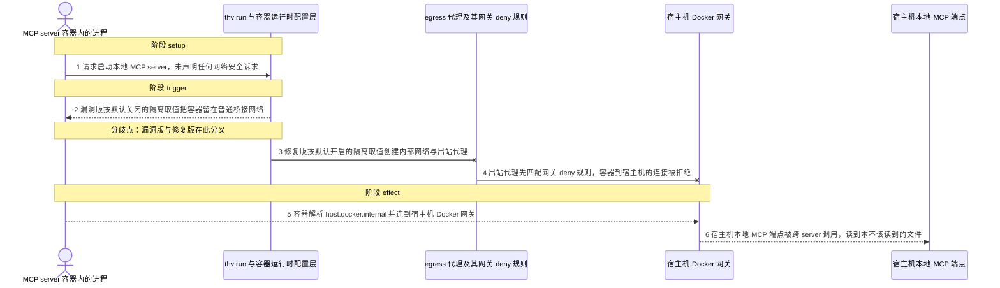
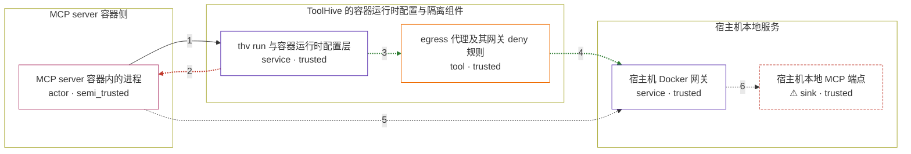

# toolhive-studio / CVE-2026-58197

状态：草稿，未完成环境和复现。这个目录由模板生成，不构成漏洞确认。

图解的唯一来源是 `diagram.toml`：编辑后运行 `python3 -m runner diagram toolhive-studio/CVE-2026-58197` 重新生成下方的图解区块。图解必须覆盖漏洞涉及的每个主体，并标出漏洞版/修复版的分歧步骤。

<!-- diagram:begin (generated from diagram.toml by `python3 -m runner diagram`; edit diagram.toml, not this block) -->
## 漏洞图解 — toolhive-studio / CVE-2026-58197 漏洞图解

ToolHive 本应让 MCP server 容器与宿主机本地服务隔离，只有显式打开隔离时才创建内部网络与 egress 代理，由代理先写入网关 deny 规则封堵 host.docker.internal。漏洞版把网络隔离的默认值留成关闭，容器因此留在普通桥接网络，可直接解析并连到 Docker 网关。于是一个低权限或被攻陷的 MCP 容器无需任何容器逃逸，就能经网关访问宿主机本地 MCP 端点，完成跨 server 的工具调用与文件读取。

### 涉及主体

| 主体 | 类型 | 信任级别 | 在漏洞里的作用 | 来源 |
| --- | --- | --- | --- | --- |
| MCP server 容器内的进程 (`mcp_server_container`) | `actor` | `semi_trusted` | 用户按工具市场条目启动的 MCP server 容器；它只应提供自己的工具，本不该触达宿主机本地服务。被攻陷或本身恶意的 server 在容器内发起对 Docker 网关的请求，由此横向移动。 | fixtures/attack_omitted_network_isolation.json |
| thv run 与容器运行时配置层 (`toolhive_run`) | `service` | `trusted` | 解析运行请求并决定容器网络形态：只有隔离打开时才创建内部网络与 egress 代理，隔离关闭时容器直接加入普通桥接网络。漏洞版把 --isolate-network 默认值留成 false，REST 请求体省略 network_isolation 时也解析成 false，于是默认配置就落在不安全分支。 | https://github.com/stacklok/toolhive/blob/v0.30.0/cmd/thv/app/run_flags.go |
| egress 代理及其网关 deny 规则 (`egress_proxy`) | `tool` | `trusted` | 隔离打开时创建的出站代理，第一条规则就是拒绝发往 Docker 网关地址（host.docker.internal、gateway.docker.internal、172.17.0.1）。这是本该拦住横向移动的那道检查，但漏洞版默认不创建它，规则无从而生。 | https://github.com/stacklok/toolhive/blob/v0.30.0/pkg/container/docker/squid.go |
| 宿主机 Docker 网关 (`host_gateway`) | `service` | `trusted` | 容器到宿主机之间的地址；容器解析 host.docker.internal 即得到它。隔离关闭时它是普通可达地址，隔离打开时被 egress 代理的 deny 规则挡在前面。 | — |
| ⚠ 宿主机本地 MCP 端点 (`host_mcp_proxy`) | `sink` | `trusted` | 宿主机上监听、本不该被容器访问的本地 MCP 端点。漏洞版里容器经网关到达它即可完成 MCP 握手、tools/list 与跨 server 的工具调用；它的内容只是用于观测可达性的标记，不是真实业务数据。 | — |

**信任边界**

- **MCP server 容器侧** (`workload_side`)：成员 `mcp_server_container`。容器内只有它自己的 server 进程与工具；它没有任何理由访问宿主机的控制面或其它本地端点，也不具备容器逃逸能力。
- **ToolHive 的容器运行时配置与隔离组件** (`toolhive_side`)：成员 `toolhive_run`、`egress_proxy`。这一层本该无条件为本地 MCP server 建立隔离网络；漏洞在于默认取值，而不是隔离能力本身缺失——一旦隔离打开，egress 代理就会先拒绝网关地址。
- **宿主机本地服务** (`host_side`)：成员 `host_gateway`、`host_mcp_proxy`。宿主机上的 Docker 网关与本地 MCP 端点，是攻击者想要但本来够不着的目标；漏洞版让容器经未隔离的桥接网络直接够到它们。

标 ⚠ 的主体是本仓库合成的替身或无害效果载体，不代表真实外部目标。

### 触发过程

### 主体与信任边界

箭头上的数字是上面的步骤编号；方框只标主体和信任级别，具体动作见「触发过程」。

**分歧点**：第 2 步（`vulnerable_only`）漏洞版按默认关闭的隔离取值把容器留在普通桥接网络。
**分歧点**：第 3 步（`patched_only`）修复版按默认开启的隔离取值创建内部网络与出站代理。
**分歧点**：第 4 步（`patched_only`）出站代理先匹配网关 deny 规则，容器到宿主机的连接被拒绝。
<!-- diagram:end -->

## 公告与机制

TODO：官方公告、漏洞根因、Agent 信任边界、受影响范围和修复来源。

## 前提

TODO：认证要求、用户交互、已有批准、工具权限、攻击者能控制的内容。

## 版本与启动

TODO：补全 metadata、Dockerfile/镜像 digest 和 Compose，再写出精确启动命令。

Compose 中 `vulnerable` 与 `patched` profiles 分开使用；未指定 profile 不启动服务。镜像变量未配置时 Compose 会明确报错。此模板不暴露宿主端口，也不挂载主机数据。

## 机制复现

TODO：实现 `reproduce.py`，固定输入并执行真实漏洞路径，注明运行位置、参数和超时。

完成实现后使用 `python3 -m runner reproduce toolhive-studio/CVE-2026-58197 --build --rounds 3`。
两脚本统一接受 `--context <context.json> --output <目录>`，详细字段见仓库 `docs/environment-contract.md`。
PoC 输出 `facts.json` 和效果文件；验证器只读证据，输出含 `target_ready` 及对应效果断言的 `verdict.json`。
镜像必须包含 Python 3 和 `/lab/` 下的脚本、fixtures；`runtime.mode` 选择 `oneshot` 或有 healthcheck 的 `service`。

## 端到端复现

TODO：实现 `end_to_end.py`；若不需要模型，明确写出不适用原因。真实模型的结果与机制复现分开统计。

## 验证与修复对照

TODO：实现 `verify.py`。记录漏洞版无害效果、修复版阻断和正常任务成功的证据，不能把服务启动失败当成阻断。

## 清理

默认运行器按每个测试的唯一 Compose project 清理容器、网络和 volume。
`--keep-on-failure` 保留失败项目，项目标识和 Compose 配置在结果目录中；仅清理该项目，不能使用全局 prune。

## 失败诊断

TODO：为本漏洞写出预期效果缺失、修复版仍有越界效果、正常任务失败及前提不满足时的具体排查路径。
启动失败、健康检查失败和超时都不能当作修复阻断。报告中应能定位到阶段、预期、实际和受控证据。

## 构建与输入

两版源码来自同一个上游仓库 `github.com/stacklok/toolhive` 的固定 commit：

| 变体 | 版本 | commit | 源码归档（`build.inputs` 名称） |
| --- | --- | --- | --- |
| vulnerable | v0.30.0 | `bc4beddb921523d1f314b82b5b9d4249ee0a605b` | `vulnerable-source.tar.gz` |
| patched | v0.30.1 | `966ca7c6ba1cf45ea156e2d08ed9ee5283bc0e01` | `patched-source.tar.gz` |

`build.base_image` 固定为本地已存在的官方镜像 `golang:1.26.1-bookworm@sha256:ab3d6955bbc813a0f3fdf220c1d817dd89c0b3f283777db8ece4a32fe7858edd`：它自带 Go 1.26 工具链、python3（`runtime.harness` 需要）以及 tar/gzip，构建期无需再装任何系统包。

`build.inputs` 共 1244 项，逐项带 HTTPS `url` 与实测 `sha256`：两个 codeload 固定 commit 源码归档，以及从 Go 模块代理枚举出的完整锁定依赖闭包（303 个 `.zip` + 636 个 `.mod` + 303 个 `.info`，合计 315324688 字节）。闭包由 `go test -c ./cmd/thv/app/` 在干净 `GOMODCACHE` 中实际解析得到，并已逐个重新下载核对 SHA-256；其中 29 个 `.info` 以代理实际返回的字节为准，因为 Go 会重排其 `Origin` 字段的 JSON 键序，而该字节序会影响编译产物的 build info。

`Dockerfile` 只用 `FROM ${BASE_IMAGE}`，无 `ADD`/`VOLUME`，按 `build/gomod-index.tsv` 把每个模块归档还原成模块缓存的 `cache/download/<module>/@v/<version>.<ext>` 布局，解开 `${SOURCE_ARCHIVE}` 到 `/lab/src`，再以 `GOPROXY=file:///lab/gomodcache/cache/download`、`GOSUMDB=off`、`GOTOOLCHAIN=local` 离线编译两个探针：`probe_<variant>_internal_test.go` 以 `package v1` 拷成 `pkg/api/v1/zz_isolation_internal_test.go`，用真实 `createRequest` 类型和真实 `workload_service.go` 决策路径产出 `zz_isolation_internal.test`；`probe_<variant>_test.go` 作为 `cmd/thv/app` 的外部测试拷成 `zz_isolation_cli_test.go`（`pkg/api/v1` 不能反向导入 `cmd/thv/app`，存在导入环），只读取真实 `--isolate-network` 注册默认值并产出 `zz_isolation_cli.test`。整条构建在 `docker build --network none` 下完成，不触网；`lab_support.py` 由 `runner build` 放进构建上下文，镜像里拷到 `/lab/`。

固定攻击/正常输入在 `fixtures/`（`attack_omitted_network_isolation.json`、`benign_explicit_network_isolation.json`），只调用上游符号的探针在 `fixtures/probe/`（两个内部探针 + 两个 CLI 探针），全部登记到 `fixtures/manifest.toml`。

## 隔离例外

默认无例外。确需例外时同时填写 `runtime.exceptions`、理由及最小范围，晋升由两位维护者审阅。

## 来源与许可

TODO：列出引用代码、fixtures 和镜像的来源及许可。
