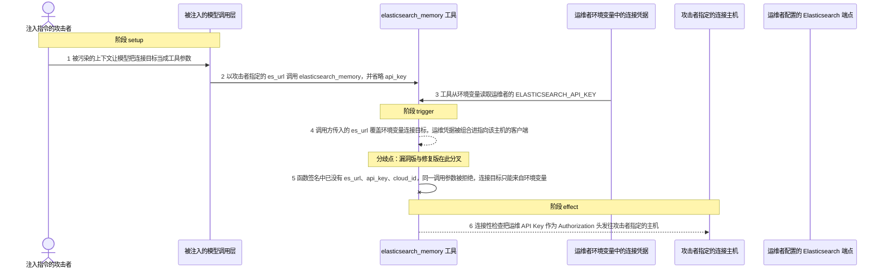
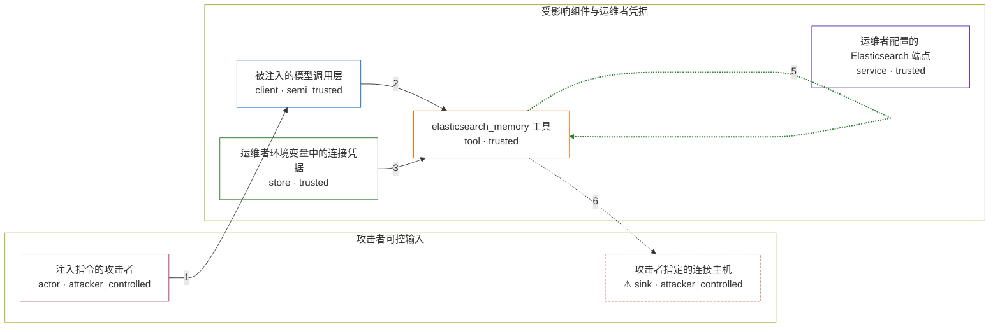

# tools / CVE-2026-15746

状态：草稿，未完成环境和复现。这个目录由模板生成，不构成漏洞确认。

图解的唯一来源是 `diagram.toml`：编辑后运行 `python3 -m runner diagram tools/CVE-2026-15746` 重新生成下方的图解区块。图解必须覆盖漏洞涉及的每个主体，并标出漏洞版/修复版的分歧步骤。

<!-- diagram:begin (generated from diagram.toml by `python3 -m runner diagram`; edit diagram.toml, not this block) -->
## 漏洞图解 — strands-agents-tools elasticsearch_memory 的连接目标与凭据可被模型参数覆盖

strands-agents-tools 的 elasticsearch_memory 工具把 cloud_id、api_key、es_url 三个连接与凭据参数写进函数签名，模型因此可以指定连接目标。调用方省略 api_key 时，代码以 api_key or os.getenv(ELASTICSEARCH_API_KEY) 回退到运维者的环境变量凭据，运维者的 API Key 就被组合进指向模型指定主机的客户端。客户端初始化后的连接性检查立刻把该凭据放进 Authorization 头发往那个主机，所以泄露不需要可用的 Elasticsearch 集群。修复版把这三个参数从签名中删除、只从环境变量读取，模型无法再决定连接目标。

### 涉及主体

| 主体 | 类型 | 信任级别 | 在漏洞里的作用 | 来源 |
| --- | --- | --- | --- | --- |
| 注入指令的攻击者 (`attacker`) | `actor` | `attacker_controlled` | 通过被污染的上下文让模型把连接目标当成工具参数传给 elasticsearch_memory；它只能控制这一次调用的参数，读不到运维者的环境变量。 | fixtures/attack.json |
| 被注入的模型调用层 (`agent_client`) | `client` | `semi_trusted` | 把不可信的上下文转成 elasticsearch_memory 的工具调用参数：转发攻击者指定的 es_url，同时省略 api_key。 | — |
| elasticsearch_memory 工具 (`es_tool`) | `tool` | `trusted` | 受影响的上游组件。漏洞版在函数签名里暴露 cloud_id、api_key、es_url，并在 api_key 为空时回退到 ELASTICSEARCH_API_KEY；修复版删除这三个参数、只从环境变量读取。 | src/strands_tools/elasticsearch_memory.py |
| 运维者环境变量中的连接凭据 (`operator_credentials`) | `store` | `trusted` | ELASTICSEARCH_API_KEY 以及 ELASTICSEARCH_URL 或 ELASTICSEARCH_CLOUD_ID 由运维者配置，是攻击者本来够不着的受保护数据。 | — |
| 运维者配置的 Elasticsearch 端点 (`operator_endpoint`) | `service` | `trusted` | 环境变量指向的正常连接目标；漏洞版里调用方传入的 es_url 会把它覆盖掉，修复版只允许连到这里。 | — |
| ⚠ 攻击者指定的连接主机 (`attacker_endpoint`) | `sink` | `attacker_controlled` | 攻击者等待接收请求的主机；工具在连接性检查中把运维凭据作为 Authorization 头发到这里，凭据因此外泄。 | — |

**信任边界**

- **攻击者可控输入** (`attacker_side`)：成员 `attacker`、`attacker_endpoint`。攻击者只能决定这次工具调用的参数和自己接收请求的主机，读不到运维者的环境变量，也改不了工具代码。
- **受影响组件与运维者凭据** (`operator_side`)：成员 `agent_client`、`es_tool`、`operator_credentials`、`operator_endpoint`。这道边界把模型可控的工具参数与运维者私有的凭据隔开；漏洞版把参数与环境变量当成可以互相替代的来源，边界因此失效。

标 ⚠ 的主体是本仓库合成的替身或无害效果载体，不代表真实外部目标。

### 触发过程

### 主体与信任边界

箭头上的数字是上面的步骤编号；方框只标主体和信任级别，具体动作见「触发过程」。

**分歧点**：第 4 步（`vulnerable_only`）调用方传入的 es_url 覆盖环境变量连接目标，运维凭据被组合进指向该主机的客户端。
**分歧点**：第 5 步（`patched_only`）函数签名中已没有 es_url、api_key、cloud_id，同一调用参数被拒绝，连接目标只能来自环境变量。
<!-- diagram:end -->

## 公告与机制

TODO：官方公告、漏洞根因、Agent 信任边界、受影响范围和修复来源。

## 前提

TODO：认证要求、用户交互、已有批准、工具权限、攻击者能控制的内容。

## 版本与启动

TODO：补全 metadata、Dockerfile/镜像 digest 和 Compose，再写出精确启动命令。

Compose 中 `vulnerable` 与 `patched` profiles 分开使用；未指定 profile 不启动服务。镜像变量未配置时 Compose 会明确报错。此模板不暴露宿主端口，也不挂载主机数据。

## 机制复现

TODO：实现 `reproduce.py`，固定输入并执行真实漏洞路径，注明运行位置、参数和超时。

完成实现后使用 `python3 -m runner reproduce tools/CVE-2026-15746 --build --rounds 3`。
两脚本统一接受 `--context <context.json> --output <目录>`，详细字段见仓库 `docs/environment-contract.md`。
PoC 输出 `facts.json` 和效果文件；验证器只读证据，输出含 `target_ready` 及对应效果断言的 `verdict.json`。
镜像必须包含 Python 3 和 `/lab/` 下的脚本、fixtures；`runtime.mode` 选择 `oneshot` 或有 healthcheck 的 `service`。

## 端到端复现

TODO：实现 `end_to_end.py`；若不需要模型，明确写出不适用原因。真实模型的结果与机制复现分开统计。

## 验证与修复对照

TODO：实现 `verify.py`。记录漏洞版无害效果、修复版阻断和正常任务成功的证据，不能把服务启动失败当成阻断。

## 清理

默认运行器按每个测试的唯一 Compose project 清理容器、网络和 volume。
`--keep-on-failure` 保留失败项目，项目标识和 Compose 配置在结果目录中；仅清理该项目，不能使用全局 prune。

## 失败诊断

TODO：为本漏洞写出预期效果缺失、修复版仍有越界效果、正常任务失败及前提不满足时的具体排查路径。
启动失败、健康检查失败和超时都不能当作修复阻断。报告中应能定位到阶段、预期、实际和受控证据。

## 构建与输入

TODO：填写两版源码 archive、完整 commit，记录 `build.inputs` 中每个下载的 SHA-256；依赖安装必须支持禁网构建。
固定攻击和正常输入放入 `fixtures/` 并登记到 `fixtures/manifest.toml`。固定 seed、环境变量，说明无害效果与真实影响的关系。

## 隔离例外

默认无例外。确需例外时同时填写 `runtime.exceptions`、理由及最小范围，晋升由两位维护者审阅。

## 来源与许可

TODO：列出引用代码、fixtures 和镜像的来源及许可。
