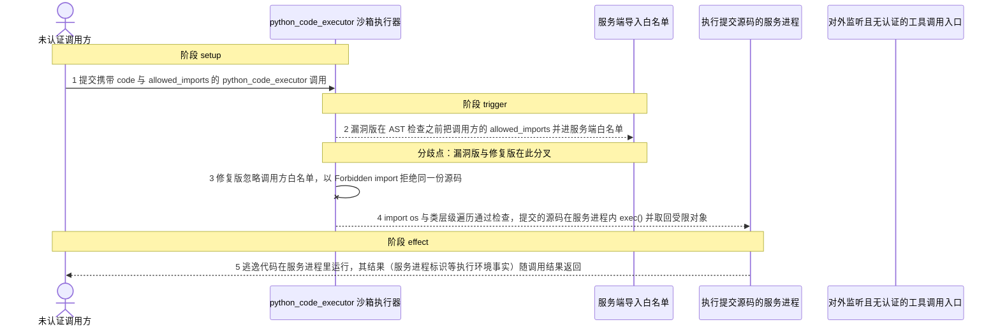
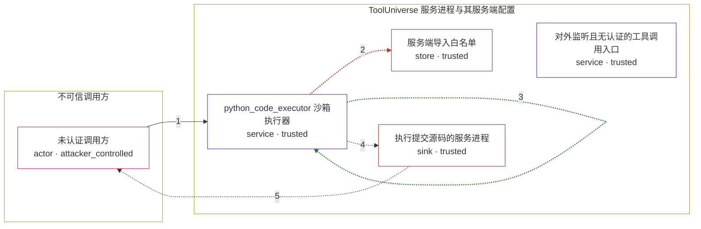

# tooluniverse / CVE-2026-81096

状态：草稿，未完成环境和复现。这个目录由模板生成，不构成漏洞确认。

图解的唯一来源是 `diagram.toml`：编辑后运行 `python3 -m runner diagram tooluniverse/CVE-2026-81096` 重新生成下方的图解区块。图解必须覆盖漏洞涉及的每个主体，并标出漏洞版/修复版的分歧步骤。

<!-- diagram:begin (generated from diagram.toml by `python3 -m runner diagram`; edit diagram.toml, not this block) -->
## 漏洞图解 — tooluniverse / CVE-2026-81096 漏洞图解

ToolUniverse 的 python_code_executor 先用服务端导入白名单和 AST 黑名单检查调用方提交的 Python 源码，再在服务进程内 exec() 执行。漏洞版在检查之前把调用方传入的 allowed_imports 合并进白名单，而 AST 黑名单既不拦 __class__ 一类 dunder，也不拦沿已允许模块取回受限对象的普通属性。调用方因此能 import os 或沿类层级取回受限对象，提交的源码以服务进程身份执行任意代码，执行结果随工具调用返回。

### 涉及主体

| 主体 | 类型 | 信任级别 | 在漏洞里的作用 | 来源 |
| --- | --- | --- | --- | --- |
| 未认证调用方 (`attacker`) | `actor` | `attacker_controlled` | 构造 python_code_executor 工具调用，唯一能控制的是这次调用的参数：提交执行的 Python 源码、allowed_imports 列表和 timeout。 | fixtures/attack.json |
| python_code_executor 沙箱执行器 (`python_executor`) | `service` | `trusted` | 上游组件本体：先按服务端白名单做 AST 安全检查，再在服务进程里 exec() 调用方源码。漏洞在于检查顺序（白名单先被调用方放宽）和检查面（dunder 与模块跳板属性不在黑名单内）。 | — |
| 服务端导入白名单 (`module_allowlist`) | `store` | `trusted` | 由服务端 tool_config 决定的可导入模块集合，本应只由部署方配置。漏洞版在 AST 检查之前把调用方传来的 allowed_imports 并进这个集合，使白名单不再是信任边界。 | — |
| 执行提交源码的服务进程 (`server_process`) | `sink` | `trusted` | exec() 的宿主进程。沙箱被绕过后，攻击者代码在这里以服务进程的身份、权限和已加载模块运行，这是攻击者本来够不着的执行环境。 | — |
| 对外监听且无认证的工具调用入口 (`exposed_endpoint`) | `service` | `trusted` | 部署前提：服务默认监听全网卡且不校验 Bearer token，任何可达调用方都能发起工具调用。它不是攻击者的动作，本图解从调用方提交工具调用开始。 | — |

**信任边界**

- **不可信调用方** (`untrusted_callers`)：成员 `attacker`。攻击者只能控制一次工具调用的参数（源码与 allowed_imports），不能控制服务进程、已加载模块，也不能直接写服务端配置。
- **ToolUniverse 服务进程与其服务端配置** (`service_runtime`)：成员 `python_executor`、`module_allowlist`、`server_process`、`exposed_endpoint`。这道边界本该由服务端白名单加 AST 检查共同守住：只让调用方代码使用预先批准的模块和语法。漏洞版让调用方在检查前改写白名单，修复版则忽略调用方白名单并拦下 dunder 与模块跳板属性。

### 触发过程

### 主体与信任边界

箭头上的数字是上面的步骤编号；方框只标主体和信任级别，具体动作见「触发过程」。

**分歧点**：第 2 步（`vulnerable_only`）漏洞版在 AST 检查之前把调用方的 allowed_imports 并进服务端白名单。
**分歧点**：第 3 步（`patched_only`）修复版忽略调用方白名单，以 Forbidden import 拒绝同一份源码。
<!-- diagram:end -->

## 公告与机制

TODO：官方公告、漏洞根因、Agent 信任边界、受影响范围和修复来源。

## 前提

TODO：认证要求、用户交互、已有批准、工具权限、攻击者能控制的内容。

## 版本与启动

TODO：补全 metadata、Dockerfile/镜像 digest 和 Compose，再写出精确启动命令。

Compose 中 `vulnerable` 与 `patched` profiles 分开使用；未指定 profile 不启动服务。镜像变量未配置时 Compose 会明确报错。此模板不暴露宿主端口，也不挂载主机数据。

## 机制复现

TODO：实现 `reproduce.py`，固定输入并执行真实漏洞路径，注明运行位置、参数和超时。

完成实现后使用 `python3 -m runner reproduce tooluniverse/CVE-2026-81096 --build --rounds 3`。
两脚本统一接受 `--context <context.json> --output <目录>`，详细字段见仓库 `docs/environment-contract.md`。
PoC 输出 `facts.json` 和效果文件；验证器只读证据，输出含 `target_ready` 及对应效果断言的 `verdict.json`。
镜像必须包含 Python 3 和 `/lab/` 下的脚本、fixtures；`runtime.mode` 选择 `oneshot` 或有 healthcheck 的 `service`。

## 端到端复现

TODO：实现 `end_to_end.py`；若不需要模型，明确写出不适用原因。真实模型的结果与机制复现分开统计。

## 验证与修复对照

TODO：实现 `verify.py`。记录漏洞版无害效果、修复版阻断和正常任务成功的证据，不能把服务启动失败当成阻断。

## 清理

默认运行器按每个测试的唯一 Compose project 清理容器、网络和 volume。
`--keep-on-failure` 保留失败项目，项目标识和 Compose 配置在结果目录中；仅清理该项目，不能使用全局 prune。

## 失败诊断

TODO：为本漏洞写出预期效果缺失、修复版仍有越界效果、正常任务失败及前提不满足时的具体排查路径。
启动失败、健康检查失败和超时都不能当作修复阻断。报告中应能定位到阶段、预期、实际和受控证据。

## 构建与输入

TODO：填写两版源码 archive、完整 commit，记录 `build.inputs` 中每个下载的 SHA-256；依赖安装必须支持禁网构建。
固定攻击和正常输入放入 `fixtures/` 并登记到 `fixtures/manifest.toml`。固定 seed、环境变量，说明无害效果与真实影响的关系。

## 隔离例外

默认无例外。确需例外时同时填写 `runtime.exceptions`、理由及最小范围，晋升由两位维护者审阅。

## 来源与许可

TODO：列出引用代码、fixtures 和镜像的来源及许可。
