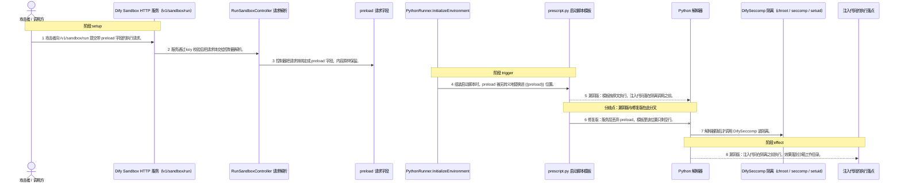
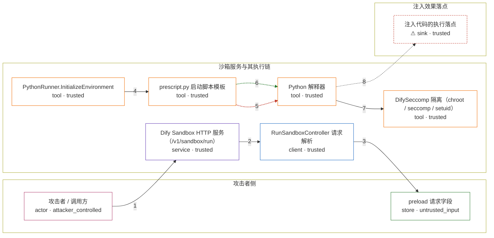

# vulnerability / CVE-2024-10252

状态：草稿。generate 阶段已产出图解、固定输入与机制 PoC；环境尚未构建，机制复现未在容器内验收，不构成漏洞确认。

图解的唯一来源是 `diagram.toml`：编辑后运行 `python3 -m runner diagram vulnerability/CVE-2024-10252` 重新生成下方的图解区块。图解必须覆盖漏洞涉及的每个主体，并标出漏洞版/修复版的分歧步骤。

<!-- diagram:begin (generated from diagram.toml by `python3 -m runner diagram`; edit diagram.toml, not this block) -->
## 漏洞图解 — Dify Sandbox preload 参数注入导致隔离前代码执行

langgenius/dify-sandbox 0.2.9 的 RunPython3Code 把调用方请求体里的 preload 字符串原样透传给 PythonRunner.InitializeEnvironment，后者只做一次无转义的 strings.Replace，就把它拼进内嵌的 prescript.py 模板。该模板由 Python 解释器作为沙箱启动脚本执行，而 {{preload}} 位于 lib.DifySeccomp(uid, gid, enable_network) 之前——chroot、seccomp 过滤与 setuid(65537) 都发生在这段注入代码之后。于是调用方提交的文本以沙箱服务进程的身份先跑完，隔离才被装上。修复版在服务层直接丢弃 preload（enable_preload 默认 False），模板里的注入点不再接受外部输入。

### 涉及主体

| 主体 | 类型 | 信任级别 | 在漏洞里的作用 | 来源 |
| --- | --- | --- | --- | --- |
| 攻击者 / 调用方 (`attacker`) | `actor` | `attacker_controlled` | 提交沙箱执行请求的一方。它能完全控制请求体，但自己拿不到沙箱服务进程的执行能力，所以要把代码送进服务的启动脚本里跑。 | fixtures/attack.json |
| Dify Sandbox HTTP 服务（/v1/sandbox/run） (`sandbox_http`) | `service` | `trusted` | 受影响的对外组件。它只用一个静态 key 校验调用方身份，对请求体里的 preload 内容不做任何检查；身份校验通过后就把请求交给执行链。 | internal/controller/router.go |
| RunSandboxController 请求解析 (`run_controller`) | `client` | `trusted` | 把请求体绑定成 Language / Code / Preload / EnableNetwork 四个字段。preload 是自由字符串，解析阶段没有转义也没有白名单，随后直接作为参数传给 RunPython3Code。 | internal/controller/run.go |
| preload 请求字段 (`preload_field`) | `store` | `untrusted_input` | 调用方提交的预加载片段。服务把它当成可信的模板素材，它实际却是攻击者完全可控的 Python 源码。 | fixtures/attack.json |
| PythonRunner.InitializeEnvironment (`python_runner`) | `tool` | `trusted` | 组装沙箱启动脚本的组件。它依次替换 {{uid}}、{{gid}}、{{enable_network}}、{{preload}}、{{code}}，其中 preload 那一处是无转义的字符串替换，注入点就在这里产生。 | internal/core/runner/python/python.go |
| prescript.py 启动脚本模板 (`prescript_template`) | `tool` | `trusted` | 真正被执行的脚本本体。{{preload}} 在模板里排在 DifySeccomp 调用之前，因此漏洞版会把注入代码放在隔离之前执行；修复版让 preload 为空，这一行只剩一个空行。 | internal/core/runner/python/prescript.py |
| Python 解释器 (`python_interpreter`) | `tool` | `trusted` | 执行拼装后启动脚本的解释器。它按文件顺序执行，先跑 {{preload}} 位置的代码，再调用隔离、最后才 exec 调用方提交的 code。 | internal/core/runner/python/prescript.py |
| DifySeccomp 隔离（chroot / seccomp / setuid） (`isolation`) | `tool` | `trusted` | 本该约束被执行代码的隔离模块：chroot 到运行目录、装载 seccomp 过滤器、把 uid 降到 65537。它只保证自己之后执行的代码受限，对已经跑过的注入代码无能为力。 | internal/core/lib/python/add_seccomp.go |
| ⚠ 注入代码的执行落点 (`effect_marker`) | `sink` | `trusted` | 注入代码实际作用的位置。它位于沙箱工作目录内，且是在隔离装上之前被写入的——这正是攻击者想要的能力。此处承载的是一个无害标记文件，不是真实破坏目标。 | fixtures/attack.json |

**信任边界**

- **攻击者侧** (`attacker_side`)：成员 `attacker`、`preload_field`。攻击者能控制的只有这次请求的字段内容。它不能直接改服务的模板文件，也不能自己给自己降权或提权。
- **沙箱服务与其执行链** (`sandbox_service`)：成员 `sandbox_http`、`run_controller`、`python_runner`、`prescript_template`、`python_interpreter`、`isolation`。这道边界本来把「调用方提交的数据」和「服务进程里以服务身份执行的代码」隔开：code 要等 DifySeccomp 装好 chroot、seccomp 和 setuid 之后才 exec。漏洞让 preload 在隔离之前穿过它。
- **注入效果落点** (`effect_side`)：成员 `effect_marker`。注入代码真正生效的地方。漏洞版能在隔离之前把效果落到这里，修复版到不了。

标 ⚠ 的主体是本仓库合成的替身或无害效果载体，不代表真实外部目标。

### 触发过程



### 主体与信任边界

箭头上的数字是上面的步骤编号；方框只标主体和信任级别，具体动作见「触发过程」。



**分歧点**：第 5 步（`vulnerable_only`）漏洞版：模板按原文执行，注入代码落在隔离调用之前。。
**分歧点**：第 6 步（`patched_only`）修复版：服务层丢弃 preload，模板里该位置只剩空行。。
<!-- diagram:end -->

## 公告与机制

公告：<https://nvd.nist.gov/vuln/detail/CVE-2024-10252>（GHSA-gvmg-6fvg-2jp2，CWE-94，
CVSS 3.0 8.8）。受影响组件是 **langgenius/dify-sandbox**：CNA 记录的
`lessThan: 0.2.10` 指沙箱组件版本，公告标题里的 `dify <= v0.9.1` 指主项目版本
（dify v0.9.1 的 compose 固定 `langgenius/dify-sandbox:0.2.9`）。

- vulnerable：tag `0.2.9` = `a831e3a5ecfcba4c911915952f968766cff8bb61`
- patched：tag `0.2.10` = `3a738590e71450170891d6874215e6aa8c865307`（即修复 PR #96 的 merge commit）

根因：`internal/service/python.go` 把请求体 `preload` 透传给
`PythonRunner.InitializeEnvironment`，后者用一次无转义的
`strings.Replace(script, "{{preload}}", preload + "\n", 1)` 把它拼进内嵌的
`prescript.py`；而 `{{preload}}` 位于 `lib.DifySeccomp(uid, gid, enable_network)`
（chroot + seccomp + setuid 65537）之前。修复在服务层丢弃 `preload`：
`if !static.GetDifySandboxGlobalConfigurations().EnablePreload { preload = "" }`，
并新增默认 `enable_preload: False`。

## 前提

- 调用方需要能访问沙箱服务的 `POST /v1/sandbox/run`，并带上服务要求的静态 key
  （上游默认 `app.key: dify-sandbox`）。本环境不启用网络：PoC 直接驱动上游 runner 路径。
- 攻击者能控制的只有请求体，尤其是 `preload` 字段；它不能改服务的模板文件，也不需要
  写权限或已有批准。
- 前提条件（不是攻击动作）：被执行的启动脚本模板 `prescript.py` 在隔离调用之前留有
  `{{preload}}` 注入点；默认部署允许网络，使沙箱内代码可以回打服务自身，但这条链路是
  公告措辞加源码的推论，本环境不把它当作已验证事实。

## 版本与启动

TODO：补全 metadata、Dockerfile/镜像 digest 和 Compose，再写出精确启动命令。

Compose 中 `vulnerable` 与 `patched` profiles 分开使用；未指定 profile 不启动服务。镜像变量未配置时 Compose 会明确报错。此模板不暴露宿主端口，也不挂载主机数据。

## 机制复现

`reproduce.py` 执行的是真实的上游启动脚本：它从被固定的源码树读出
`internal/core/runner/python/prescript.py`，按 `PythonRunner.InitializeEnvironment` 的替换顺序
拼装启动脚本（`{{uid}}`/`{{gid}}` 取自 `internal/static/user.go` 的 `SANDBOX_USER_UID = 65537`
与 `SANDBOX_GROUP_ID = 0`，`{{preload}}` 取自 `fixtures/attack.json`，`{{code}}` 按上游的
XOR + base64 方式编码），再由沙箱解释器执行这个脚本。

被验证的漏洞代码本体没有被替换：模板原文逐字使用，`{{preload}}` 在模板中仍然排在
`lib.DifySeccomp(...)` 之前，隔离调用照常发生。`python.so` 是上游
`build/build_amd64.sh` 用 `cmd/lib/python/main.go` 编译出的构建产物，源码树里没有；
PoC 用 C 编译器现场构建一个最小替身，导出同名同签名的 `DifySeccomp`，只把这次调用记录到
`seccomp_stub.log` 并返回。漏洞版与修复版加载的是同一个替身，所以两版的差别只来自
`preload` 有没有被拼进模板，而不是来自替身。

漏洞版（tag `0.2.9`）注入的 preload 会在隔离之前把无害标记
`preload_marker.txt`（内容 `CVE-2024-10252 preload executed before DifySeccomp`）
写进运行目录；修复版（tag `0.2.10`）的服务层在 `!EnablePreload` 时把 `preload` 置空，
默认配置 `enable_preload: False`，于是同一请求不产生标记，而普通任务
（`benign.json`）在两版都正常打印 `benign-job-ok`。观测字段里
`preload_executed_before_isolation` 同时要求标记存在且 `DifySeccomp` 被调用过，
用来证明注入确实发生在隔离之前而不是靠跳过隔离伪造出来的。

入口参数固定为 `--context <context.json> --output <目录>`，子进程超时 60s；详细字段见
`docs/environment-contract.md`。运行方式：

```sh
python3 -m runner reproduce vulnerability/CVE-2024-10252 --build --rounds 3
```

镜像侧需要满足：源码树落在 `/lab/app`（含 `internal/core/runner/python/prescript.py`
与 `internal/static/user.go`）、`fixtures/` 装载到 `/lab/fixtures`、Python 3 解释器可用，
并且存在 `cc`/`gcc`/`clang` 之一用于构建隔离替身；工作目录 `/lab/sandbox-run` 可写。
`runtime.mode` 仍为 `oneshot`：PoC 直接驱动上游 runner 路径，不需要监听端口。

## 端到端复现

TODO：实现 `end_to_end.py`；若不需要模型，明确写出不适用原因。真实模型的结果与机制复现分开统计。

## 验证与修复对照

TODO：实现 `verify.py`。记录漏洞版无害效果、修复版阻断和正常任务成功的证据，不能把服务启动失败当成阻断。

## 清理

默认运行器按每个测试的唯一 Compose project 清理容器、网络和 volume。
`--keep-on-failure` 保留失败项目，项目标识和 Compose 配置在结果目录中；仅清理该项目，不能使用全局 prune。

## 失败诊断

TODO：为本漏洞写出预期效果缺失、修复版仍有越界效果、正常任务失败及前提不满足时的具体排查路径。
启动失败、健康检查失败和超时都不能当作修复阻断。报告中应能定位到阶段、预期、实际和受控证据。

## 构建与输入

两版源码归档与完整 commit 由 build 阶段写入 `metadata.toml` 的 `[vulnerable]`/`[patched]`
与 `build.inputs`（含 SHA-256）：vulnerable `a831e3a5ecfcba4c911915952f968766cff8bb61`
（tag `0.2.9`）、patched `3a738590e71450170891d6874215e6aa8c865307`（tag `0.2.10`）。
上游 `docker/amd64/dockerfile` 在构建期联网安装 `libseccomp-dev`、pip 依赖与 Node 运行时，
`build/build_amd64.sh` 还需要 Go 工具链以 `CGO_ENABLED=1 -buildmode=c-shared` 编译
`python.so`/`nodejs.so`；禁网构建必须把这些输入一并固定。

固定攻击和正常输入放在 `fixtures/attack.json`、`fixtures/benign.json`，SHA-256 登记在
`fixtures/manifest.toml`。无害效果与真实影响的关系：PoC 让注入代码写一个固定内容的标记文件，
它代表「隔离前的一次任意执行机会」，而不是公告所述的删除整个沙箱服务。

## 隔离例外

默认无例外。确需例外时同时填写 `runtime.exceptions`、理由及最小范围，晋升由两位维护者审阅。

## 来源与许可

TODO：列出引用代码、fixtures 和镜像的来源及许可。
