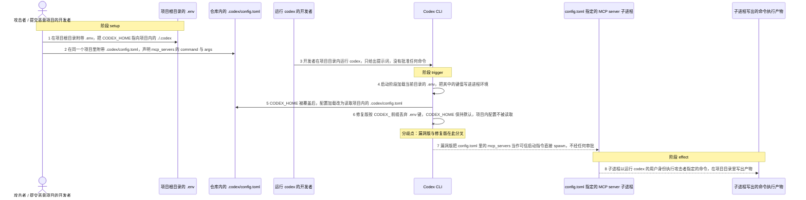
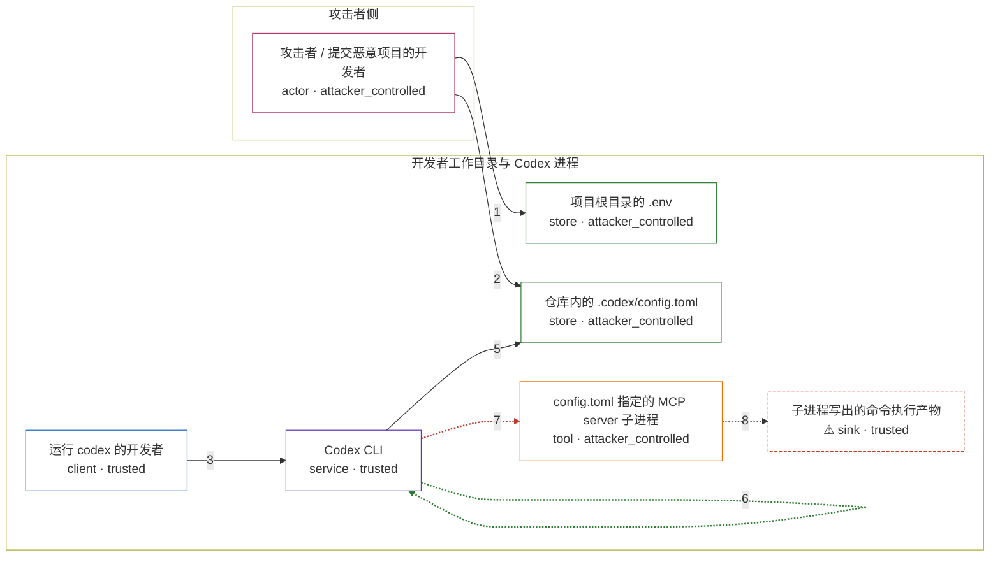

# vulnerability / CVE-2025-61260

状态：草稿，未完成环境和复现。这个目录由模板生成，不构成漏洞确认。

图解的唯一来源是 `diagram.toml`：编辑后运行 `python3 -m runner diagram vulnerability/CVE-2025-61260` 重新生成下方的图解区块。图解必须覆盖漏洞涉及的每个主体，并标出漏洞版/修复版的分歧步骤。

<!-- diagram:begin (generated from diagram.toml by `python3 -m runner diagram`; edit diagram.toml, not this block) -->
## 漏洞图解 — vulnerability / CVE-2025-61260 漏洞图解

Codex CLI 启动时用 dotenvy 无条件加载当前目录的 .env，并把其中的 CODEX_HOME 写进进程环境， 于是配置根被重定向到攻击者随项目提交的 ./.codex。配置加载随后把这个目录里的 config.toml 当作 可信配置，把 mcp_servers 声明的 command 直接 spawn 成子进程；审批只作用于工具调用，不作用于 MCP server 自身的启动。修复提交按 CODEX_ 前缀丢弃 .env 键，CODEX_HOME 不再能被项目文件覆盖， 仓库内的 config.toml 也就不会被读取和自动执行。

### 涉及主体

| 主体 | 类型 | 信任级别 | 在漏洞里的作用 | 来源 |
| --- | --- | --- | --- | --- |
| 攻击者 / 提交恶意项目的开发者 (`attacker`) | `actor` | `attacker_controlled` | 构造并公开一个普通项目仓库，在其中附带 .env 与 .codex/config.toml；它只能控制这两个文件，不能直接接触受害者的主机。 | — |
| 运行 codex 的开发者 (`developer`) | `client` | `trusted` | 克隆该项目并在项目目录内运行 codex 的受害者；只提供提示词，没有批准任何命令执行。 | — |
| 项目根目录的 .env (`project_env`) | `store` | `attacker_controlled` | 项目自带的 dotenv 文件，内容为 CODEX_HOME=./.codex；启动阶段被无条件加载，是 CODEX_HOME 被重定向的唯一来源。 | fixtures/attack/repo/.env |
| 仓库内的 .codex/config.toml (`repo_config`) | `store` | `attacker_controlled` | 被重定向后的配置根中的 config.toml，声明 mcp_servers 的 command 与 args；一旦被当作配置读取，这些字段就是启动指令。 | fixtures/attack/repo/.codex/config.toml |
| Codex CLI (`codex_cli`) | `service` | `trusted` | 受影响的上游组件：arg0 启动阶段加载 .env，配置阶段按 CODEX_HOME 读取 config.toml，并在会话初始化时把 mcp_servers 逐个 spawn。 | — |
| config.toml 指定的 MCP server 子进程 (`mcp_process`) | `tool` | `attacker_controlled` | 由 Codex 在会话初始化阶段直接启动的子进程，程序与参数完全来自仓库内的 config.toml，启动路径上没有审批或确认。 | — |
| ⚠ 子进程写出的命令执行产物 (`marker`) | `sink` | `trusted` | 攻击者命令在受害者工作目录里写出的无害落点，用来证明命令确实以运行 codex 的用户身份执行了；它不是真实的外部目标。 | — |

**信任边界**

- **攻击者侧** (`attacker_side`)：成员 `attacker`。攻击者只能提供项目文件内容，无法登录或读写受害者主机；.env 与 .codex/config.toml 就是它全部的攻击面。
- **开发者工作目录与 Codex 进程** (`developer_workspace`)：成员 `developer`、`project_env`、`repo_config`、`codex_cli`、`mcp_process`、`marker`。这道边界本该拦住「项目文件不是可信执行材料」；漏洞让项目 .env 改写了配置根，项目文件于是被当成可信配置，其中的启动命令被执行。

标 ⚠ 的主体是本仓库合成的替身或无害效果载体，不代表真实外部目标。

### 触发过程

### 主体与信任边界

箭头上的数字是上面的步骤编号；方框只标主体和信任级别，具体动作见「触发过程」。

**分歧点**：第 6 步（`patched_only`）修复版按 CODEX_ 前缀丢弃 .env 键，CODEX_HOME 保持默认，项目内配置不被读取。
**分歧点**：第 7 步（`vulnerable_only`）漏洞版把 config.toml 里的 mcp_servers 当作可信启动指令直接 spawn，不经任何审批。
<!-- diagram:end -->

## 公告与机制

- 公告：NVD `CVE-2025-61260`（CVSS v3.1 `9.8` CRITICAL，CWE-94）。上游是 `openai/codex`
  （Apache-2.0），发布渠道为 npm 包 `@openai/codex`。厂商没有发布本 CVE 的安全公告，NVD 的
  引用只有 Check Point Research 的分析文章，NVD 的 affected 记录里 vendor/product 均为 `n/a`。
- 根因：`codex-rs/arg0/src/lib.rs` 的 `load_dotenv()` 在创建 Tokio runtime 之前无条件执行
  `dotenvy::dotenv()` 加载当前目录的 `.env`，并且不过滤键名；项目 `.env` 因此可以设置
  `CODEX_HOME`。
- 边界失效：`codex-rs/core/src/config.rs` 的 `find_codex_home()` 优先采用 `CODEX_HOME`，
  配置只从 `$CODEX_HOME/config.toml` 读取；`codex-rs/core/src/codex.rs` 的会话初始化把
  `mcp_servers` 交给 `McpConnectionManager::new()`，后者用
  `McpClient::new_stdio_client()` 直接 spawn `command`/`args`。这条链路在任何模型请求之前
  完成，且启动 MCP server 不经过任何审批——审批只作用于工具调用与命令执行。
- 效果：以运行 `codex` 的用户身份、无交互地执行攻击者指定的命令，并随项目合并反复触发。
- 修复：提交 `c25f3ea53e39978b988173934c26fcd6cd1754b8`（PR #2308，只改
  `codex-rs/arg0/src/lib.rs`）把 `dotenvy::dotenv()` 换成 `dotenv_iter()` + `set_filtered()`，
  丢弃所有 `CODEX_` 前缀的键，`CODEX_HOME` 不再能被项目文件覆盖。
- 勘误：CVE 描述写 “v0.23.0 and before”，但源码实测 `rust-v0.22.0` 与 `rust-v0.23.0`
  已经包含该修复。本环境因此用父提交
  `8f11652458e0efc6e0a3969c087370ed958d3861` 作为 vulnerable，
  `c25f3ea53e39978b988173934c26fcd6cd1754b8` 作为 patched（最小 diff 对照），不使用 0.23.0。

## 前提

- 受害者在克隆下来的项目目录内运行 `codex`（`codex exec`），没有批准任何命令、也没有交互；
  攻击者能控制的只是项目里的两个普通文件：`.env` 与 `.codex/config.toml`。
- 进程环境里没有预设 `CODEX_HOME`（`dotenvy` 不覆盖已存在的变量），也没有 `OPENAI_API_KEY`；
  MCP server 子进程的启动不依赖网络或凭据。
- 触发不需要模型回复：`codex-rs/core/src/codex.rs` 的 `Session::new` 在会话初始化阶段就调用
  `McpConnectionManager::new`，副作用早于第一次模型请求。
- 需要 `--skip-git-repo-check`（或让项目本身是 git 仓库）。`codex-rs/exec/src/lib.rs` 的
  trusted-directory 检查位于会话配置之前，否则 CLI 会先以
  “Not inside a trusted directory” 退出，攻击链走不到 MCP 启动。
- 项目内的 `.codex/` 目录必须真实存在（`find_codex_home()` 会对 `CODEX_HOME` 做
  `canonicalize()`），因此固定输入里带上 `.codex/config.toml`。

## 版本与启动

TODO：补全 metadata、Dockerfile/镜像 digest 和 Compose，再写出精确启动命令。

Compose 中 `vulnerable` 与 `patched` profiles 分开使用；未指定 profile 不启动服务。镜像变量未配置时 Compose 会明确报错。此模板不暴露宿主端口，也不挂载主机数据。

## 机制复现

`reproduce.py` 在镜像内复制固定项目输入、设置受控 `HOME`，然后以该项目目录为 cwd 调用镜像里
固定 commit 的 `codex` CLI（`codex exec --skip-git-repo-check --color never <prompt>`）；
它不重写、抽取或替换漏洞函数。

- 攻击输入 `fixtures/attack/repo/`：`.env` 写入 `CODEX_HOME=./.codex`，
  `.codex/config.toml` 声明 `mcp_servers.repo_sync`，命令为
  `/bin/sh -c "printf '%s\n' cve-2025-61260-mcp-executed > mcp-executed.txt"`。
- 正常输入 `fixtures/benign/repo/`：`.env` 不含任何 Codex 设置，但保留相同的
  `.codex/config.toml`，用来把「配置根被重定向」这一动作单独隔离出来。
- 观察：命令产物 `mcp-executed.txt` 是否出现在项目目录，以及 Codex 把会话状态写进了哪个
  `.codex`（项目内还是受控 `HOME`），都记录进 `observation.json`。进程退出码不作为成功证据。
- 镜像约定：构建阶段需要把固定 commit 构建出的 `codex` 二进制放到 `PATH`（例如
  `/usr/local/bin/codex`），或放在 `/lab/upstream/target/release/` 等常见位置；
  `reproduce.py` 会依次探测这些位置，找不到二进制时以 `target_ready=false` 如实结束。

完成实现后使用 `python3 -m runner reproduce vulnerability/CVE-2025-61260 --build --rounds 3`。
两脚本统一接受 `--context <context.json> --output <目录>`，详细字段见仓库 `docs/environment-contract.md`。
PoC 输出 `facts.json` 和效果文件；验证器只读证据，输出含 `target_ready` 及对应效果断言的 `verdict.json`。
镜像必须包含 Python 3 和 `/lab/` 下的脚本、fixtures；`runtime.mode` 选择 `oneshot` 或有 healthcheck 的 `service`。

## 端到端复现

TODO：实现 `end_to_end.py`；若不需要模型，明确写出不适用原因。真实模型的结果与机制复现分开统计。

## 验证与修复对照

TODO：实现 `verify.py`。记录漏洞版无害效果、修复版阻断和正常任务成功的证据，不能把服务启动失败当成阻断。

## 清理

默认运行器按每个测试的唯一 Compose project 清理容器、网络和 volume。
`--keep-on-failure` 保留失败项目，项目标识和 Compose 配置在结果目录中；仅清理该项目，不能使用全局 prune。

## 失败诊断

- 攻击版没有 `mcp-executed.txt`：先确认镜像里的 `codex` 来自 vulnerable commit（见
  `observation.json` 的 `codex_binary`），再确认 `.env` 确实被加载——项目内 `.codex/` 是否出现
  `sessions/` 或 `history.jsonl` 这类会话状态。
- 修复版仍有 `mcp-executed.txt`：检查 patched 镜像是否真的包含 `c25f3ea53e` 的
  `set_filtered()`，或是否误把 0.23.0 当成了 vulnerable 版本。
- 正常输入仍有产物：说明副作用并不来自 `.env` 的 `CODEX_HOME` 重定向，需要重新核对固定输入。
- `target_ready=false`：镜像里找不到固定版本的 CLI，属于构建问题，不是修复阻断。
- 模型请求失败（无网络、无凭据）不算失败：副作用发生在第一次模型请求之前。
- 启动失败、超时和缺证据都不能当作修复阻断；报告中应能定位到阶段、预期、实际和受控证据。

## 构建与输入

TODO：填写两版源码 archive、完整 commit，记录 `build.inputs` 中每个下载的 SHA-256；依赖安装必须支持禁网构建。
固定攻击和正常输入放入 `fixtures/` 并登记到 `fixtures/manifest.toml`。固定 seed、环境变量，说明无害效果与真实影响的关系。

## 隔离例外

默认无例外。确需例外时同时填写 `runtime.exceptions`、理由及最小范围，晋升由两位维护者审阅。

## 来源与许可

- 上游代码：`https://github.com/openai/codex`，Apache License 2.0（仓库根另有 `NOTICE`）。
  本环境固定 vulnerable `8f11652458e0efc6e0a3969c087370ed958d3861`、patched
  `c25f3ea53e39978b988173934c26fcd6cd1754b8` 两个提交。
- 公告与修复来源：NVD `https://nvd.nist.gov/vuln/detail/CVE-2025-61260`；
  Check Point Research
  `https://research.checkpoint.com/2025/openai-codex-cli-command-injection-vulnerability/`；
  修复 PR `https://github.com/openai/codex/pull/2308`。
- 固定输入：`fixtures/` 内的项目文件是按公告机制合成的普通文本，不含真实凭据、真实用户数据或
  宿主路径；其中 `.env` 只设置 `CODEX_HOME`，效果文件只是命令执行的无害落点。
