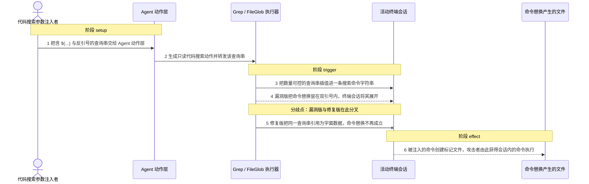
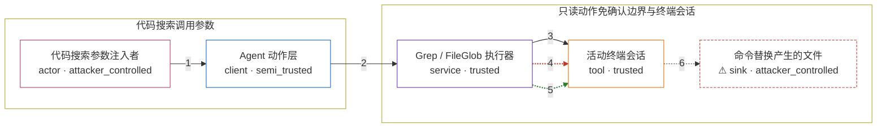

# warp / CVE-2026-48703

状态：草稿，未完成环境和复现。这个目录由模板生成，不构成漏洞确认。

图解的唯一来源是 `diagram.toml`：编辑后运行 `python3 -m runner diagram warp/CVE-2026-48703` 重新生成下方的图解区块。图解必须覆盖漏洞涉及的每个主体，并标出漏洞版/修复版的分歧步骤。

<!-- diagram:begin (generated from diagram.toml by `python3 -m runner diagram`; edit diagram.toml, not this block) -->
## 漏洞图解 — warp / CVE-2026-48703 代码搜索工具参数命令注入

Warp 的代码搜索工具把模型输出与项目指令可控的查询串、glob 模式和目标路径直接插值进 shell 命令字符串，只转义双引号或完全不转义单引号，因此 $(...) 与反引号在双引号内仍被展开。Grep 与 FileGlob 在策略层被归类为只读动作而自动放行，于是攻击者无需用户逐条确认就能让活动终端会话执行命令替换。修复提交为每个参数改用 shell_quote_arg 单引号安全引用，同一输入此后只作为字面数据传给 grep 与 find。

### 涉及主体

| 主体 | 类型 | 信任级别 | 在漏洞里的作用 | 来源 |
| --- | --- | --- | --- | --- |
| 代码搜索参数注入者 (`attacker`) | `actor` | `attacker_controlled` | 控制一次代码搜索调用的查询串、glob 模式与目标路径。载荷随模型输出或项目指令进入动作参数，攻击者本身不需要目标机器上的任何权限。 | fixtures/attack/bash_query.txt |
| Agent 动作层 (`agent`) | `client` | `semi_trusted` | 把模型输出与项目指令翻译成 Grep / FileGlob 动作并生成本次调用的参数。它转发攻击者可控的查询串，本身不校验 shell 元字符。 | upstream/vulnerable/execute/grep.rs |
| Grep / FileGlob 执行器 (`grep_executor`) | `service` | `trusted` | 受影响的搜索工具实现。它把查询串、glob 模式和目标路径插值进命令字符串，再用会话的命令执行接口下发。漏洞版只做双引号转义，单引号包裹的 glob 模式则完全不转义引号。 | upstream/vulnerable/execute/grep.rs |
| 活动终端会话 (`session`) | `tool` | `trusted` | 在用户当前活动的 shell 里执行搜索命令。它是用户自己的会话，但只看得见一条已经拼好的命令字符串，无法分辨其中哪一段来自攻击者；修复把每个参数改为单引号安全引用。 | upstream/patched/session/shared.rs |
| ⚠ 命令替换产生的文件 (`injection_marker`) | `sink` | `attacker_controlled` | 被注入的命令在终端会话里产生的可见效果。它是受控的无害载体，用来证明命令替换确实执行，而不是攻击者真正想要的外部目标。 | fixtures/attack/bash_query.txt |

**信任边界**

- **代码搜索调用参数** (`attacker_side`)：成员 `attacker`、`agent`。攻击者能控制的只有这一次调用的查询串、模式和路径；它不能写目标机器的文件，也不能改变工具或会话的实现。
- **只读动作免确认边界与终端会话** (`read_only_autoexec`)：成员 `grep_executor`、`session`、`injection_marker`。策略层把代码搜索当作只读本地上下文读取，因此自动放行；终端会话被当成只读搜索的执行者，却收到一条含未引用命令替换的完整命令字符串。修复让每个参数以单引号安全引用，这条命令替换不再成立。

标 ⚠ 的主体是本仓库合成的替身或无害效果载体，不代表真实外部目标。

### 触发过程

### 主体与信任边界

箭头上的数字是上面的步骤编号；方框只标主体和信任级别，具体动作见「触发过程」。

**分歧点**：第 4 步（`vulnerable_only`）漏洞版把命令替换留在双引号内，终端会话将其展开。
**分歧点**：第 5 步（`patched_only`）修复版把同一查询串引用为字面数据，命令替换不再成立。
<!-- diagram:end -->

## 公告与机制

TODO：官方公告、漏洞根因、Agent 信任边界、受影响范围和修复来源。

## 前提

TODO：认证要求、用户交互、已有批准、工具权限、攻击者能控制的内容。

## 版本与启动

TODO：补全 metadata、Dockerfile/镜像 digest 和 Compose，再写出精确启动命令。

Compose 中 `vulnerable` 与 `patched` profiles 分开使用；未指定 profile 不启动服务。镜像变量未配置时 Compose 会明确报错。此模板不暴露宿主端口，也不挂载主机数据。

## 机制复现

`reproduce.py` 不重写漏洞函数。它把修复提交改动过的命令构造函数按固定行范围从
`fixtures/upstream/<variant>/` 里的上游源码切片取出，再用 `rustc` 编译成一个只含这些函数、
`ShellType` 枚举和 `join_paths` 垫片的可执行文件，让上游代码自己算出 Warp 会交给
`Session::execute_command` 的命令字符串，最后用 `bash -c` 按终端会话的方式执行该字符串。

- 攻击输入取自修复提交自带的回归测试：查询串 `$(touch /tmp/warp-poc); \`id\`` 与
  glob 模式 `$(touch /tmp/warp-poc)*.rs`（`fixtures/attack/`）；正常输入是普通搜索词
  （`fixtures/benign/`），两版都必须照常返回匹配。
- 漏洞版把查询串留在双引号内，命令替换被展开，注入的命令创建 `/tmp/warp-poc`；
  修复版用 `shell_quote_arg` 单引号引用同一载荷，不再展开，标记文件不出现。
- 只覆盖命令构造与执行层：不构建 Warp 客户端，也不覆盖策略层的免确认判定，因此这是
  **机制层**证明，不是端到端 RCE 证明。

完成实现后使用 `python3 -m runner reproduce warp/CVE-2026-48703 --build --rounds 3`。
两脚本统一接受 `--context <context.json> --output <目录>`，详细字段见仓库 `docs/environment-contract.md`。
PoC 输出 `facts.json` 和效果文件；验证器只读证据，输出含 `target_ready` 及对应效果断言的 `verdict.json`。
镜像必须包含 Python 3 和 `/lab/` 下的脚本、fixtures；本环境还需要 `rustc`、`bash` 与 `git`，
`runtime.mode` 选择 `oneshot` 或有 healthcheck 的 `service`。

## 端到端复现

TODO：实现 `end_to_end.py`；若不需要模型，明确写出不适用原因。真实模型的结果与机制复现分开统计。

## 验证与修复对照

`verify.py` 只读 `facts.json`、`observation.json` 与已被哈希核对的证据文件，不重跑攻击：

- 漏洞版攻击要求 `command-transcript.txt` 中出现 `-e "$(touch /tmp/warp-poc); \`id\`"`
  形式的未引用载荷，同时 `canary-marker.txt` 存在；
- 修复版攻击要求同一载荷以单引号形式出现、不再出现双引号形式，且标记文件不存在；
- 正常任务要求两版都实际返回搜索匹配、没有标记文件、也没有未引用的命令替换。

验证器只在本阶段产出的观察数据上演练过，容器内四场景三轮验收由 `validate` / `solve`
阶段补齐；`build` 阶段必须让镜像同时具备 `rustc`、`bash` 和 `git`。

## 清理

默认运行器按每个测试的唯一 Compose project 清理容器、网络和 volume。
`--keep-on-failure` 保留失败项目，项目标识和 Compose 配置在结果目录中；仅清理该项目，不能使用全局 prune。

## 失败诊断

TODO：为本漏洞写出预期效果缺失、修复版仍有越界效果、正常任务失败及前提不满足时的具体排查路径。
启动失败、健康检查失败和超时都不能当作修复阻断。报告中应能定位到阶段、预期、实际和受控证据。

## 构建与输入

TODO：填写两版源码 archive、完整 commit，记录 `build.inputs` 中每个下载的 SHA-256；依赖安装必须支持禁网构建。
固定攻击和正常输入放入 `fixtures/` 并登记到 `fixtures/manifest.toml`。固定 seed、环境变量，说明无害效果与真实影响的关系。

已知的 `generate` 阶段输入：vulnerable = `b1a41d0b1aba9f40db1e5ceb695183452a894003`（修复提交的父提交），
patched = `43f4f483e0c2dd253d2aaa8a495b2d71f0208c40`。`fixtures/upstream/` 下是这两个提交中相关源文件的
逐字副本，`fixtures/manifest.toml` 的 `[[regions]]` 记录 `reproduce.py` 切片用的行范围，
因此 `build` 阶段无需把这些文件再打进源码归档，也必须保证镜像里有 Rust 工具链。

## 隔离例外

默认无例外。确需例外时同时填写 `runtime.exceptions`、理由及最小范围，晋升由两位维护者审阅。

## 来源与许可

TODO：列出引用代码、fixtures 和镜像的来源及许可。
