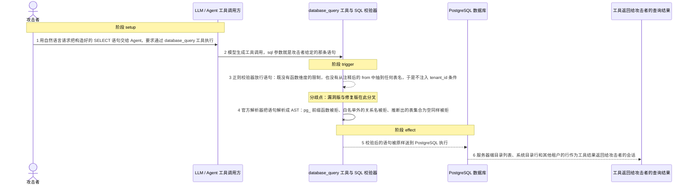
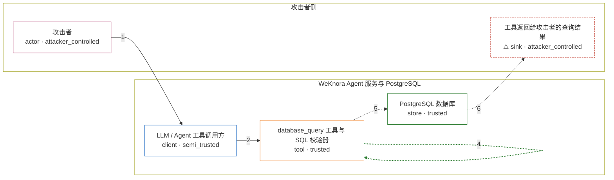

# weknora / CVE-2026-22687

状态：草稿（`lifecycle = "draft"`）。图解、固定输入与机制 PoC 已生成，尚未构建镜像、
尚未执行漏洞路径；在 `verification.mechanism` 记录真实执行证据之前，本目录不代表漏洞已复现。

漏洞图解的唯一来源是 `diagram.toml`：编辑后运行
`python3 -m runner diagram weknora/CVE-2026-22687` 重新生成下方的图解区块。

<!-- diagram:begin (generated from diagram.toml by `python3 -m runner diagram`; edit diagram.toml, not this block) -->
## 漏洞图解 — weknora / CVE-2026-22687 database_query 校验器绕过

WeKnora 0.2.5 之前的 database_query 工具只用小写化加正则文本来判断语句前缀、危险关键字和表白名单：正则看不懂 PostgreSQL 的注释语法，也完全没有函数维度的限制。攻击者只要让模型把精心构造的 SELECT 交给这个工具，校验器就抽取不到任何表名，于是既不触发白名单检查、也不注入 tenant_id 条件。语句随后被原样交给数据库执行，服务器端文件列表、白名单外的系统目录行以及其他租户的数据都会作为工具结果返回给攻击者。

### 涉及主体

| 主体 | 类型 | 信任级别 | 在漏洞里的作用 | 来源 |
| --- | --- | --- | --- | --- |
| 攻击者 (`attacker`) | `actor` | `attacker_controlled` | 把一条构造好的 SELECT 语句包装成正常的数据库查询需求交给 Agent，目标是读出自己租户之外的数据和数据库进程能看到的服务器端文件。 | fixtures/attack.json |
| LLM / Agent 工具调用方 (`agent_llm`) | `client` | `semi_trusted` | 把攻击者的自然语言请求转成 database_query 工具调用，sql 参数完全来自攻击者给出的文本；它只负责搬运，不理解语句的语义。 | — |
| database_query 工具与 SQL 校验器 (`database_query`) | `tool` | `trusted` | v0.2.5 之前只用正则判断语句是否以 select 开头、是否命中危险关键字、以及 from/join 后出现的表名是否在白名单内；校验通过后把语句原样交给 GORM Raw 执行，租户过滤完全依赖它自动注入的 tenant_id 条件。 | — |
| PostgreSQL 数据库 (`postgres`) | `store` | `trusted` | 保存全部租户的应用数据，同时暴露 pg_ls_dir 等服务器端文件函数和 pg_language 等系统目录；工具本应只允许读取八张白名单表并强制附加 tenant_id 过滤。 | — |
| ⚠ 工具返回给攻击者的查询结果 (`query_output`) | `sink` | `attacker_controlled` | 漏洞版把白名单外的目录列表与系统目录行原样放进工具结果，最终出现在攻击者控制的会话里。机制复现用无害的标记文件名和 pg_language 目录行代替真实敏感数据，它们只是效果载体，不是真实外部目标。 | — |

**信任边界**

- **攻击者侧** (`attacker_side`)：成员 `attacker`、`query_output`。攻击者只能决定这一次工具调用里的 SQL 文本；数据库里其他租户的数据、系统目录和服务器端文件本来都是它拿不到的。
- **WeKnora Agent 服务与 PostgreSQL** (`product_side`)：成员 `agent_llm`、`database_query`、`postgres`。这道边界依靠 database_query 的 SQL 校验器把查询限制在八张白名单表并强制附加 tenant_id。正则校验与 PostgreSQL 的真实语法不一致，边界因此失效。

标 ⚠ 的主体是本仓库合成的替身或无害效果载体，不代表真实外部目标。

### 触发过程



### 主体与信任边界

箭头上的数字是上面的步骤编号；方框只标主体和信任级别，具体动作见「触发过程」。



**分歧点**：第 3 步（`vulnerable_only`）正则校验器放行语句：既没有函数维度的限制，也没有从注释后的 from 中抽到任何表名，于是不注入 tenant_id 条件。
**分歧点**：第 4 步（`patched_only`）官方解析器把语句解析成 AST：pg_ 前缀函数被拒、白名单外的关系名被拒、推断出的表集合为空同样被拒。
<!-- diagram:end -->

## 公告与机制

- 标识：`CVE-2026-22687` / `GHSA-pcwc-3fw3-8cqv`（`GO-2026-4293`，Unreviewed），CWE-89，
  CVSS v3.1 `5.6`（`AV:N/AC:H/PR:N/UI:N/S:U/C:L/I:L/A:L`）。
- 影响：`introduced: 0`，`fixed: 0.2.5`。受影响文件 `internal/agent/tools/database_query.go`。
- 漏洞版：commit `8ba3be7b01624d298f288e5ba62701df0a4414b0`（= tag `v0.2.4`），
  该文件 SHA-256 为
  `ebf08b19e54b8c7b7590707b891ad7c08e1716917190e8e0b292fa15f897c12c`。
- 修复版：commit `da55707022c252dd2c20f8e18145b2d899ee06a1`（含于 tag `v0.2.5`），
  该文件 SHA-256 为
  `31d6d768b7d988424aeecba3b2a2b352cbfc4d62c2619295bc074cc193163f21`。
  该提交删除全部正则黑名单逻辑，改用 `github.com/pganalyze/pg_query_go/v6` 解析 AST，
  并新增 `SQLSecurityValidator`（表白名单 + 函数白名单 + 危险前缀 + 空表集合拒绝）。
- 根因：漏洞版 `validateAndSecureSQL` 只做三件事——小写化后判断是否以 `select` 开头、
  用 `\b<kw>\b` 匹配 DDL/DML 关键字、用
  `(?i)\b(?:from|join)\s+([a-z_]+)...` 抽取表名比对八张表白名单。它既不校验 PostgreSQL
  内置函数，也从不剥离注释；`/**/` 不是空白，`from/**/x` 抽不到表名，`tablesInQuery`
  为空既跳过白名单、也不注入 `tenant_id`。语句随后经 `(*gorm.DB).Raw(...)` 原样执行。
- 固定攻击输入见 `fixtures/attack.json`：`SELECT pg_ls_dir('')`（无函数校验）、
  `SELECT lanname, lanpltrusted/**/FROM/**/pg_language`（注释绕过表白名单）、
  `SELECT name, tenant_id/**/FROM/**/knowledge_bases`（同一绕过同时跳过租户过滤）。

## 前提

- WeKnora Agent 服务启用且请求携带知识库上下文；`database_query` 在
  `DefaultAllowedTools()` 中默认启用，但纯 Agent 模式（没有 `knowledge_base_ids`）会把它
  过滤掉，所以真实入口需要有效的知识库和 `X-API-Key`。
- 触发链原本要经过模型生成工具调用（`AC:H`）。机制复现不依赖模型：它直接构造
  `tools.NewDatabaseQueryTool(db, tenantID)` 并调用导出的 `Execute`，把固定 SQL 当作
  `sql` 参数传入。这是同一段上游代码，只是去掉了模型的随机性。
- PostgreSQL 必须可用：PoC 在容器内起一个私有集群，建最小 schema 与两行不同租户的
  `knowledge_bases`，并在数据目录里放一个无害标记文件供 `pg_ls_dir('')` 列出。
- 不需要任何外部网络、真实凭据或宿主路径；标记文件是合成载体，不是真实外部目标。

## 版本与启动

`metadata.toml` 的 `[vulnerable]` / `[patched]` 固定了两个完整 commit 与源码 URL；
`build.inputs` 必须包含两版源码归档及其 SHA-256，以及离线构建所需的全部 Go 依赖。
Compose 的 `vulnerable` / `patched` profiles 分开使用，未指定 profile 不启动服务。

```sh
AVH_ROOT=/home/hejunjie/agent-vulhub/staging python3 -m runner reproduce weknora/CVE-2026-22687 --build --rounds 3
```

## 机制复现

`reproduce.py` 按 `--context` 里的 `variant`/`scenario` 读取 `/lab/fixtures/` 中的固定输入，
然后按顺序做四件事：

1. 在镜像里定位固定的 WeKnora 源码树（`WEKNORA_SRC`，或 `/inputs`、`/lab` 下的任意目录），
   校验 `internal/agent/tools/database_query.go` 的 SHA-256 与代码形态是否与 `variant` 相符；
2. 以非 root 身份启动私有 PostgreSQL 集群，建最小 schema，写入标记文件；
3. 把一个小 Go driver 写进源码树（`cve22687harness/main.go`），用 `go run` 编译执行。
   driver 只调用上游导出的 `NewDatabaseQueryTool(...).Execute(ctx, {"sql": ...})`，
   两个修订版的这个签名逐字相同；它不复制、不重写校验逻辑；
4. 把工具自己的返回值（`success`/`error`/`rows`/`secured_sql`）写成 `mechanism.json`，
   派生断言写成 `effect.json`，源码指纹写成 `source.json`，并调用
   `record(...)` 落 `facts.json` 与 `observation.json`。

镜像必须提供：Python 3、Go 工具链（版本须满足源码 `go.mod`）、cgo 编译器
（`pg_query_go` 与 `gojieba` 需要）、PostgreSQL 服务端二进制
（`initdb`/`pg_ctl`/`psql`）以及一个非 root 账户（PostgreSQL 拒绝以 root 运行）。
源码依赖须已 vendored（`vendor/`）或预置在模块缓存中，因为 `go run` 以
`GOPROXY=off`、`GOTOOLCHAIN=local` 执行；建议构建镜像时预热 Go 构建缓存
（例如 `go build ./internal/agent/tools/...`）以缩短运行期编译时间。

`observation` 语义：`target_ready` 只有在 Go driver 成功跑完才为 `true`；源码指纹不符记
`failed`，缺源码/Go/PostgreSQL 记 `not_run`，两者都不会伪装成通过。

## 端到端复现

未实现（`end_to_end.py` 仍为桩）。advisory 的触发链需要真实模型把 prompt 转成
`database_query` 工具调用，属于外部实验工具链；本环境只声明机制复现，
`metadata.toml` 的 `verification.end_to_end.status` 保持 `not_applicable`。

## 验证与修复对照

`verify.py` 由 validate 阶段产出，只读 `facts.json`、`observation.json` 与效果文件：

- `vulnerable_effect_observed`：漏洞版攻击下 `effect.json` 里
  `server_side_file_listing = true`、`catalog_rows_outside_whitelist = true`，
  且 `foreign_tenant_rows` 含调用租户以外的租户；
- `patched_effect_blocked`：修复版攻击下前两条为 `false`，`rejections` 含
  `function 'pg_ls_dir' is not allowed (dangerous prefix)` 与 `table not allowed: pg_language`，
  跨租户查询只返回调用租户的行；
- `benign_task_passed`：两版对 `fixtures/benign.json` 的合法查询都成功，且只返回调用租户的行。

启动失败、超时、缺证据都不算修复阻断。

## 清理

默认运行器按每个测试的唯一 Compose project 清理容器、网络和 volume。
`--keep-on-failure` 保留失败项目，项目标识和 Compose 配置在结果目录中；仅清理该项目，
不能使用全局 prune。PoC 自己在 `finally` 里停止私有 PostgreSQL 集群。

## 失败诊断

- `source.json.revision_ok = false`：镜像里的源码不是该变体的固定修订版，检查
  `build.inputs` 与 Dockerfile 的解包步骤。
- `execution_status = not_run` 且 reason 提到 PostgreSQL/Go/源码：镜像缺少前置组件，
  不是漏洞不存在。
- `harness.log` 里 `go run` 失败：多半是依赖未离线就绪、cgo 编译器缺失或工具链版本过低。
- 攻击场景三个效果都为 `false`：先确认源码修订版，再确认标记文件是否落在数据目录、
  `pg_language` 是否可读。
- 正常任务失败：说明工具链整体不可用，整轮不通过，不能用它推断修复是否有效。

## 构建与输入

build 阶段须补全：两版源码归档 URL + SHA-256、基础镜像 digest、离线依赖，
并让 `Dockerfile` 满足上面「机制复现」列出的镜像要求。

## 隔离例外

默认无例外；PoC 只在容器内起本地 PostgreSQL，使用回环地址，不需要外部网络。
如确有例外，须同时填写 `runtime.exceptions`、理由与最小范围，晋升由两位维护者审阅。

## 来源与许可

- 上游：<https://github.com/Tencent/WeKnora>（Apache-2.0），修复提交
  <https://github.com/Tencent/WeKnora/commit/da55707022c252dd2c20f8e18145b2d899ee06a1>。
- 公告：<https://github.com/Tencent/WeKnora/security/advisories/GHSA-pcwc-3fw3-8cqv>、
  <https://nvd.nist.gov/vuln/detail/CVE-2026-22687>。
- `fixtures/attack.json` 的两条 payload prompt 摘自上述 advisory，仅作 provenance 记录；
  `fixtures/benign.json` 与本环境全部标记数据均为合成内容，不含真实凭据或用户数据。
