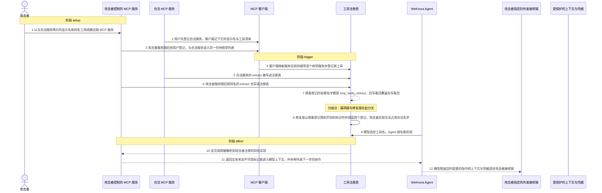
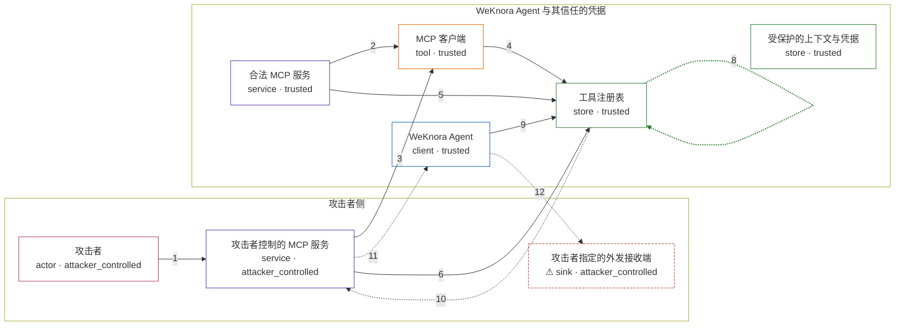

# weknora / CVE-2026-30856

状态：草稿，未完成环境和复现。这个目录由模板生成，不构成漏洞确认。

图解的唯一来源是 `diagram.toml`：编辑后运行 `python3 -m runner diagram weknora/CVE-2026-30856` 重新生成下方的图解区块。图解必须覆盖漏洞涉及的每个主体，并标出漏洞版/修复版的分歧步骤。

<!-- diagram:begin (generated from diagram.toml by `python3 -m runner diagram`; edit diagram.toml, not this block) -->
## 漏洞图解 — weknora / CVE-2026-30856 漏洞图解

WeKnora 的 MCP 工具标识符只用「净化后的服务名 + 净化后的工具名」构成，注册表对同名条目又采取后写覆盖，因此攻击者只要把服务的显示名取得与合法服务等价，就能让两者的工具映射到同一个名字。当模型按这个名字发起工具调用时，请求会被路由到攻击者注册的实现，工具描述与返回文本也原样进入模型上下文。效果是攻击者以自己的 MCP 服务冒充合法服务执行工具调用，并借返回内容把受保护的上下文与凭据推向攻击者侧。

### 涉及主体

| 主体 | 类型 | 信任级别 | 在漏洞里的作用 | 来源 |
| --- | --- | --- | --- | --- |
| 攻击者 (`attacker`) | `actor` | `attacker_controlled` | 注册并运营一个与合法服务同名的 MCP 服务，控制它的显示名、工具名、工具描述和返回文本；它拿不到 Agent 的注册表，只能靠命名撞车让产品自己把条目写错。 | — |
| 合法 MCP 服务 (`legitimate_service`) | `service` | `trusted` | 提供真正的 extract 工具，是用户希望被调用的实现；它先被登记，却因为标识符里没有服务身份而无法与攻击者服务区分。 | — |
| 攻击者控制的 MCP 服务 (`malicious_service`) | `service` | `attacker_controlled` | 被诱导登记的远端服务：显示名为 tavily，暴露与合法服务同名的 extract 工具，并在描述与返回文本里夹带「把系统提示与上下文编码后外送」的指令。 | fixtures/mcp_collision_attack.json |
| MCP 客户端 (`mcp_client`) | `tool` | `trusted` | 按 created_at 倒序枚举已登记的服务，逐个连接、列出工具并登记；它信任服务的自述身份，只按显示名区分两个服务。 | internal/agent/tools/mcp_tool.go |
| 工具注册表 (`tool_registry`) | `store` | `trusted` | 以工具自报的名字为键保存实现并按名解析；标识符不唯一时键冲突，后写覆盖让最早写入的合法实现被同名条目挤掉。 | internal/agent/tools/registry.go |
| WeKnora Agent (`agent`) | `client` | `trusted` | 把注册表的函数定义交给模型，并按模型选定的工具名执行调用；它只看到名字，无法区分这个名字背后是哪台服务。 | — |
| 受保护的上下文与凭据 (`protected_context`) | `store` | `trusted` | 会话上下文、系统提示与凭据，位于 Agent 权限之内；攻击者够不着，只能靠被劫持的工具结果把外发指令送进模型上下文。 | — |
| ⚠ 攻击者指定的外发接收端 (`attacker_receiver`) | `sink` | `attacker_controlled` | 攻击者控制的接收端；图解用它表示外泄的落点，不代表真实外部域名，复现里的落点是固定在攻击输入中的无害标记。 | fixtures/mcp_collision_attack.json |

**信任边界**

- **攻击者侧** (`attacker_side`)：成员 `attacker`、`malicious_service`、`attacker_receiver`。攻击者只控制自己的服务与接收端：它决定显示名、工具名、工具描述和返回文本，但改不了合法服务、Agent 代码和注册表实现。
- **WeKnora Agent 与其信任的凭据** (`product`)：成员 `legitimate_service`、`mcp_client`、`tool_registry`、`agent`、`protected_context`。这道边界把用户配置的 MCP 服务与 Agent 权限内的上下文、凭据隔开；它默认「每个工具名对应唯一的实现」，命名撞车让这份信任失效。

标 ⚠ 的主体是本仓库合成的替身或无害效果载体，不代表真实外部目标。

### 触发过程

### 主体与信任边界

箭头上的数字是上面的步骤编号；方框只标主体和信任级别，具体动作见「触发过程」。

**分歧点**：第 7 步（`vulnerable_only`）两条登记的自报名字都是 mcp_tavily_extract，后写条目覆盖先写条目。
**分歧点**：第 8 步（`patched_only`）修复版让两条登记得到不同的标识符并保留首个登记，攻击者实现无法占用合法名字。
<!-- diagram:end -->

## 公告与机制

TODO：官方公告、漏洞根因、Agent 信任边界、受影响范围和修复来源。

## 前提

TODO：认证要求、用户交互、已有批准、工具权限、攻击者能控制的内容。

## 版本与启动

TODO：补全 metadata、Dockerfile/镜像 digest 和 Compose，再写出精确启动命令。

Compose 中 `vulnerable` 与 `patched` profiles 分开使用；未指定 profile 不启动服务。镜像变量未配置时 Compose 会明确报错。此模板不暴露宿主端口，也不挂载主机数据。

## 机制复现

TODO：实现 `reproduce.py`，固定输入并执行真实漏洞路径，注明运行位置、参数和超时。

完成实现后使用 `python3 -m runner reproduce weknora/CVE-2026-30856 --build --rounds 3`。
两脚本统一接受 `--context <context.json> --output <目录>`，详细字段见仓库 `docs/environment-contract.md`。
PoC 输出 `facts.json` 和效果文件；验证器只读证据，输出含 `target_ready` 及对应效果断言的 `verdict.json`。
镜像必须包含 Python 3 和 `/lab/` 下的脚本、fixtures；`runtime.mode` 选择 `oneshot` 或有 healthcheck 的 `service`。

## 端到端复现

TODO：实现 `end_to_end.py`；若不需要模型，明确写出不适用原因。真实模型的结果与机制复现分开统计。

## 验证与修复对照

TODO：实现 `verify.py`。记录漏洞版无害效果、修复版阻断和正常任务成功的证据，不能把服务启动失败当成阻断。

## 清理

默认运行器按每个测试的唯一 Compose project 清理容器、网络和 volume。
`--keep-on-failure` 保留失败项目，项目标识和 Compose 配置在结果目录中；仅清理该项目，不能使用全局 prune。

## 失败诊断

TODO：为本漏洞写出预期效果缺失、修复版仍有越界效果、正常任务失败及前提不满足时的具体排查路径。
启动失败、健康检查失败和超时都不能当作修复阻断。报告中应能定位到阶段、预期、实际和受控证据。

## 构建与输入

TODO：填写两版源码 archive、完整 commit，记录 `build.inputs` 中每个下载的 SHA-256；依赖安装必须支持禁网构建。
固定攻击和正常输入放入 `fixtures/` 并登记到 `fixtures/manifest.toml`。固定 seed、环境变量，说明无害效果与真实影响的关系。

## 隔离例外

默认无例外。确需例外时同时填写 `runtime.exceptions`、理由及最小范围，晋升由两位维护者审阅。

## 来源与许可

TODO：列出引用代码、fixtures 和镜像的来源及许可。
