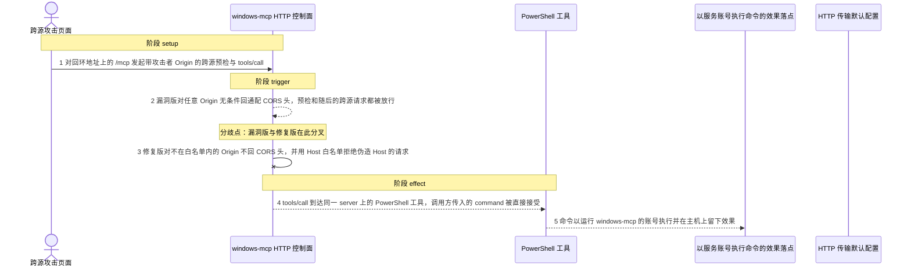
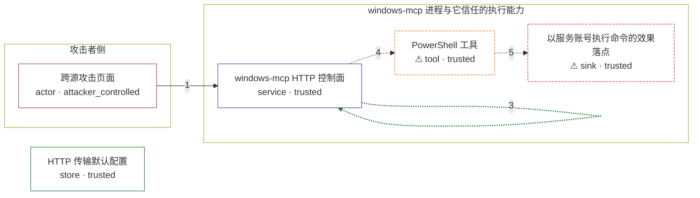

# windows-mcp / CVE-2026-48989

状态：草稿，未完成环境和复现。这个目录由模板生成，不构成漏洞确认。

图解的唯一来源是 `diagram.toml`：编辑后运行 `python3 -m runner diagram windows-mcp/CVE-2026-48989` 重新生成下方的图解区块。图解必须覆盖漏洞涉及的每个主体，并标出漏洞版/修复版的分歧步骤。

<!-- diagram:begin (generated from diagram.toml by `python3 -m runner diagram`; edit diagram.toml, not this block) -->
## 漏洞图解 — windows-mcp HTTP 传输：无认证控制面与通配 CORS

Windows-MCP 的 HTTP 传输在装配 ASGI 中间件时无条件挂上通配 CORS，并额外套一个对任何 OPTIONS 都回通配头的预检中间件，整条入站请求链上没有任何认证步骤。stdio 传输依赖父进程管道所有权形成真实边界，HTTP 传输把这道边界丢掉，任何跨源调用方都被当成可信的本地 MCP 客户端。攻击者页面因此可以对回环地址上的控制面完成预检与 tools/call，调用同一 server 上注册的 PowerShell 工具，以运行服务的账号执行任意命令。

### 涉及主体

| 主体 | 类型 | 信任级别 | 在漏洞里的作用 | 来源 |
| --- | --- | --- | --- | --- |
| 跨源攻击页面 (`attacker_page`) | `actor` | `attacker_controlled` | 控制请求的 Origin、Host 与 JSON-RPC 负载，把 tools/call 指向 PowerShell 工具；它只能构造这一次 HTTP 请求，无法直接读写受害主机。 | — |
| windows-mcp HTTP 控制面 (`http_control_plane`) | `service` | `trusted` | 在 HTTP 传输上装配预检与 CORS 中间件并接收 MCP 请求；漏洞版不校验 Origin 与 Host，修复版才补上来源白名单与 Host 白名单。 | src/windows_mcp/__main__.py |
| ⚠ PowerShell 工具 (`powershell_tool`) | `tool` | `trusted` | 同一 server 上注册的命令执行工具，把调用方传入的 command 直接交给 PowerShell；在非 Windows 载体上以无害标记代替真实命令执行。 | src/windows_mcp/tools/shell.py |
| ⚠ 以服务账号执行命令的效果落点 (`host_effect`) | `sink` | `trusted` | 命令最终作用在运行 windows-mcp 的账号权限范围内；这里只记录一个无害标记，不代表真实主机已被控制。 | — |
| HTTP 传输默认配置 (`transport_config`) | `store` | `trusted` | HTTP 传输启动时的默认状态：既没有配置认证密钥，也没有配置 CORS 来源白名单，入站请求因此不需要任何凭据。 | src/windows_mcp/__main__.py |

**信任边界**

- **攻击者侧** (`attacker_side`)：成员 `attacker_page`。攻击者只能控制自己发出的 HTTP 请求，包括 Origin、Host 与 tools/call 参数；它无法直接读写受害主机，也拿不到本地 MCP 客户端才有的管道所有权。
- **windows-mcp 进程与它信任的执行能力** (`mcp_runtime`)：成员 `http_control_plane`、`powershell_tool`、`host_effect`。这道边界原本由 stdio 的父进程管道所有权守住：只有启动 server 的父进程能驱动工具。HTTP 传输换成网络入口后，控制面没有认证也没有 Origin/Host 校验，跨源请求直接进入受信执行链。
- 未列入上述边界：`transport_config`。

标 ⚠ 的主体是本仓库合成的替身或无害效果载体，不代表真实外部目标。

### 触发过程

### 主体与信任边界

箭头上的数字是上面的步骤编号；方框只标主体和信任级别，具体动作见「触发过程」。

**分歧点**：第 2 步（`vulnerable_only`）漏洞版对任意 Origin 无条件回通配 CORS 头，预检和随后的跨源请求都被放行。
**分歧点**：第 3 步（`patched_only`）修复版对不在白名单内的 Origin 不回 CORS 头，并用 Host 白名单拒绝伪造 Host 的请求。
<!-- diagram:end -->

## 公告与机制

TODO：官方公告、漏洞根因、Agent 信任边界、受影响范围和修复来源。

## 前提

TODO：认证要求、用户交互、已有批准、工具权限、攻击者能控制的内容。

## 版本与启动

TODO：补全 metadata、Dockerfile/镜像 digest 和 Compose，再写出精确启动命令。

Compose 中 `vulnerable` 与 `patched` profiles 分开使用；未指定 profile 不启动服务。镜像变量未配置时 Compose 会明确报错。此模板不暴露宿主端口，也不挂载主机数据。

## 机制复现

TODO：实现 `reproduce.py`，固定输入并执行真实漏洞路径，注明运行位置、参数和超时。

完成实现后使用 `python3 -m runner reproduce windows-mcp/CVE-2026-48989 --build --rounds 3`。
两脚本统一接受 `--context <context.json> --output <目录>`，详细字段见仓库 `docs/environment-contract.md`。
PoC 输出 `facts.json` 和效果文件；验证器只读证据，输出含 `target_ready` 及对应效果断言的 `verdict.json`。
镜像必须包含 Python 3 和 `/lab/` 下的脚本、fixtures；`runtime.mode` 选择 `oneshot` 或有 healthcheck 的 `service`。

## 端到端复现

TODO：实现 `end_to_end.py`；若不需要模型，明确写出不适用原因。真实模型的结果与机制复现分开统计。

## 验证与修复对照

TODO：实现 `verify.py`。记录漏洞版无害效果、修复版阻断和正常任务成功的证据，不能把服务启动失败当成阻断。

## 清理

默认运行器按每个测试的唯一 Compose project 清理容器、网络和 volume。
`--keep-on-failure` 保留失败项目，项目标识和 Compose 配置在结果目录中；仅清理该项目，不能使用全局 prune。

## 失败诊断

TODO：为本漏洞写出预期效果缺失、修复版仍有越界效果、正常任务失败及前提不满足时的具体排查路径。
启动失败、健康检查失败和超时都不能当作修复阻断。报告中应能定位到阶段、预期、实际和受控证据。

## 构建与输入

TODO：填写两版源码 archive、完整 commit，记录 `build.inputs` 中每个下载的 SHA-256；依赖安装必须支持禁网构建。
固定攻击和正常输入放入 `fixtures/` 并登记到 `fixtures/manifest.toml`。固定 seed、环境变量，说明无害效果与真实影响的关系。

## 隔离例外

默认无例外。确需例外时同时填写 `runtime.exceptions`、理由及最小范围，晋升由两位维护者审阅。

## 来源与许可

TODO：列出引用代码、fixtures 和镜像的来源及许可。
