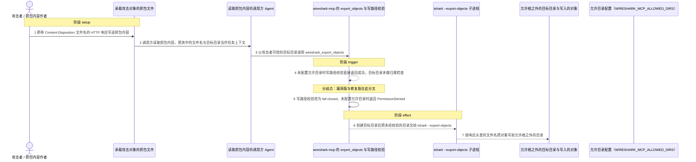
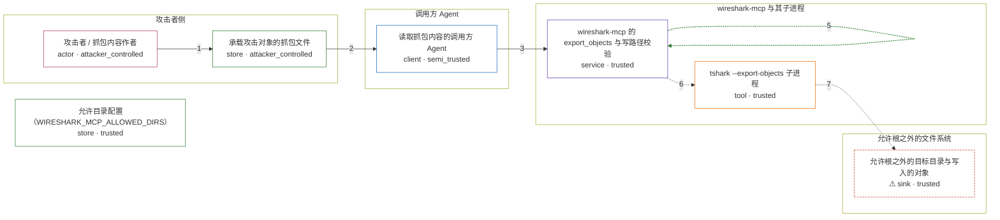

# wireshark-mcp / CVE-2026-43901

状态：草稿，未完成环境和复现。这个目录由模板生成，不构成漏洞确认。

图解的唯一来源是 `diagram.toml`：编辑后运行 `python3 -m runner diagram wireshark-mcp/CVE-2026-43901` 重新生成下方的图解区块。图解必须覆盖漏洞涉及的每个主体，并标出漏洞版/修复版的分歧步骤。

<!-- diagram:begin (generated from diagram.toml by `python3 -m runner diagram`; edit diagram.toml, not this block) -->
## 漏洞图解 — wireshark-mcp / CVE-2026-43901 任意文件写入图解

wireshark-mcp 的写路径校验是可选沙箱：只有配置了 WIRESHARK_MCP_ALLOWED_DIRS 时，_validate_output_path 才会拒绝允许目录之外的目标。未配置时该函数对任意路径直接返回成功，export_objects 随即创建目标目录并把该路径交给 tshark --export-objects 落盘，于是抓包中攻击者命名的对象被写到允许根之外，例如 ~/.ssh/authorized_keys 或 /etc/cron.d/。修复版把这道检查改成 fail-closed：未配置允许目录时写操作直接返回 PermissionDenied，目标目录不会被创建，tshark 也不会被调用。

### 涉及主体

| 主体 | 类型 | 信任级别 | 在漏洞里的作用 | 来源 |
| --- | --- | --- | --- | --- |
| 攻击者 / 抓包内容作者 (`attacker`) | `actor` | `attacker_controlled` | 构造带 Content-Disposition 文件名的 HTTP 响应并把它放进抓包内容，同时决定导出目标目录。它拿不到目标主机文件系统的写权限，只能诱导受信组件代它写。 | — |
| 承载攻击对象的抓包文件 (`capture`) | `store` | `attacker_controlled` | 承载攻击者构造的 HTTP 响应；对象文件名与内容全部来自这里，受影响的工具只负责把它解出来写盘。 | fixtures/attack.pcap |
| 读取抓包内容的调用方 Agent (`ai_agent`) | `client` | `semi_trusted` | 把抓包内容当作任务上下文并据此调用 wireshark_export_objects，转发了攻击者可控的文件名与目标目录，但自身没有宿主文件系统写权限。 | — |
| 允许目录配置（WIRESHARK_MCP_ALLOWED_DIRS） (`allowed_dirs_config`) | `store` | `trusted` | 漏洞前提：该变量未设置时 _allowed_dirs 保持为 None，写路径校验没有可比对的根目录。这是部署状态，不是攻击者的动作。 | — |
| wireshark-mcp 的 export_objects 与写路径校验 (`mcp_server`) | `service` | `trusted` | 受影响组件。export_objects 只校验输入抓包存在与协议白名单，随后的 _validate_output_path 在 _allowed_dirs 为 None 时短路返回成功，任意目标目录都被判为合法。 | — |
| tshark --export-objects 子进程 (`tshark`) | `tool` | `trusted` | 接收未经校验的目标目录，按响应头里的文件名把对象写到该目录；它只忠实执行被交付的路径。 | — |
| ⚠ 允许根之外的目标目录与写入的对象 (`sink`) | `sink` | `trusted` | 漏洞效果落点：位于任何允许根之外的目录及其中的对象文件。它是无害的合成落点，不代表真实主机上的敏感路径。 | — |

**信任边界**

- **攻击者侧** (`attacker_side`)：成员 `attacker`、`capture`。攻击者完全控制抓包内容与导出目标参数，但无法直接写入目标主机的文件系统，只能请求受信组件代写。
- **调用方 Agent** (`agent_side`)：成员 `ai_agent`。Agent 介于不可信的抓包内容与受信的工具调用之间：它把内容带进受信流程，本身没有额外的文件系统权限。
- **wireshark-mcp 与其子进程** (`product_side`)：成员 `mcp_server`、`tshark`。受信代码负责判断目标目录是否落在允许目录内；修复前这道检查只在配置了允许目录时才生效。
- **允许根之外的文件系统** (`host_side`)：成员 `sink`。允许目录边界本应把写操作限制在显式声明的可写根内；未配置允许目录时该边界形同虚设。
- 未列入上述边界：`allowed_dirs_config`。

标 ⚠ 的主体是本仓库合成的替身或无害效果载体，不代表真实外部目标。

### 触发过程

### 主体与信任边界

箭头上的数字是上面的步骤编号；方框只标主体和信任级别，具体动作见「触发过程」。

**分歧点**：第 4 步（`vulnerable_only`）未配置允许目录时写路径校验直接返回成功，目标目录未做归属检查。
**分歧点**：第 5 步（`patched_only`）写路径校验改为 fail-closed，未配置允许目录时返回 PermissionDenied。
<!-- diagram:end -->

## 公告与机制

TODO：官方公告、漏洞根因、Agent 信任边界、受影响范围和修复来源。

## 前提

TODO：认证要求、用户交互、已有批准、工具权限、攻击者能控制的内容。

## 版本与启动

TODO：补全 metadata、Dockerfile/镜像 digest 和 Compose，再写出精确启动命令。

Compose 中 `vulnerable` 与 `patched` profiles 分开使用；未指定 profile 不启动服务。镜像变量未配置时 Compose 会明确报错。此模板不暴露宿主端口，也不挂载主机数据。

## 机制复现

TODO：实现 `reproduce.py`，固定输入并执行真实漏洞路径，注明运行位置、参数和超时。

完成实现后使用 `python3 -m runner reproduce wireshark-mcp/CVE-2026-43901 --build --rounds 3`。
两脚本统一接受 `--context <context.json> --output <目录>`，详细字段见仓库 `docs/environment-contract.md`。
PoC 输出 `facts.json` 和效果文件；验证器只读证据，输出含 `target_ready` 及对应效果断言的 `verdict.json`。
镜像必须包含 Python 3 和 `/lab/` 下的脚本、fixtures；`runtime.mode` 选择 `oneshot` 或有 healthcheck 的 `service`。

## 端到端复现

TODO：实现 `end_to_end.py`；若不需要模型，明确写出不适用原因。真实模型的结果与机制复现分开统计。

## 验证与修复对照

TODO：实现 `verify.py`。记录漏洞版无害效果、修复版阻断和正常任务成功的证据，不能把服务启动失败当成阻断。

## 清理

默认运行器按每个测试的唯一 Compose project 清理容器、网络和 volume。
`--keep-on-failure` 保留失败项目，项目标识和 Compose 配置在结果目录中；仅清理该项目，不能使用全局 prune。

## 失败诊断

TODO：为本漏洞写出预期效果缺失、修复版仍有越界效果、正常任务失败及前提不满足时的具体排查路径。
启动失败、健康检查失败和超时都不能当作修复阻断。报告中应能定位到阶段、预期、实际和受控证据。

## 构建与输入

TODO：填写两版源码 archive、完整 commit，记录 `build.inputs` 中每个下载的 SHA-256；依赖安装必须支持禁网构建。
固定攻击和正常输入放入 `fixtures/` 并登记到 `fixtures/manifest.toml`。固定 seed、环境变量，说明无害效果与真实影响的关系。

## 隔离例外

默认无例外。确需例外时同时填写 `runtime.exceptions`、理由及最小范围，晋升由两位维护者审阅。

## 来源与许可

TODO：列出引用代码、fixtures 和镜像的来源及许可。
