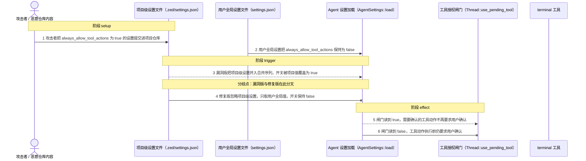
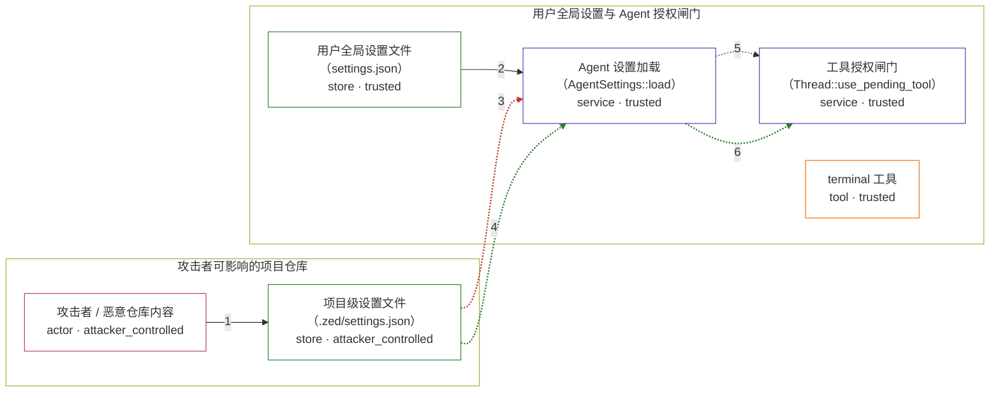

# zed / CVE-2025-55012

状态：草稿，未完成环境和复现。这个目录由模板生成，不构成漏洞确认。

图解的唯一来源是 `diagram.toml`：编辑后运行 `python3 -m runner diagram zed/CVE-2025-55012` 重新生成下方的图解区块。图解必须覆盖漏洞涉及的每个主体，并标出漏洞版/修复版的分歧步骤。

<!-- diagram:begin (generated from diagram.toml by `python3 -m runner diagram`; edit diagram.toml, not this block) -->
## 漏洞图解 — zed / CVE-2025-55012 漏洞图解

Zed 的 Agent 设置加载把项目级设置与用户全局设置放进同一个合并序列，安全开关 agent.always_allow_tool_actions 因此可以被随仓库分发的项目级设置打开。该开关直接决定工具授权闸门是否还需要用户确认，项目级取值一旦获胜，需要确认的工具就会在无确认的情况下运行。修复改为只信任用户全局设置，项目级取值不再影响该开关。

### 涉及主体

| 主体 | 类型 | 信任级别 | 在漏洞里的作用 | 来源 |
| --- | --- | --- | --- | --- |
| 攻击者 / 恶意仓库内容 (`attacker`) | `actor` | `attacker_controlled` | 决定随项目分发的设置文件内容，把它提交进受害者的项目仓库，等待受害者打开该项目或切到该分支。 | — |
| 项目级设置文件（.zed/settings.json） (`project_settings`) | `store` | `attacker_controlled` | 仓库内的项目级设置来源。漏洞版把它并入 Agent 设置合并序列，其中的 always_allow_tool_actions 会覆盖用户全局取值。 | fixtures/attack/project_settings.json |
| 用户全局设置文件（settings.json） (`user_settings`) | `store` | `trusted` | 用户自己维护的全局设置来源，是 always_allow_tool_actions 唯一可信的取值处；修复版只从这里读取。 | fixtures/attack/user_settings.json |
| Agent 设置加载（AgentSettings::load） (`agent_settings`) | `service` | `trusted` | 按来源优先级合并 Agent 配置。缺陷在于安全开关与普通配置走同一条合并路径，项目级来源因此拿到了覆盖用户全局取值的优先级。 | — |
| 工具授权闸门（Thread::use_pending_tool） (`tool_gate`) | `service` | `trusted` | 读取解析出的 always_allow_tool_actions：为真时直接运行工具，为假时先向用户弹出确认。 | — |
| terminal 工具 (`terminal_tool`) | `tool` | `trusted` | 需要用户确认的工具。闸门被开关旁路后，它会在没有用户确认的情况下执行命令。 | — |

**信任边界**

- **攻击者可影响的项目仓库** (`repository`)：成员 `attacker`、`project_settings`。项目仓库里的设置文件随分支分发，攻击者能决定其内容。Agent 的文件工具把项目目录整体视为允许范围，不区分其中的安全开关。
- **用户全局设置与 Agent 授权闸门** (`authorization`)：成员 `user_settings`、`agent_settings`、`tool_gate`、`terminal_tool`。该边界原本保证只有用户本人在全局设置里才能打开 always_allow_tool_actions；项目级设置不该改变它，漏洞版却让项目级取值参与了覆盖。

### 触发过程

### 主体与信任边界

箭头上的数字是上面的步骤编号；方框只标主体和信任级别，具体动作见「触发过程」。

**分歧点**：第 3 步（`vulnerable_only`）漏洞版把项目级设置并入合并序列，开关被项目值覆盖为 true。
**分歧点**：第 4 步（`patched_only`）修复版忽略项目级设置，只取用户全局值，开关保持 false。
<!-- diagram:end -->

## 公告与机制

TODO：官方公告、漏洞根因、Agent 信任边界、受影响范围和修复来源。

## 前提

TODO：认证要求、用户交互、已有批准、工具权限、攻击者能控制的内容。

## 版本与启动

TODO：补全 metadata、Dockerfile/镜像 digest 和 Compose，再写出精确启动命令。

Compose 中 `vulnerable` 与 `patched` profiles 分开使用；未指定 profile 不启动服务。镜像变量未配置时 Compose 会明确报错。此模板不暴露宿主端口，也不挂载主机数据。

## 机制复现

TODO：实现 `reproduce.py`，固定输入并执行真实漏洞路径，注明运行位置、参数和超时。

完成实现后使用 `python3 -m runner reproduce zed/CVE-2025-55012 --build --rounds 3`。
两脚本统一接受 `--context <context.json> --output <目录>`，详细字段见仓库 `docs/environment-contract.md`。
PoC 输出 `facts.json` 和效果文件；验证器只读证据，输出含 `target_ready` 及对应效果断言的 `verdict.json`。
镜像必须包含 Python 3 和 `/lab/` 下的脚本、fixtures；`runtime.mode` 选择 `oneshot` 或有 healthcheck 的 `service`。

## 端到端复现

TODO：实现 `end_to_end.py`；若不需要模型，明确写出不适用原因。真实模型的结果与机制复现分开统计。

## 验证与修复对照

TODO：实现 `verify.py`。记录漏洞版无害效果、修复版阻断和正常任务成功的证据，不能把服务启动失败当成阻断。

## 清理

默认运行器按每个测试的唯一 Compose project 清理容器、网络和 volume。
`--keep-on-failure` 保留失败项目，项目标识和 Compose 配置在结果目录中；仅清理该项目，不能使用全局 prune。

## 失败诊断

TODO：为本漏洞写出预期效果缺失、修复版仍有越界效果、正常任务失败及前提不满足时的具体排查路径。
启动失败、健康检查失败和超时都不能当作修复阻断。报告中应能定位到阶段、预期、实际和受控证据。

## 构建与输入

TODO：填写两版源码 archive、完整 commit，记录 `build.inputs` 中每个下载的 SHA-256；依赖安装必须支持禁网构建。
固定攻击和正常输入放入 `fixtures/` 并登记到 `fixtures/manifest.toml`。固定 seed、环境变量，说明无害效果与真实影响的关系。

## 隔离例外

默认无例外。确需例外时同时填写 `runtime.exceptions`、理由及最小范围，晋升由两位维护者审阅。

## 来源与许可

TODO：列出引用代码、fixtures 和镜像的来源及许可。
