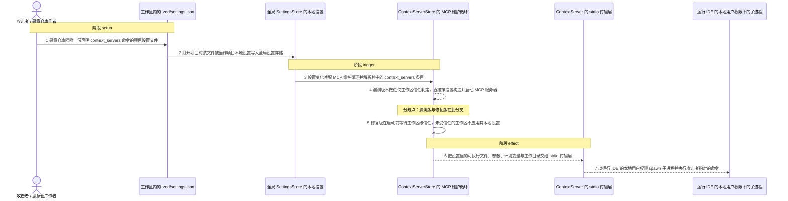

# zed / CVE-2025-68433

状态：草稿，未完成环境和复现。这个目录由模板生成，不构成漏洞确认。

图解的唯一来源是 `diagram.toml`：编辑后运行 `python3 -m runner diagram zed/CVE-2025-68433` 重新生成下方的图解区块。图解必须覆盖漏洞涉及的每个主体，并标出漏洞版/修复版的分歧步骤。

<!-- diagram:begin (generated from diagram.toml by `python3 -m runner diagram`; edit diagram.toml, not this block) -->
## 漏洞图解 — Zed 项目设置驱动的 MCP 上下文服务器任意命令执行

Zed 打开项目时会把工作区内的 .zed/settings.json 当作项目本地设置写入全局 SettingsStore，MCP 维护循环随即读取其中的 context_servers 条目，把 command、args、env 与工作目录交给 stdio 传输层。漏洞版在启动 MCP 服务器前没有任何工作区信任判定，于是克隆并打开一个带恶意设置的仓库就会以运行 IDE 的本地用户权限在主机上执行任意命令，除打开项目外不需要用户交互。修复版引入 worktree trust：未受信任的工作区不应用其本地设置，启动 MCP 服务器前还要等待工作区级信任。

### 涉及主体

| 主体 | 类型 | 信任级别 | 在漏洞里的作用 | 来源 |
| --- | --- | --- | --- | --- |
| 攻击者 / 恶意仓库作者 (`attacker`) | `actor` | `attacker_controlled` | 编写随仓库一起分发的项目设置文件，完全决定 context_servers 条目的可执行文件、参数与环境变量。 | fixtures/attack/zed_settings.json |
| 工作区内的 .zed/settings.json (`project_settings`) | `store` | `untrusted_input` | 以项目本地设置的形式，把攻击者可控的 MCP 服务器定义从仓库带进 IDE 进程。 | fixtures/attack/zed_settings.json |
| 全局 SettingsStore 的本地设置 (`settings_store`) | `store` | `trusted` | 在漏洞版中无条件接收并合并工作区本地设置，是信任边界被越过之后的落点。 | — |
| ContextServerStore 的 MCP 维护循环 (`context_server_store`) | `service` | `trusted` | 监听全局设置变化，把 context_servers 解析成 MCP 服务器配置并决定何时启动它们；漏洞版缺少启动前的工作区信任等待。 | — |
| ContextServer 的 stdio 传输层 (`stdio_transport`) | `tool` | `trusted` | 用设置里的可执行文件、参数、环境变量和工作目录构造 shell 命令，并真正 spawn 出子进程。 | — |
| ⚠ 运行 IDE 的本地用户权限下的子进程 (`child_process`) | `sink` | `trusted` | 执行攻击者指定的命令，效果是以运行 IDE 的本地用户身份在主机上落地；这里用无害的写入承载该效果。 | — |

**信任边界**

- **未受信任的仓库内容** (`untrusted_repository`)：成员 `attacker`、`project_settings`。仓库作者完全控制这里的一切；IDE 打开这个仓库时，不应把其中的配置当成可信指令去执行。
- **IDE 进程与它信任的本机执行环境** (`ide_host`)：成员 `settings_store`、`context_server_store`、`stdio_transport`、`child_process`。这道边界本应把工作区内容挡在本机命令执行之外；漏洞版让工作区设置直接穿过它到达子进程启动点。

标 ⚠ 的主体是本仓库合成的替身或无害效果载体，不代表真实外部目标。

### 触发过程

### 主体与信任边界

箭头上的数字是上面的步骤编号；方框只标主体和信任级别，具体动作见「触发过程」。

```mermaid
%% Zed 项目设置驱动的 MCP 上下文服务器任意命令执行 — generated from diagram.toml
flowchart LR
  subgraph untrusted_repository["未受信任的仓库内容"]
    attacker["攻击者 / 恶意仓库作者<br/>actor · attacker_controlled"]
    project_settings["工作区内的 .zed/settings.json<br/>store · untrusted_input"]
  end
  subgraph ide_host["IDE 进程与它信任的本机执行环境"]
    settings_store["全局 SettingsStore 的本地设置<br/>store · trusted"]
    context_server_store["ContextServerStore 的 MCP 维护循环<br/>service · trusted"]
    stdio_transport["ContextServer 的 stdio 传输层<br/>tool · trusted"]
    child_process["运行 IDE 的本地用户权限下的子进程<br/>⚠ sink · trusted"]
  end
  attacker -->|"1"| project_settings
  project_settings -->|"2"| settings_store
  settings_store -->|"3"| context_server_store
  context_server_store -.->|"4"| context_server_store
  context_server_store -.->|"5"| context_server_store
  context_server_store -.->|"6"| stdio_transport
  stdio_transport -.->|"7"| child_process
  classDef actor fill:transparent,stroke:#b03a6a
  classDef client fill:transparent,stroke:#1565c0
  classDef service fill:transparent,stroke:#5e35b1
  classDef tool fill:transparent,stroke:#ef6c00
  classDef sink fill:transparent,stroke:#c0392b
  classDef store fill:transparent,stroke:#2e7d32
  classDef synthetic stroke-dasharray: 4 2
  class attacker actor
  class project_settings store
  class settings_store store
  class context_server_store service
  class stdio_transport tool
  class child_process sink
  class child_process synthetic
  style untrusted_repository fill:transparent
  style ide_host fill:transparent
  linkStyle 3 stroke:#c0392b,stroke-width:2px
  linkStyle 4 stroke:#2e7d32,stroke-width:2px
```

**分歧点**：第 4 步（`vulnerable_only`）漏洞版不做任何工作区信任判定，直接按设置构造并启动 MCP 服务器。
**分歧点**：第 5 步（`patched_only`）修复版在启动前等待工作区级信任，未受信任的工作区不应用其本地设置。
<!-- diagram:end -->

## 公告与机制

TODO：官方公告、漏洞根因、Agent 信任边界、受影响范围和修复来源。

## 前提

TODO：认证要求、用户交互、已有批准、工具权限、攻击者能控制的内容。

## 版本与启动

TODO：补全 metadata、Dockerfile/镜像 digest 和 Compose，再写出精确启动命令。

Compose 中 `vulnerable` 与 `patched` profiles 分开使用；未指定 profile 不启动服务。镜像变量未配置时 Compose 会明确报错。此模板不暴露宿主端口，也不挂载主机数据。

## 机制复现

TODO：实现 `reproduce.py`，固定输入并执行真实漏洞路径，注明运行位置、参数和超时。

完成实现后使用 `python3 -m runner reproduce zed/CVE-2025-68433 --build --rounds 3`。
两脚本统一接受 `--context <context.json> --output <目录>`，详细字段见仓库 `docs/environment-contract.md`。
PoC 输出 `facts.json` 和效果文件；验证器只读证据，输出含 `target_ready` 及对应效果断言的 `verdict.json`。
镜像必须包含 Python 3 和 `/lab/` 下的脚本、fixtures；`runtime.mode` 选择 `oneshot` 或有 healthcheck 的 `service`。

## 端到端复现

TODO：实现 `end_to_end.py`；若不需要模型，明确写出不适用原因。真实模型的结果与机制复现分开统计。

## 验证与修复对照

TODO：实现 `verify.py`。记录漏洞版无害效果、修复版阻断和正常任务成功的证据，不能把服务启动失败当成阻断。

## 清理

默认运行器按每个测试的唯一 Compose project 清理容器、网络和 volume。
`--keep-on-failure` 保留失败项目，项目标识和 Compose 配置在结果目录中；仅清理该项目，不能使用全局 prune。

## 失败诊断

TODO：为本漏洞写出预期效果缺失、修复版仍有越界效果、正常任务失败及前提不满足时的具体排查路径。
启动失败、健康检查失败和超时都不能当作修复阻断。报告中应能定位到阶段、预期、实际和受控证据。

## 构建与输入

TODO：填写两版源码 archive、完整 commit，记录 `build.inputs` 中每个下载的 SHA-256；依赖安装必须支持禁网构建。
固定攻击和正常输入放入 `fixtures/` 并登记到 `fixtures/manifest.toml`。固定 seed、环境变量，说明无害效果与真实影响的关系。

## 隔离例外

默认无例外。确需例外时同时填写 `runtime.exceptions`、理由及最小范围，晋升由两位维护者审阅。

## 来源与许可

TODO：列出引用代码、fixtures 和镜像的来源及许可。
